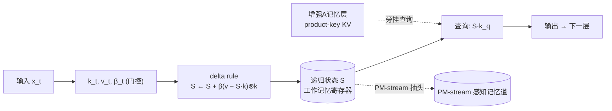
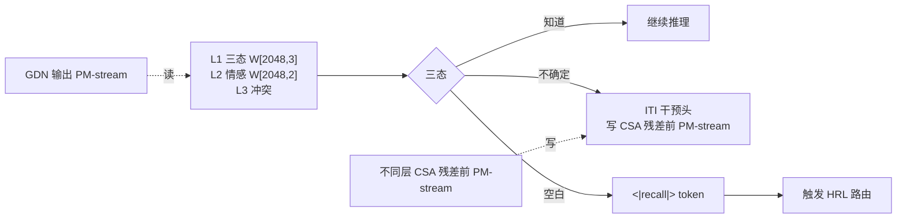
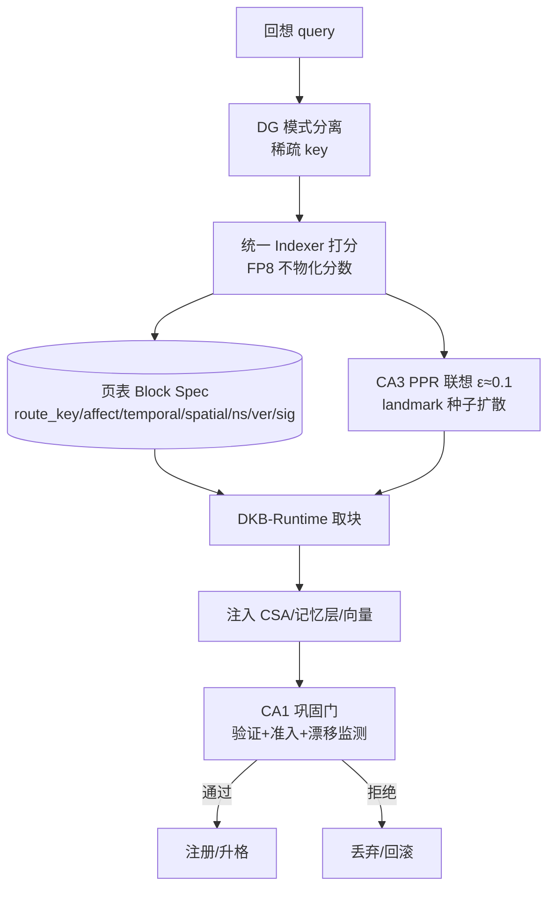
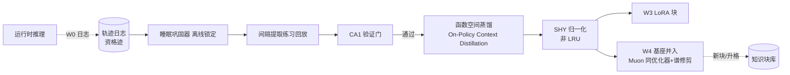

# TAIS Obsidian 子系统架构规格（v1.0）

**tais-obsidian ｜ 自底向上的部件 → 子系统 → 整机工程规格**

- 日期：2026-07-26
- 配套：《TAIS_Obsidian_细致框架设计文档》(v2.5)、《article_ref/》五份背景论文笔记
- 视角：**计算机体系结构工程**（部件/接口/数据通路/时序）+ **神经科学**（脑区功能映射）双镜头
- 范围：把 v2.5 设计文档的 28 节"为什么"翻译成"怎么造"——每个部件/子系统给出 7 个工程面（责任 / 架构角色 / 作用 / 实现形态 / 结构图 / 交互 / 训练优化），并标注承重神经科学映射与已核实文献。

> 阅读约定：⭐=设计基石（有独立文献）；【关键/风险/机会】=文献标注（见 article_ref/）；🧠=承重神经科学映射；🔧=工程红线。

---

## 0. 整机数据通路总览

```mermaid
flowchart TB
  classDef frozen fill:#e8eef7,stroke:#3a5a8c,color:#1a2a4a
  classDef native fill:#fef3e8,stroke:#b8741a,color:#4a2a0a
  classDef memory fill:#e8f7ee,stroke:#2a8a4a,color:#0a3a1a
  classDef write fill:#f7e8ee,stroke:#8a2a4a,color:#4a0a1a

  subgraph A["Part A 主干计算子系统（冻结基座）"]
    A1[A1 输入与动态词表层]
    A2[A2 GDN-MemBlock ×3 工作记忆寄存器]
    A3[A3 CSA-AttnBlock ×1 情景检索 L1]
    A4[A4 HCA 重压缩 L2 gist 块注入原生落点]
    A5[A5 滑窗 L0 精确]
    A6[A6 PM-stream mHC n=5 感知记忆专用道]
    A8[A8 LM-Head + MTP]
  end
  subgraph B["Part B 感知与元认知子系统 KAL（内生）"]
    B1[B1 L1 三态头 P(IK)]
    B2[B2 L2 情感头 valence/arousal]
    B3[B3 L3 冲突检测头]
    B4[B4 ITI 干预头]
    B5[B5 原生动作 token recall/blank/gist]
  end
  subgraph C["Part C 海马路由子系统 HRL（内生）"]
    C1[C1 DG 模式分离]
    C2[C2 统一 Indexer 打分头]
    C3[C3 页表 Block Spec]
    C4[C4 CA3 PPR 联想]
    C5[C5 CA1 巩固门]
    C6[C6 侧信道头簇 ×5]
  end
  subgraph D["Part D 记忆载体子系统"]
    D1[D1 KV 块 CSA harvest]
    D2[D2 增强 A 记忆层 GDN 旁挂 delta]
    D3[D3 向量块 ICV/steering]
    D4[D4 路径块 / 概念槽]
    D5[D5 可选 LoRA 程序性块]
  end
  subgraph E["Part E 运行时与存储子系统"]
    E1[E1 DKB-Runtime]
    E2[E2 L0-L3 存储层级]
    E3[E3 苏醒序列]
    E4[E4 热切换中间件]
  end
  subgraph F["Part F 写通道与进化子系统"]
    F1[F1 W0-W4 写通道分级]
    F2[F2 睡眠巩固器]
    F3[F3 受控基座并入 W4]
  end
  subgraph G["Part G 动态词表子系统"]
    G1[G1 第0级 concept_slot]
    G2[G2 第1级 词表升格]
    G3[G3 第2级 架构溶解]
  end

  A1 --> A2 --> A3 --> A4 --> A5 --> A8
  A2 -.读.-> A6
  A6 -.读.-> B1 & B2 & C6
  B1 --> B4
  B4 -.写.-> A6
  B5 -.token.-> A8
  B1 --空白--> C2
  C1 --> C2 --> C3 --> C4 --> C5
  C2 --route--> E1
  E1 <--> E2
  E1 -.注入.-> D1 & D2 & D3 & D4
  D1 -.拼.-> A3
  D2 -.查.-> A2
  D3 -.加.-> A6
  A8 -.W0日志.-> F1
  F1 --> F2 --> F3
  F2 -.固化.-> D1 & D2 & D3 & D4 & G1
  G1 --> G2 --> G3
  G1 -.slot注入.-> A1

  class A,A1,A2,A3,A4,A5,A6,A8 frozen
  class B,B1,B2,B3,B4,B5,C,C1,C2,C3,C4,C5,C6,G,G1,G2,G3 native
  class D,D1,D2,D3,D4,D5,E,E1,E2,E3,E4 memory
  class F,F1,F2,F3 write
```

**整机数据流（一次推理）**：`输入(含概念槽) → 主干分层计算(GDN工作记忆↔CSA情景检索↔HCA gist↔滑窗精确，全程 PM-stream 旁挂感知/记忆道) → KAL 各层读 PM-stream 出三态/情感/冲突信号 → 空白态触发 <|recall|> → HRL DG分离→Indexer→页表→CA3联想→CA1准入 → DKB-Runtime 从 L0/L1/L2 取块注入(CSA拼接/记忆层查询/向量加法) → 带记忆继续推理 → 全程落 W0 日志 → 睡眠固化器 间隔提取练习→验证门→蒸馏→SHY归一化 → 新块/升格注册回库`。

**双镜头读图**：
- **体系结构视角**：A=CPU 流水线（冻结）；B=性能计数器/异常检测单元；C=MMU+TLB+预取器；D=cache 层级的不同行格式；E=存储控制器+页错误处理；F=后台 journaling/defrag；G=动态符号表。
- **神经科学视角**：A=皮层+语言中枢；B=前额叶元认知；C=海马（DG/CA3/CA1）；D=不同记忆印迹形态；E=记忆层级；F=睡眠巩固；G=词汇皮层可塑性。

---

## Part A · 主干计算子系统（冻结基座）

> **职责边界**：承担"语言中枢+皮层"的通用计算；权重在 T1 预训练后**冻结**，运行时不接受梯度（🔧 红线：只有睡眠期 W3+ 才改基座权重）。所有原生部件以"旁路抽头/独立分支/专用残差道"接入，**主干残差流保持干净**。

### A1 · 输入与动态词表层

- **责任**：把字节/字符 → token id → embedding；承载动态词表第 0 级概念槽注入；输出侧 LM-Head 反查。
- **架构角色**：唯一与外部符号接壤的"门"（v2.2 §26：tokenizer 通路 vs 原生通路之分界）。
- **作用**：① 标准 tokenization；② **reserved 2048 槽**（预训练噪声占位防 glitch token，ZeTT 指出的固定词表病灶）；③ concept_slot 经此注入融合表示（输入侧免费，Over-Tokenized log-linear 保证零风险）。
- **实现**：tied embedding（vocab 129280=127232 基础+2048 reserved），hidden 2048；输入侧扩张用 Kaplan Procrustes T_E 映射把概念槽向量投到 embedding 空间；输出侧扩张**选择性**（仅精选高频多 token 概念，每批限数十条，§28.7）。
- **交互**：G1（concept_slot 注入）/ G2（升格激活 reserved 槽）/ A8（LM-Head tied 反查）/ A2（喂入第一层）。
- **训练优化**：预训练期 reserved 槽做**噪声占位训练**（避免成为 glitch 吸引子）；T1 观测内词典提取强度（1.5B 最大不确定项）。
- 🧠 承重映射：词汇皮层可塑性（轻度）；🧠 装饰映射：无。
- ⭐ Over-Tokenized（ICML 2025）/ Kaplan（ICLR 2025）/ BLT（ACL 2025）。

### A2 · GDN-MemBlock（Gated DeltaNet，工作记忆寄存器）

- **责任**：递归状态更新 = "工作记忆寄存器"；原生无界上下文（恒定计算成本）；承载增强 A 旁挂记忆层。
- **架构角色**：占 3/4 层（7×3=21 层），主干的主力计算 + 工作记忆；**线性注意力已知弱点**：固定状态在检索密集任务上遗忘（arXiv:2510.20787）→ CSA 层补偿。
- **作用**：① 序列压缩进递归状态 S（delta rule `S←S+β(v−v̄)⊗k` + forget gate）；② **PM-stream 读取点**（GDN 输出最适合作"已理解内容"摘要，§13.4）；③ 增强 A 记忆层旁挂于此（同 delta 规则，运行时写入由构造保证分布内）。
- **实现**：16 头 × 128 维，通道级门控，DPLR chunk kernel（纯 PyTorch naive_recurrent + chunked 双路径，tests/test_gdn.py 对拍 <1e-4）。
- **交互**：A1（输入）/ A3（输出给 CSA）/ A6（PM-stream 读）/ D2（增强 A 记忆层旁挂查询）/ B1-B3/C6（读 PM-stream）。
- **训练优化**：T1 预训练；GDN 层无 KV cache（W-State 状态快照是混合架构独有红利，但当前引擎不支持——🔧 需 DKB-Runtime 自研 state checkpointing）。
- 🧠 承重映射：**前额叶工作记忆**（递归状态=工作记忆寄存器）；🧠 海马齿状回（DG，若挂增强 A）。
- ⭐ Gated DeltaNet（arXiv:2412.06464）/ Titans MAL（同构验证）。



### A3 · CSA-AttnBlock（压缩稀疏注意力，情景检索 L1）

- **责任**：全局选择性检索已压缩摘要 = "情景记忆 L1"；**陈述性块 KV 注入的原生落点**。
- **架构角色**：占 1/4 层（7×1=7 层），是主干里唯一的"全局注意力"——补偿 GDN 遗忘性；原生 1M 上下文的成本控制点（indexer 每 query O(L) 打分 + O(k) 精细）。
- **作用**：① stride-4 学习压缩器（m=4，4 token→1 压缩条目）；② FP8/FP4 indexer top-128/1024 选择性检索；③ **CSA `harvest()` 自编译接口**（ICAE/kv-distill 范式，收割压缩 KV 即块）；④ 块 KV 拼接注入（带 namespace 校验，fail-closed）。
- **实现**：GQA 16Q/2KV × 128，partial RoPE + 训练内 YaRN；双 KV 流 + 重叠 2m-softmax 模糊块边界（DeepSeek V4 CSA 同款）。
- **交互**：A2（输入）/ A4（输出给 HCA）/ A6（PM-stream 写入点，注入紧邻检索层）/ D1（KV 块拼接注入）/ C2（indexer 权重初始化块域索引器）。
- **训练优化**：T1 预训练；stride-4 压缩器训练期学、推理期冻结（🔧 与 W-State 的干扰见 Part Z）；indexer 用 CSA 权重初始化再做块域 KL 对齐（T2）。
- 🧠 承重映射：**海马 CA3 模式补全**（检索已压缩情景）；🧠 后部联合皮层（注意力直接读取）。
- ⭐ DeepSeek V4 CSA（arXiv:2606.19348）/ NSA（arXiv:2502.11089）/ ICAE / kv-distill（99% 压缩）。

### A4 · HCA 重压缩（L2 gist，块注入原生落点）

- **责任**：128:1 重压缩全局摘要 = "L2 长期 gist"；**最激进的全局鸟瞰**，是 `<gist>` 自我总结的架构级载体。
- **架构角色**：与 CSA 交错的第二注意力栈（DeepSeek V4 三级：滑窗 L0 / CSA L1 / HCA L2）；1M 上下文下 cache 仅 GQA8 基线 0.4%。
- **作用**：① 把 128 token 平均成 1 条目（单流、无 indexer、稠密注意）；② **块注入原生落点**（注入即读模型自己写的东西，消除 §11.1 前缀偏差）；③ 高 arousal 触发更激进 HCA 压缩（McGaugh 落地）。
- **实现**：m′=128；压缩矩阵训练期学、推理期冻结。
- **交互**：A3（输入）/ A5（输出给滑窗）/ D1（块注入）/ B2（arousal 调压缩率）。
- **训练优化**：T1 预训练；🔧 **W-State 不得在 HCA 上游改残差**（否则被 128:1 池化冲刷，见 Part Z）。
- 🧠 承重映射：**海马 CA1 → 皮层 gist 巩固**；🧠 内嗅皮层（概览表征）。
- ⭐ DeepSeek V4 HCA / DLCM（compression-aware scaling law）。

### A5 · 滑窗注意力（L0 精确）

- **责任**：近期 token 的精确全注意力 = "L0 工作记忆精确"。
- **架构角色**：512 token 滑窗，三级注意力里成本最高但最准的层；与 CSA/HCA 互补。
- **作用**：保证近期上下文精确不被压缩有损；attention sinks（可学习 sink logits）作"缺页声明/诚实降级"的原生注意力版。
- **交互**：A4（输入）/ A8（输出给 LM-Head）；与 A3/A4 并行三路融合。
- 🧠 承重映射：**感觉皮层近期表征**。
- ⭐ DeepSeek V4 滑窗 / TTT-E2E（刻意只用滑窗避学习型压缩冲突——见 Part Z）。

### A6 · PM-stream（mHC 感知-记忆专用道）

- **责任**：给残差流修一条"感知-记忆专用车道"，让 KAL/HRL 信号贯穿全层而不污染主干计算。
- **架构角色**：残差流由单流扩展为 **n=5**（4 内容流 + 1 PM-stream）；DeepSeek mHC 双随机约束（Sinkhorn-Knopp 投影到 Birkhoff 多胞形）保证稳定（无约束 HC 信号放大 3000×，mHC 压到 1.6×）。
- **作用**：① **读**：KAL 三态/四侧信道头从 GDN 输出处 PM-stream 读（已压缩摘要信号）；② **写**：HRL 载荷经 H_post 映射写 CSA 残差前 PM-stream（紧邻检索层，注入立刻参与注意力）；③ 人格向量/ITI 共用此道（单一写入纪律）。
- **实现**：mHC 层（arXiv:2512.24880），开销 6.7%；TAIS 的 n=5（4 内容+1 PM）是 DeepSeek n=4 纯内容的独创延伸——🔧 **无先例，需 pilot 消融**（logs_train_pm.txt 正在做，tests/test_pmstream.py 恒等初始化 <1e-6）。
- **交互**：A2（读点）/ A3（写点）/ B1-B4（读）/ C6（读）/ D3（向量加法写入）。
- **训练优化**：恒等初始化保证与单流基线 <1e-6（开机即用）；T1 消融 PM-stream 数；T3 RL 时 PM-stream 携带 HRL 决策标记传播。
- 🧠 承重映射：**丘脑皮层环路**（感知-记忆门控）。🧠 装饰：无。
- ⭐ mHC（arXiv:2512.24880）。

### A8 · LM-Head + MTP

- **责任**：RMSNorm → tied LM-Head（DoLa 开关）→ MTP（多 token 预测）。
- **作用**：① token 生成；② **原生动作 token**（`<|recall|>`/`<|blank|>`/`<|gist|>`/`<|ref|>`/`<|box|>`）在此发出，与普通 token 同一"生成中的结构化动作"范式；③ DoLa 开关由 KAL 不确定态触发（对比早层/晚层 logit）。
- **交互**：A5（输入）/ B5（动作 token 回流触发 HRL）/ F1（生成落 W0 日志）。
- 🧠 承重映射：**运动皮层+语言产出**。
- ⭐ DoLa / MTP。

---

## Part B · 感知与元认知子系统（KAL，内生）

> **职责边界**：模型"知道自己知道什么/不知道什么/感受到了什么/有无冲突"——全部以 **checkpoint 内生权重**实现，推理时零外部服务依赖。🧠 承重映射：**前额叶元认知**（Fleming aPFC/rlPFC）。
> 🔧 **监测/执行分置红线**：探针只读（GDN 输出 PM-stream），干预头只写（CSA 残差前 PM-stream）——**读写不同层**，避免探针读到自己刚写的干预而自激（PMC9053853 监测/控制分离）。

### B1 · L1 三态头（P(IK)）

- **责任**：知识感知——输出"知道/不确定/空白"三态。
- **作用**：① 推理中持续监测；② 空白态触发 `<|recall|>`；③ 作 T3 的天然**过程奖励**。
- **实现**：`nn.Linear W[2048,3]`（朴素线性头——⭐ arXiv:2606.02628 证明线性探针 0.904–1.000 AUROC @4-bit NF4，MLP 探针极少超线性 +0.01，线性即足够）；挂 ℓ10/14/18（28 层 36–64% 深度，与峰值带 50–90% 部分重叠、略偏前捕获早出线性特征）。
- **训练优化**：预训练后期以 **P(IK) 辅助目标**（Kadavath 范式）；T2 用"已知/未知"事实对 + **预测-反馈循环**（单纯预测无效，反馈必要）；**校准对准绝对值**（Barkan：瓶颈在校准非判别）；T2 后每 N 次固化**定期重校准**（Kadavath：新任务漂移；BCI 解码器再校准制度）。
- 🧠 承重映射：**aPFC 知觉元认知基质**（Fleming）。
- ⭐ SAPLMA（2304.13734，⚠️71–83% 是 accuracy 非 AUROC）/ 2606.02628 / Kadavath（2207.05221）/ Barkan（2512.24661）。

### B2 · L2 情感头（valence/arousal）

- **责任**：语境情感感知——输出效价/唤醒度。
- **作用**：① arousal 接写显著性头（高 arousal=惊讶=值得记，Titans 惊讶度门控同源）；② valence 入 route_key 情感匹配召回；③ 调制 HCA 压缩率（高 arousal 更激进）。
- **实现**：`nn.Linear W[2048,2]`，与 L1 共享 PM-stream 读取点与训练管线（成本≈0）。
- **训练优化**：T2；**情感 ground truth 不来自模型自评**（防自指循环）——从外部信号 bootstrap（用户纠正/显式反馈/文本情感分类器），模型自标签仅在 CA1 复核后用。
- 🧠 承重映射：**杏仁核**（McGaugh 调制）。
- ⭐【机会/风险】McGaugh 教科书；Anthropic 情感电路论文 + Latent Context LM ⚠️未复验。

### B3 · L3 冲突检测头

- **责任**：语境一致性感知——检索块与当前上下文是否矛盾。
- **作用**：作 CA1 仲裁的执行器（版本仲裁三路：版本号+时间戳+置信度）；冲突不静默覆盖。
- **实现**：注入矛盾/一致块对训练；远期项。
- 🧠 承重映射：**前岛叶/dmPFC 显著性网络**（追踪错误）。

### B4 · ITI 干预头

- **责任**：执行通道——把真实度/置信度方向写回残差流。
- **作用**：不确定态时经 ITI 头平移激活（ITI 32.5%→65.1%）；与 DoLa 协同。
- **实现**：ITI 方向**蒸馏为原生干预头**（学习型投影），写 CSA 残差前 PM-stream。
- **训练优化**：T2 蒸馏（数百样本即可，离线睡眠期廉价重训方向）；🔧 **向量冻结做偏置注入，绝不对探针信号加损失项**（否则模型把特质重编码到不可读基底）。
- 🧠 承重映射：**前额叶执行控制**。
- ⭐ ITI（2306.03341）。

### B5 · 原生动作 token

- **责任**：以模型自己的 token 发出元认知决策。
- **作用**：`<|recall|>`（空白→回想，触发 HRL）/ `<|blank|>`（显式声明"该部分记忆暂不可用"=诚实降级）/ `<|gist|>`（自我总结，触发 CSA harvest 编译 slot token）。
- **实现**：词表内特殊 token（与 `<|ref|>/<|box|>` 同范式）；**必须显式出现在 CoT 中**（隐形路径显形化，审计接口——Turpin CoT 不忠实对策）。
- **训练优化**：T2 SFT + T3 RL（三元/TIAR 奖励 GRPO）。



---

## Part C · 海马路由子系统（HRL，内生）

> **职责边界**：决定"何时调/调哪块/调来怎么注入/调用结果如何固化"——类 MoE 双向路由。🧠 承重映射：**海马（DG/CA3/CA1）+ 内嗅**。⭐ **海马索引理论**（页表=索引，块载荷=皮层内容——HRL→注入拓扑的唯一理论依据）。

### C1 · DG 模式分离

- **责任**：把查询/project key 稀疏化去相关，防碰撞。
- **作用**：route_key 经 DG 稀疏 key 作防碰撞哈希；landmark 锚点块（知识图中学度/中心性高）作 CA3 PPR 扩散种子。
- 🧠 承重映射：**齿状回**（pattern separation）。

### C2 · 统一 Indexer 打分头

- **责任**：检索打分——块域/token 域/专家域（远期）三维同构统一打分头。
- **作用**：FP8 分块归并 Indexer（🔧 **不物化分数张量，StreamIndex 红线**）；用 CSA indexer 权重初始化再做块域 KL 对齐。
- **训练优化**：T2 KL 蒸馏 warmup（TGR-MoE/DSA 式，对齐稠密教师）；**辅助损失梯度只进 indexer，禁止污染主干**；T3 转统一 RL。
- 🧠 承重映射：**内嗅皮层**（索引/网格）。

### C3 · 页表（Block Spec）

- **责任**：块注册表——内容寻址 + 元数据（route_key/affect/temporal/spatial/namespace/版本/签名/TTL/usage_count）。
- **作用**：动态词表第 0 级的 codebook（concept_slot = 词表块的页表项）；双形态（markdown 源=ground truth 可审计，编译产物=可失效缓存）；Zep 双时态模型（valid_at/ingested_at）补进。
- **实现**：SQLite（页表/元数据）+ 向量库（route_key 检索）+ 文件存储（块载荷）。
- 🧠 承重映射：**海马索引**（Teyler-DiScenna）。

### C4 · CA3 PPR 联想

- **责任**：联想检索——Personalized PageRank 在块图上扩散，ε≈0.1 探索。
- **作用**：多跳/类比联想增强（HippoRAG 式 +20%）；对路径块做模式补全（走过前几步即补全整条熟路）。
- 🧠 承重映射：**CA3 自动联想**（pattern completion）。
- ⭐ HippoRAG / TEM（关系抽象）。

### C5 · CA1 巩固门

- **责任**：固化准入 + 验证门 + 信念漂移监测（§26.2 三原语之一）。
- **作用**：① 块升格/并入基座准入（高使用计数 + 回归验证 + 教师共识度 GATES 式）；② **路径学习验证门**（Kairos 验证门控 Hebbian——⚠️ Kairos 未核实，用 Ramsauer Hopfield 替代）；③ 防记忆投毒（MemoryGraft 信念腐蚀拦截）。
- **实现**：校验集回归测试（提取练习效应——测试比重学强 50%，间隔重复 d≈0.46）；微软后门扫描器（⚠️87.8% 检出数字未核实）接入 draft 区筛查。
- 🧠 承重映射：**CA1 巩固**。
- ⭐ 提取练习 / MemoryGraft（2512.16962）/ Kairos⚠️。

### C6 · 侧信道头簇（×5，全部 <1% 参数）

| 头 | 挂载 | 功能 | 证据 |
|---|---|---|---|
| 预取预测头 | ℓ4/ℓ10 | 预测下一思考段所需块，提前挂载（分支预测器） | PreScope |
| 写显著性头 | ℓ10/ℓ14 | 惊讶度 KL 阈值 + 用户纠正 + 复用潜力 → W0 日志加标 | Titans 惊讶度门控 |
| 冲突检测头 | ℓ14 | 检索块与上下文矛盾 → CA1 仲裁 | B3 执行器 |
| 归因监测头 | ℓ18 | 注入后测注意力质量/输出归因 → usage_count + 路由器 RL 奖励 | CMI 因果审计 |
| 联想触发头 | ℓ14 | 决定何时开 CA3 PPR 探索（ε-greedy 情境化） | ABC 学习型记忆 |

- **训练优化**：各头独立小目标，不进主干损失；T2-T3 训；T3 路由稳定性专项（MoE-RL 教训：序列级重要性裁剪 GSPO、相邻块选择 Jaccard 重叠下限、ε 退火）。



---

## Part D · 记忆载体子系统

> **职责边界**：定义"块"的物理形态。🔧 **核心边界（⭐ 已核实并强化）**：**token 寻址载体（KV 前缀/记忆层条目）能做事实回忆；位置不变向量（ICV/FV/DeCoVec）不能，只能 steer 行为/风格/函数。** Block Spec 须按载体标注"事实召回能力"字段。

| 载体 | 寻址 | 事实召回 | 上下文开支 | 生成机制 | 脑对应 |
|---|---|---|---|---|---|
| D1 KV 块 | token | ✅ | 小（压缩后） | CSA harvest 一次前向 | 后部联合皮层 |
| D2 增强 A 记忆层 | key | ✅ | 零（参数化） | delta 规则写入（分布内） | 海马 DG/CA3 |
| D3 向量块 | 位置不变 | ❌ | 零（一次加法） | ICV PCA top-1 / steering 均值差 | 人格/风格调制 |
| D4 路径块/概念槽 | 图/槽 | 部分 | 零 | 轨迹固化 / Kaplan 提取 | 前额叶引导 / 词汇皮层 |
| D5 LoRA（可选） | 权重 | 部分 | 零（挂载） | 睡眠蒸馏（非关键路径） | 功能皮层区 |

### D1 · KV 块（CSA harvest）
- **作用**：陈述性事实/经历；CSA 压缩收割 + Expected Attention 免训练修剪 60% + Q4 量化。
- **交互**：注入 CSA 压缩区（namespace 校验：模型/层/压缩矩阵版本/dtype/RoPE 五元组）。
- ⭐ ICAE（4×）/ kv-distill（99%）/ Expected Attention / RelayCaching（80% 复用）。

### D2 · 增强 A 记忆层（GDN 旁挂 delta）
- **作用**：陈述性块**优先写入此原生记忆层**（非拼接 CSA KV 区）；写入规则与 GDN delta 同构 `S←S+β(v−v̄)⊗k`，由构造保证分布内；容量管理复用 GDN 门控衰减。
- **训练优化**：Memory Layers sweet-spot ~3 层居中（与 GDN 比例吻合）；W3+ 离线写入基底。
- ⭐ Memory Layers at Scale（128B/1T，加参数不加 FLOPs）/ Titans MAL 同构。

### D3 · 向量块（ICV/steering）
- **作用**：技能/行为/风格/人格/格式调制；**只能"怎么思考"不能"知道什么"**；可向量算术组合。
- **交互**：写入 PM-stream（残差一次加法）或 logits（DeCoVec Δz）。
- 🔧 人格块**冻结只读常驻 L0**；steering 向量运行时可写但限 W2。
- ⭐ ICV（2311.06668）/ FV / DeCoVec（2604.11129 ACL 2026 Findings）/ Persona Vectors。

### D4 · 路径块 / 概念槽
- **路径块**：块引用的有序序列 + 进入/退出条件 + 成功率；高度熟练路径蒸馏为 D5 LoRA（ACT-R 陈述性→程序性）。
- **概念槽**：动态词表第 0 级（见 Part G）。

### D5 · LoRA 程序性块（可选）
- **角色降级**（v2.0）：从"必备载体"降为"可选深度固化产物"，退出关键路径；睡眠期蒸馏保留为深度程序性技能通道。

---

## Part E · 运行时与存储子系统

### E1 · DKB-Runtime
- **组件**：API 网关 / Pager（缺页处理）/ BlockStore / **注入中间件**（🔧 热切换红线：切换成本压到毫秒级，llama.cpp slot 1.4ms 已证明可行）。
- **职责**：TAIS Memory Bus 的服务端；fail-closed 回退（重算/文本 RAG）。

### E2 · 存储层级 L0-L3
- L0 VRAM（工作记忆，常驻个位数块）/ L1 DRAM（短期，概念槽表）/ L2 NVMe（长期）/ L3 远端（档案）。🧠 承重映射：记忆层级。

### E3 · 苏醒序列
- **顺序**（麻醉苏醒证据）：阶段 0 路由器/接口层 → 1 人格块+元数据块 → 2 高频陈述性块 → 3 长尾惰性加载 → 4 完成声明"记忆部分加载"（诚实降级）。🧠 承重映射：麻醉恢复（执行功能先于陈述记忆）。

### E4 · 热切换中间件 + state checkpointing
- 🔧 **关键工程缺口**：当前引擎对混合模型递归状态持久化是空白（llama.cpp slot 不存 SSM/DeltaNet 状态，discussion #24043）→ **W-State 须自研 state checkpointing**（读/恢复 GDN 状态缓冲区）；这是对上游生态的潜在贡献点。

---

## Part F · 写通道与进化子系统

### F1 · W0-W4 写通道分级（读写不对称 🔧 安全红线）

| 级 | 机制 | 时点 | 神经对应 |
|---|---|---|---|
| W0 | 日志追加（轨迹日志=资格迹） | 运行时 | ACh 惊讶标记 |
| W1 | steering 向量 | 运行时 | — |
| W2 | KV prefix 追加 / 记忆层 delta 写 | 运行时 | 海马快存 |
| **W3+** | LoRA 梯度 / 合并入主干 | **仅离线睡眠** | DA 门控固化 |
| W4 | 受控基座并入 | 离线 | 皮层慢固化 |

- 🔧 **页保护位**：人格块运行时只读；元数据块写入需验证门；知识块可写；draft 日志区隔离。
- 🧠 承重映射：**三因子 STDP**（ACh 暂不固化 / DA 升级固化——证据最硬、迁移最干净）。

### F2 · 睡眠巩固器（离线锁定）
- **流程**：间隔提取练习式回放（按衰减预测在扩展间隔重激活，回放难度=固化强度信号）→ CA1 验证门 → 蒸馏（函数空间 On-Policy Context Distillation）→ **SHY 归一化**（强度归一化+选择性保护，**非 LRU 删除**）。
- 🔧 **离线锁定**：固化期不对外服务（🧠 cSPW-R DOWN 态=合并锁——✅ Vöröslakos/Buzsáki 2026 全文已核，升回🟢承重）。
- 🧠 承重映射：**SHY + CLS 慢固化 + 提取练习**（三项承重）。

### F3 · 受控基座并入（W4）
- **四级机制**：权重空间合并（TIES/DARE，随次数退化，仅小规模整理）/ **函数空间蒸馏★首选**（On-Policy Context Distillation，带块模型当教师、裸基座当学生，reverse-KL，GATES 共识门）/ 结构空间增长（Neutral Residues 恒等新层）/ 坐标空间隔离（JumpLoRA）。
- **纪律**：固化用与预训练**同优化器 Muon**（2605.06654：优化器一致显著降遗忘）；并入后原块标 `merged` 退役，markdown 源永久保留。



---

## Part G · 动态词表子系统

> **职责边界**：tokenizer 不再是体外冻结件，按 §14.1 三时间尺度生长；全部三级端侧离线可完成（自我评估/自我编译/自我更新）。**与 KAL/HRL/记忆层同构的第四种动态部件**——复用全部既有基础设施。

### G1 · 第 0 级 concept_slot（运行时，零梯度）
- **检测**：KAL 第四信号源「词表摩擦」（高熵碎片段 + 反复共现多 token + 低 P(IK) 专名，= BLT 熵 patching token 级对应）。
- **提取**：Kaplan 内词典——候选多 token 序列喂入，取末 token 在最早成功层 ℓ(≈5-15) 的 detokenized hidden state r（一次前向，绕开 zip2zip ~10 GPU-h PEFT）。
- **注册**：Block Spec `compiled.kind=concept_slot`，route_key=概念文本，payload=输入侧向量 ê+markdown 源。
- **注入**：输入侧经 CSA/记忆层免费注入（Over-Tokenized log-linear 零风险）。
- ⭐ Kaplan（2410.05864）/ Over-Tokenized / zip2zip / OMP（2506.06607，⚠️数值 token 不匹配损数学）。

### G2 · 第 1 级 词表升格（睡眠期，轻梯度）
- **准入**：CA1 门（高使用计数 + 回归验证 + 共识度）→ 激活 reserved 槽（不改矩阵形状，Runtime ABI 不变）。
- **初始化**：Kaplan Procrustes T_E/T_U / FOCUS（⚠️EMNLP 2023 非 NAACL 2022）/ ZeTT 超网（批量首选）。
- **固化**：本地自蒸馏 CPT（原模型当教师 KL 对齐 + 回放 + 谱修剪，**仅训 W_E/W_U** 20M token 级，复用 W4/Muon）；**SHY 式退场**长期不用降级回 concept_slot。
- 🔧 **跨设备**：reserved 槽命名空间须中心协调，否则块交换撞 ID（"断网自治"唯一例外）。
- 🔧 **输出侧选择性**：Over-Tokenized 证明输出扩张对小模型有害；Kaplan 证明精选高频多 token 概念 input+output 都可行 → 保守序"输入宽进/输出窄升/tied 合一"。

### G3 · 第 2 级 架构溶解（换代，27B+）
- CSA stride-4 压缩器 → H-Net 式端到端动态分块（tokenizer 消失，词表变 HRL 页表另一视图）；第 0/1 级是低风险探针。⭐ H-Net（2507.07955）/ BLT / DLCM。

---

## Part H · 安全子系统（§26.2 命名防御范式）

> **威胁模型（⭐ MemoryGraft 2512.16962 已实证）**：写通道是真实可利用攻击面；攻击**腐蚀信念/策略**（非动作）；**时间解耦**（今日下毒、数周后语义触发）。"检测恶意动作"防御失效——必须检测"被腐蚀的信念"。

**微软 Defender 三原语 ↔ TAIS 实现**：
| 原语 | TAIS 实现 |
|---|---|
| memory contracts | 块签名 + namespace fail-closed（五元组校验）|
| belief drift detection | CA1 巩固门回归测试 + 探针漂移监测 |
| context provenance tracking | markdown 源代码形态（永久审计/回滚依据）|

**工具**：微软后门扫描器（arXiv:2602.03085v1，⚠️87.8% 检出数字未核实）接入睡眠固化前 draft 区筛查 + MemSAD 式梯度耦合检测。
**EXP-PERSONA 沙箱例外**：仅 KAL 道德约束块 MCB 作强制闸门时分级开放人格写通道（§8A）；MCB 自身永不可写。

---

## Part Z · 交叉干扰红线：CSA/HCA ↔ 运行时学习（W-State/TTT）

> 这是本轮论文复核的核心技术发现（article_ref/01 末尾）。**结论：学习型压缩注意力 × 逐序列权重更新确有冲突风险，TTT-E2E 刻意只用朴素滑窗回避。**

**已核实**：TTT/Titans 测试时**只更新 MLP/hidden-state 权重，不动注意力/压缩权重**；CSA/HCA 压缩矩阵推理期冻结；Titans（组合测试时记忆+attention）**未报告干扰**——关键是记忆作**独立分支**（KV 注入/门控）而非回流改残差，且其 attention 是 full/SWA **非学习型压缩**。

**假设（无任何论文直接测过 HCA+TTT，需 pilot）**：冻结 HCA(128:1) 若处于 TTT 层下游，TTT 逐序列残差漂移喂 OOD 输入给 HCA 冻结 pooling → 压缩退化；HCA 也可能把 TTT 注入细节池化掉。

**安全组合模式（风险低→高）**：
1. 🟢 **"记忆即独立分支"**（Titans MAC/MAG）：运行时学习输出作 KV/上下文注入，**不改动 HCA 所压残差** → 干扰最小（✅ Titans 消融间接支持）。
2. 🟡 **"先压缩后学习"**（CSA/HCA 在前、运行时学习读已压缩表示）→ 次安全。
3. 🔴 **"先学习后压缩"**（运行时学习在 HCA 之前改残差再被冻结 HCA 压缩）→ **最高风险**，需 RMSNorm 兜底 + pilot。

**对 TAIS 的工程结论**：运行时学习（W-State、≤W2）应**从 CSA/HCA 输出读取、或以独立分支注入 KV**，**绝不改动任何冻结学习型压缩器下游所依赖的残差**。这同时守住"冻结基座权重"红线 + 避免 HCA 128:1 把 TTT 信号池化掉。D-0 pilot 加一组「运行时记忆位置 ∈ {HCA 前 / HCA 后 / 并行 KV 分支}」消融验证。

---

## 附录 A · 子系统 ↔ 神经科学承重映射总表

| 子系统 | 映射 | 承重等级 | 删掉会改设计？ |
|---|---|---|---|
| A2 GDN 递归状态 | 前额叶工作记忆 | 中 | 否（命名）|
| A2 增强 A 记忆层 | 海马 DG/CA3 | 🟢 承重 | 是（写入规则）|
| A3 CSA | CA3 模式补全 | 🟢 承重 | 是（注入拓扑）|
| A4 HCA | CA1→皮层 gist | 中 | 部分 |
| B KAL | aPFC 元认知 | 🟢 承重 | 是（内生非外挂）|
| B2 情感头 | 杏仁核（McGaugh）| 中 | affect 权重项 |
| C HRL | 海马索引理论 | 🟢 承重 | 是（页表/载荷拓扑）|
| C1 DG | 齿状回 | 中 | 稀疏 key |
| C5 CA1 | CA1 巩固 | 🟢 承重 | 是（验证门）|
| D-F 双时间尺度 | CLS | 🟢 承重 | 是（整个架构）|
| F1 写门控 | 三因子 STDP | 🟢 承重 | 是（W0/W3 分离）|
| F2 SHY 归一化 | SHY | 🟢 承重 | 是（淘汰算法）|
| F2 提取练习 | Testing Effect | 🟢 承重 | 是（验证门训练）|
| E3 苏醒序列 | 麻醉恢复 | 中 | 顺序 |
| F2 cSPW-R 锁定 | cSPW-R ⚠️未核 | 🟡 待降级 | 用 Buzsáki 兜底 |
| 人格块 | mPFC/默认网络 | 🔴 装饰 | 否（命名）|

> **承重率 ~60%**——TAIS 的神经科学映射**不是装饰性叙事**，多数直接改写了工程决策。建议 §23.1 把装饰行明确标"命名性类比"，把 cSPW-R 降级兜底（article_ref/05）。

---

## 附录 B · 训练时序总表（T0-T5 + 睡眠固化）

| 阶段 | 主干 | KAL | HRL/indexer | 侧信道头 | 词表 | 奖励 |
|---|---|---|---|---|---|---|
| T1 预训练 | 从零 Dolma3 取样 | P(IK) 辅助目标（后期）| 接口预留 | — | reserved 噪声占位 | — |
| T2 信号对齐 | 冻结 | L1/L2 监督+预测反馈循环；ITI 蒸馏 | KL warmup（DSA 式）| 独立小目标 | — | — |
| T3 行为塑形 | 冻结 | 三态作过程奖励 | 统一 RL+路由一致性约束 | RL | — | TIAR 轨迹知情（替代静态三元）|
| T3.5 技能习得 | 冻结 | — | — | — | — | Absolute Zero 自play+SKILL0 撤出 |
| T4 长上下文 | 云端 Longmino 128K→1M | — | — | — | — | — |
| 睡眠固化（每次）| W4 时 Muon 同优化器 | 探针重校准（每 N 次）| — | 轨迹回放 | 第 1 级升格 CPT | — |

*v1.0 与设计文档 v2.5 配套；所有文献标注见 article_ref/。装饰性神经映射已在附录 A 标注。*
