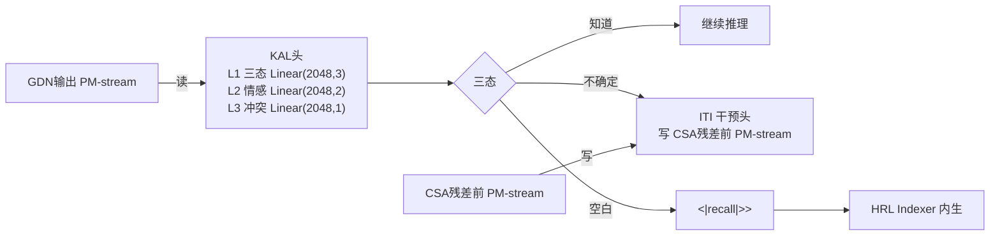
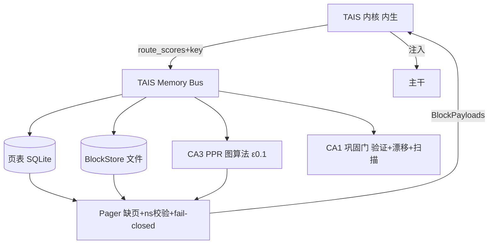

# TAIS Obsidian 接口与实现计划（v1.0）

**tais-obsidian ｜ 可落地的部件级工程规格——从接口到训练到信号到数据**

- 日期：2026-07-26
- 配套：《子系统架构规格 v1.0》、《细致框架设计文档 v2.5》、`article_ref/`（含本轮新核实的 6 篇元认知框架 + cSPW-R + Kairos）
- 目标：把"是什么部件"翻译成"怎么写代码、怎么训练、捕捉什么信号、需要什么数据、注意什么红线"——可直接进入 D-0 之后的实现。
- 范围：**KAL 与 HRL 给出完整接口签名 + 训练数据协议 + 信号清单**（用户点名细化）；主干/载体/写通道/词表给关键接口与红线。

> 约定：🔧=工程红线；🧠=承重神经映射；📐=接口签名（Python 伪代码）；📡=须捕捉信号；📊=训练数据；⭐=已核实文献。

---

## 0. checkpoint 边界判定（本轮核心决策，用户已选 B）

**判定：HRL 的"学习型头"内生 checkpoint，"数据/算法"走运行时服务。**

| 部件 | 归属 | 依据 |
|---|---|---|
| KAL L1/L2/L3 头、ITI 干预头 | 🟢 **内生 checkpoint** | 被训练的权重；Fleming aPFC 内生映射 |
| **HRL Indexer 打分头** | 🟢 **内生 checkpoint** | ⭐ Titans 记忆模块内生（arXiv:2501.00663）；⭐ Memory Layers 键值是**训练参数**（arXiv:2412.09764）；MoE router 必须**与主干同训**才能稳定 RL（§27.3 R3/GSPO/RSPO 教训）——HRL Indexer 要 T3 RL 就必须在 checkpoint，否则 train-inference 差异破坏 T3 |
| HRL DG 投影（稀疏 key 编码） | 🟢 **内生 checkpoint** | 模式分离的投影矩阵是学习参数 |
| 侧信道头簇 ×5 | 🟢 **内生 checkpoint** | 各头是 `nn.Linear` 抽头 |
| 增强A记忆层 keys/values | 🟢 **内生 checkpoint**（训练期）+ 运行时 delta 写入 | ⭐ Memory Layers：keys/values 训练所得，运行时 delta 写入由构造分布内 |
| 页表（Block Spec 元数据） | 🟡 **运行时服务**（SQLite） | 数据非权重 |
| BlockStore（块载荷） | 🟡 **运行时服务**（文件存储） | 数据非权重 |
| CA3 PPR 图算法 | 🟡 **运行时服务** | 算法（用内生 Indexer 分数做种子） |
| CA1 巩固门逻辑 | 🟡 **运行时服务** | 规则+回归测试（用内生冲突检测头信号） |
| 苏醒序列调度 | 🟡 **运行时服务** | 软件时钟 |

**工程含义**：`model/` 包只放**前向可微、随 state_dict 存取**的部件；`runtime/` 包放**数据/算法/IO**。两者经 **TAIS Memory Bus** 通信——主干一次前向内调"TAIS 内核"读 PM-stream，内核经 Bus 调运行时取块、回填注入。

---

## 1. 代码包结构（在现有 `src/tais_obsidian/` 上扩展）

```
src/tais_obsidian/
  model/                      # 🟢 checkpoint 内生（前向可微）
    tri_attention.py          # TriRetrievalAttention 三级检索注意力（滑窗+CSA+HCA+可选 indexer）
    gdn.py                    # GDN-MemBlock（已有）
    model.py                  # TaisObsidianForCausalLM（已有，加内核挂点）
    blockpath.py              # CSA 块通路（已有）
    pmstream.py               # mHC PM-stream（已有）
    kal.py                    # KAL 各头（已有，扩展 L2/L3/ITI）
    hrl_heads.py              # 【新】HRL Indexer + DG 投影 + 侧信道头簇（内生）
    memlayer.py               # 【新】增强A记忆层（product-key KV，内生+delta 写）
    injection.py              # 【新】注入点接口（KV拼接/向量加法/记忆层查询）
    tais_kernel.py            # 【新】TAIS 内核：统一前向接口，聚合 KAL+HRL头
  runtime/                    # 🟡 运行时服务（数据/算法/IO）
    bus.py                    # TAIS Memory Bus（内核↔服务 RPC/进程内调用）
    pager.py                  # 缺页处理 + namespace 校验 + fail-closed
    blockstore.py             # 块载荷文件存储 + L0/L1/L2 分页
    pagetable.py              # 页表 SQLite（Block Spec 元数据）
    ca3_ppr.py                # CA3 PPR 图算法（用 Indexer 分数种子）
    ca1_gate.py               # CA1 巩固门（验证门 + 回归测试）
    awakener.py               # 苏醒序列调度
    state_ckpt.py             # 【关键缺口】GDN 状态 save/restore（自研）
  sleep/                      # 离线固化
    consolidator.py           # 睡眠巩固器（间隔提取练习+蒸馏+SHY）
    distill.py                # W4 函数空间 On-Policy Context Distillation
  config.py data/ train.py generate.py   # 已有
```

---

## 2. TAIS 内核接口（内生部件统一前向）

📐 **核心思想**：主干每个 CSA 层残差前、每个 GDN 层输出后，调内核读写 PM-stream。内核聚合所有内生头，一次前向产出**感知信号 + 路由分数 + 注入载荷**。

```python
# model/tais_kernel.py
class TAISKernel(nn.Module):
    """聚合 KAL + HRL 内生头，挂在主干 PM-stream 上。随 state_dict 存取。"""
    def __init__(self, cfg: ModelConfig):
        self.kal = KALHeads(cfg)            # L1 三态 / L2 情感 / L3 冲突 / ITI
        self.hrl_indexer = HRLIndexer(cfg)  # 统一打分头（token域/块域）
        self.dg_proj = DGProjection(cfg)    # 稀疏 key 编码
        self.side_heads = SideChannelHeads(cfg)  # 预取/写显著/冲突/归因/联想 ×5
        self.memlayer = MemoryLayer(cfg)    # 增强A（可选，按 cfg.enable_memlayer）

    def sense(self, pm_out: Tensor, layer_idx: int) -> SenseOut:
        """读 GDN 输出 PM-stream：返三态/情感/写显著/归因信号（零副作用）。"""
        return SenseOut(pik=self.kal.L1(pm_out), affect=self.kal.L2(pm_out),
                        write_sal=self.side_heads.write_salience(pm_out), ...)

    def route(self, query: Tensor, ctx: RouteCtx) -> RouteOut:
        """HRL Indexer 打分（块域）+ DG 稀疏 key；返 route_scores 给运行时 Pager。"""
        sparse_key = self.dg_proj(query)
        return RouteOut(key=sparse_key, scores=self.hrl_indexer(query, ctx))

    def inject(self, pm_pre: Tensor, payloads: list[BlockPayload]) -> Tensor:
        """写 CSA 残差前 PM-stream：KV拼接/向量加法/ITI/记忆层查询。返回修改后 PM-stream。"""
```

🔧 **监测/执行分置红线**：`sense()` 只读 GDN 输出层；`inject()` 只写 CSA 残差前层——**不同层读写**，避免探针读到自己刚写的干预而自激（PMC9053853 监测/控制分离）。

---

## 3. KAL 详细实现（用户点名细化）

> 🧠 承重映射：**前额叶元认知**（Fleming aPFC/rlPFC）。⭐ 线性探针即足够（arXiv:2606.02628：4-bit NF4 下 0.904–1.000 AUROC，MLP 探针极少超线性 +0.01）。

### 3.1 KAL L1 三态头（P(IK)）
- **是什么**：读 GDN 输出 PM-stream，输出"知道/不确定/空白"三态 + 校准概率。
- **做什么**：推理中持续监测；空白→触发 `<|recall|>`；不确定→ITI 调制；作 T3 过程奖励。
- **怎么实现**：
  ```python
  # model/kal.py（扩展现有）
  class KALHeads(nn.Module):
      def __init__(self, cfg):
          d = cfg.hidden_size  # 2048
          self.L1 = nn.Linear(d, 3)   # 三态 logits（朴素线性，⭐线性即足够）
          self.L2 = nn.Linear(d, 2)   # valence, arousal
          self.L3 = nn.Linear(d, 1)   # 冲突概率（远期）
          self.iti = ITIHead(cfg)     # 干预方向投影
      def forward(self, pm_out): return self.L1(pm_out), self.L2(pm_out), ...
  ```
  挂点 ℓ10/14/18（28 层 36–64% 深度，与 2606.02628 峰值带 50–90% 部分重叠、略偏前捕获早出线性特征）。多挂点取**加权融合**（各层 AUROC 作权重，T1 标定）。
- **怎么训练**：
  - **预训练后期**：以 **P(IK) 辅助目标**参与训练（⭐ Kadavath arXiv:2207.05221 范式）。
  - **T2 监督**：已知集（模型答对）/未知集（截止后实体 + 合成虚构实体）二分类 + **预测-反馈循环**（先预测能否答对→给反馈；单纯预测无效，反馈必要——认知科学 N=518 证据）。
  - **校准对准绝对值**：辅助损失 = Brier/预期校准误差 ECE（⭐ Barkan arXiv:2512.24661：瓶颈在校准非判别，"决策对估计理性但估计乐观"）。
  - **定期重校准**：T2 后每 N 次睡眠固化重训探针（⭐ Kadavath：新任务漂移；BCI 解码器再校准制度）。
- **📡 须捕捉信号**：① P(IK) 三态概率；② 校准曲线（ECE/Brier）；③ 探针 AUROC（vs token 概率、自报置信度两基线）；④ FPR95 / AURC（⭐ AutoMeco EMNLP 2025 协议）；⑤ 各挂点 AUROC（标定融合权重）。
- **📊 训练数据**：
  - 已知集：预训练语料中模型已掌握的事实（用模型自己答题正确性打标）。
  - 未知集：① 时间截止后新增实体（ Wikidata 截止日之后）；② 合成虚构实体（FECAM/合成名字）；③ 边界例（模型答错但自信）。
  - **预测-反馈对**：`(问题, 模型预测能否答对, 实际是否答对)`。
- **🔧 红线**：① 探针**冻结**做只读监测，不对其加生成损失（否则模型把不确定重编码到不可读基底——Meta-R1/NeurIPS 激活监控的安全警示）；② 不靠自报置信度（⭐ Turpin：CoT 系统性误表真实原因）；③ 评测避开"配对标签 vs 采样检测器"结构性误配（2606.02628）。

### 3.2 KAL L2 情感头（valence/arousal）
- **是什么/做什么**：输出效价/唤醒度；arousal 接写显著性头（高 arousal=惊讶=值得记）；valence 入 route_key；调制 HCA 压缩率。
- **怎么实现**：`nn.Linear(d, 2)`，与 L1 共享 PM-stream 读取点与训练管线（成本≈0）。
- **怎么训练**：T2；**ground truth 不来自模型自评**（防自指循环）——外部信号 bootstrap（用户纠正/显式反馈/文本情感分类器），模型自标签仅在 CA1 复核后用。
- **📡 信号**：valence/arousal 时间序列；与写显著性头的相关性；固化优先级 vs saliency。
- **📊 数据**：外部情感标注（情感分类器在交互日志上的输出 + 用户显式反馈）；不要用模型自标做训练标签。
- **🔧 红线**：情感头不得给自己出题（自指循环）；🧠 McGaugh 杏仁核映射为 affect 权重项（中承重）。

### 3.3 KAL L3 冲突检测头 + ITI 干预头
- **L3 冲突**：`nn.Linear(d,1)`，注入矛盾/一致块对训练；作 CA1 仲裁执行器（🧠 前岛叶/dmPFC 显著性网络）。远期项。
- **ITI 干预**：把真实度方向写 CSA 残差前 PM-stream（⭐ ITI arXiv:2306.03341：32.5%→65.1%，数百样本即可）。T2 蒸馏为内生干预头；🔧 **向量冻结做偏置注入，绝不对探针信号加损失项**。

### 3.4 原生动作 token
- **`<|recall|>`/`<|blank|>`/`<|gist|>`** 在词表内（与 `<|ref|>/<|box|>` 同范式）；🔧 **必须显式出现在 CoT 中**（隐形路径显形化，审计接口——⭐ Turpin CoT 不忠实对策）。
- **训练**：T2 SFT + T3 RL（TIAR 轨迹知情奖励 GRPO，§27.2）；T3 加"说-做分歧"惩罚项。



---

## 4. HRL 详细实现（用户点名细化）

> 🧠 承重映射：**海马（DG/CA3/CA1）+ 内嗅**；⭐ **海马索引理论**（页表=索引，块载荷=皮层内容——HRL→注入拓扑唯一理论依据）。

### 4.1 HRL Indexer 打分头（🟢 内生 checkpoint）
- **是什么**：统一打分头——块域（检索块）+ token 域（CSA 选摘要）同构；远期 +专家域（MoE）。
- **做什么**：给候选块打分（FP8 分块归并）；用 CSA indexer 权重初始化再做块域 KL 对齐。
- **怎么实现**：
  ```python
  # model/hrl_heads.py
  class HRLIndexer(nn.Module):
      def __init__(self, cfg):
          self.score = nn.Linear(cfg.hidden_size, 1)  # 打分头
          # 用 CSA indexer 权重初始化（load from attention.py）
      def forward(self, query, candidates):
          # 🔧 不物化全分数张量（StreamIndex 红线）：分块归并 top-k
          return topk_scores
  class DGProjection(nn.Module):
      def __init__(self, cfg): self.proj = nn.Linear(cfg.hidden_size, cfg.dg_dim)
      def forward(self, x): return sparse_topk(self.proj(x))  # 稀疏 key 防碰撞
  ```
- **怎么训练**：T2 **KL 蒸馏 warmup**（TGR-MoE/DSA 式：稠密教师先枚举全块打分，学生 KL 对齐）；🔧 **辅助损失梯度只进 Indexer，禁止污染主干**；T3 转统一 RL。
- **📡 信号**：① 块检索 recall@k；② Indexer 分布 vs 教师分布 KL；③ T3 路由一致性（相邻策略块选择 Jaccard 重叠——§27.3 MoE-RL 教训）。
- **📊 数据**：稠密教师打分（离线枚举全块）；下游任务"该任务需要哪块"的弱标注（可由任务成败反推）。
- **🔧 红线**：辅助损失梯度隔离；T3 防路由振荡（序列级重要性裁剪 GSPO、ε 退火）。

### 4.2 侧信道头簇 ×5（🟢 内生 checkpoint）
| 头 | `nn.Linear` | 信号 |
|---|---|---|
| 预取预测头 ℓ4/ℓ10 | `(d, n_blocks)` | 下一思考段所需块预测 |
| 写显著性头 ℓ10/ℓ14 | `(d, 1)` | 惊讶度 KL 阈值→W0 加标 |
| 冲突检测头 ℓ14 | `(d, 1)` | 块-上下文矛盾→CA1 |
| 归因监测头 ℓ18 | `(d, 2)` | 注入质量/usage_count |
| 联想触发头 ℓ14 | `(d, 1)` | ε-greedy 开 CA3 PPR |
- **训练**：各头独立小目标，不进主干损失；T2-T3 训；写显著性头接 KAL L2 arousal（⭐ Titans 惊讶度门控同源）。

### 4.3 运行时服务（🟡 TAIS Memory Bus）
- **页表 `pagetable.py`**：SQLite，Block Spec 字段——`block_id, route_key, affect{valence,arousal,saliency}, temporal_ctx, spatial_coord, namespace, version, signature, ttl, usage_count, compiled_kind, merged_flag`。⭐ Zep 双时态模型 `valid_at/ingested_at` 补进。
- **BlockStore `blockstore.py`**：块载荷文件存储；L0 VRAM（常驻个位数块）/L1 DRAM/L2 NVMe 分页。
- **CA3 PPR `ca3_ppr.py`**：⭐ HippoRAG 式 Personalized PageRank 在块图上扩散（ε≈0.1），landmark 锚点块（知识图中心性高）作种子；用内生 Indexer 分数做种子。🧠 CA3 自动联想。
- **CA1 巩固门 `ca1_gate.py`**：① 块升格/并入准入（高 usage_count + 回归验证 + ⭐ GATES 共识度）；② 验证门（⭐ Kairos NORA 2025：验证通过的推理才强化路径；⚠️ workshop PoC，配 Ramsauer Hopfield ✅ 加固）；③ **信念漂移监测**（⭐ MemoryGraft arXiv:2512.16962：检测被腐蚀的信念非动作）；④ 接入 ⭐ MS 后门扫描器（arXiv:2602.03085，机制已核；具体检出率数字待全文）做 draft 区筛查。🧠 CA1 巩固。
- **Pager `pager.py`**：缺页处理 + namespace 校验（模型/层/压缩矩阵版本/dtype/RoPE 五元组）+ **fail-closed** 回退（重算/文本 RAG）。
- **state_ckpt `state_ckpt.py`**：🔧 **关键工程缺口**——自研 GDN 状态 save/restore（llama.cpp slot 不存 SSM 状态，discussion #24043）。



---

## 5. 主干与注入点（关键接口）

- **GDN-MemBlock**（A2）：递归状态=工作记忆；🔧 W-State 须自研 state checkpointing；GDN 遗忘性由 CSA 补偿。
- **TriRetrievalAttention**（A3）：滑窗 L0 + CSA stride-4 压缩选择 L1 + HCA 128:1 gist L2；**`harvest()` 自编译接口**（⭐ ICAE 4× / ⭐ kv-distill 99%）；块 KV 拼接注入；可选独立 LightningIndexer（tri_use_indexer）。
- **HCA 重压缩**（A4）：128:1 gist；🔧 **块注入原生落点**；W-State 不得在 HCA 上游改残差（Part Z 红线）。
- **PM-stream**（A6）：mHC n=5，恒等初始化 <1e-6；KAL/HRL 读写点。
- **注入点 `injection.py`**：🔧 **载体能力边界**（⭐ 已核实）——token 寻址载体（KV/记忆层）能事实回忆；位置不变向量（ICV/steering）不能。Block Spec 须标"事实召回能力"字段。

### 5.1 块注入接口
```python
@dataclass
class BlockPayload:
    block_id: str; compiled_kind: Literal["kv","mem_entry","icv","steering","concept_slot","lora","gist"]
    layer_ns: tuple  # (model,layer,compVer,dtype,rope) 五元组
    factual_recall: bool  # 🔧 载体能力边界标注
    signature: bytes
class Injector:
    def inject(self, pm_pre, payloads: list[BlockPayload]) -> Tensor:
        for p in payloads:
            assert verify_ns(p.layer_ns, self.ctx)  # 🔧 fail-closed
            if p.compiled_kind in ("kv","gist"):  # 拼接 CSA 压缩区
            elif p.compiled_kind == "mem_entry":   # 记忆层查询
            elif p.compiled_kind in ("icv","steering"):  # PM-stream 加法
```

---

## 6. 记忆载体 / 写通道 / 睡眠 / 词表（关键红线）

| 部件 | 载体 | 事实召回 | 关键红线/依据 |
|---|---|---|---|
| KV 块 | CSA harvest | ✅ | namespace 五元组校验 + fail-closed |
| 增强A记忆层 | product-key delta | ✅ | 写入与 GDN delta 同构（分布内）⭐ Memory Layers |
| 向量块 ICV/steering | 位置不变 | ❌ | 只 steer 行为；人格块冻结只读 ⭐ ICV 2311.06668 |
| 路径块 | 图序列 | 部分 | ⭐ Kairos 验证门控 Hebbian |
| 概念槽 | 输入侧向量 | 部分 | 输入免费/输出窄升 ⭐ Over-Tokenized/Kaplan |

- **W0-W4 写通道**：🔧 读写不对称——运行时只 W0-W2（零梯度快写），W3+ 仅离线；🧠 三因子 STDP（ACh 暂不固化/DA 升级，⭐ Brzosko 2017 最硬）。
- **睡眠巩固器**：间隔提取练习（⭐ d≈0.46）→CA1 门→蒸馏（On-Policy Context Distillation，同优化器 Muon）→SHY 归一化（非 LRU）；🔧 **离线锁定**（🧠 cSPW-R DOWN 态=合并锁 ⭐ Vöröslakos/Buzsáki 2026 全文已核，升回🟢承重）。
- **动态词表**：第0级 concept_slot（KAL 词表摩擦→Kaplan 提取→注册）；第1级升格（reserved 槽+自蒸馏 CPT 仅训 W_E/W_U）；🔧 输入宽进/输出窄升；跨设备槽位命名空间中心协调。

---

## 7. 数据需求汇总 📊

| 部件 | 数据 |
|---|---|
| KAL L1 | 已知集（模型答对）/未知集（截止后实体+合成虚构+边界例）/预测-反馈对 |
| KAL L2 | 外部情感标注（分类器+用户反馈，**非模型自标**）|
| HRL Indexer | 稠密教师打分（离线枚举全块）/任务-块弱标注 |
| 块固化 | 校验集回归（提取练习）/ 环境反馈（Verilator 等 verifier）|
| 概念槽 | 高频多 token 概念候选（语料共现统计）|
| 安全 | 投毒块对（⭐ MemoryGraft 范式）/ 后门样本 |

---

## 8. 信号捕获清单 📡（tensorboard / W0 日志）

**感知**：P(IK) 三态、valence/arousal、写显著性、冲突概率、词表摩擦（高熵碎片）。
**路由**：Indexer recall@k、教师 KL、路由 Jaccard、CA3 PPR 命中。
**注入**：usage_count、归因注意力质量、namespace 校验失败率。
**校准**：ECE/Brier、AUROC、FPR95、AURC（vs token 概率/自报置信度基线）。
**安全**：draft 区异常率、签名校验失败、信念漂移距离。

---

## 9. 训练时序与依赖

| 阶段 | KAL | HRL Indexer | 侧信道 | 词表 | 奖励 |
|---|---|---|---|---|---|
| T1 预训练后期 | P(IK) 辅助目标 | CSA indexer 权重初始化 | — | reserved 噪声占位 | — |
| T2 信号对齐 | L1/L2 监督+预测反馈；ITI 蒸馏 | KL warmup（梯度隔离）| 独立小目标 | — | — |
| T3 行为塑形 | 三态作过程奖励 | 统一 RL+路由一致性 | RL | — | TIAR 轨迹知情 |
| 睡眠固化（每次）| 探针重校准（每 N 次）| — | 轨迹回放 | 第1级升格 CPT | — |

🔧 **关键依赖**：① Indexer 必须 T2 前内生（否则 T3 无法 RL）；② state_ckpt 必须先于边缘部署；③ KAL 探针强度是 T1 首要观测（§9 开放问题 #1）。

---

## 10. 风险红线汇总

1. **CSA/HCA ↔ 运行时学习干扰**（Part Z）：运行时学习只从 HCA 输出读或独立 KV 分支注入，绝不改冻结压缩器下游残差。D-0 pilot 消融「记忆位置∈{HCA前/HCA后/并行}」。
2. **监测/执行分置**：探针读 GDN 层，干预写 CSA 层，不同层避自激。
3. **探针冻结**：不对探针加生成损失（防重编码到不可读基底）。
4. **载体能力边界**：向量不能事实召回；Block Spec 标注。
5. **读写不对称**：W3+ 仅离线；人格块只读。
6. **注入即攻击面**（⭐ MemoryGraft）：签名+namespace+CA1 漂移监测+MS 扫描器；时间解耦→必须离线筛查。
7. **CoT 忠实性**（⭐ Turpin）：`<|recall|>` 必须显式；归因监测头因果审计。
8. **跨设备词表槽位**：中心协调命名空间防 ID 撞车。

---

## 附录 · 本轮新核实文献（已落入上述规格）

| 文献 | arXiv | 用途 |
|---|---|---|
| cSPW-R（Vöröslakos/Buzsáki 2026）| bioRxiv 714843 | §6 睡眠离线锁定升回🟢承重 |
| Kairos（Singh & Yu, NORA 2025）| CEUR Vol-4162 p4 | §4.3 CA1 验证门（workshop PoC）|
| Meta-R1 | 2508.17291 | §3 KAL 同代（+27.3%，object/meta 分解）|
| AutoMeco | EMNLP 2025 main 171 | §3.1 KAL 评测协议（FPR95/AURC）|
| Know More Clearer | 2602.12996 | §3.1 三态同构（mastered/confused/missing）|
| MeCo | 2502.12961 (ACL 2025) | §3.4 `<|recall|>` 触发同族 |
| Think² | 2602.18806 | §3 监测-执行+自校正 3× |
| MIND | 2509.05714 | §4.3 CA1 知识激活监控 |
| MOSAIC | 2607.16211 | §4.3 **【勘误】agent 记忆冲突检测（66%，4.7×基线），非词表扩展**；支撑 CA1 |
| MemoryGraft | 2512.16962 | §10 注入即攻击面（机制已核）|
| MS Trigger in the Haystack | 2602.03085 | §4.3 后门扫描器（机制已核；87.8% 待全文）|
| **CLEAR** | — | ❌ **误归属删除**（2412.16112 是 DiT 论文）|

*v1.0 与子系统架构规格 v1.0、设计文档 v2.5 配套。HRL checkpoint 边界采用用户选定的方案 B（学习型头内生 + 数据/算法运行时）。所有文献标注见 article_ref/。*
