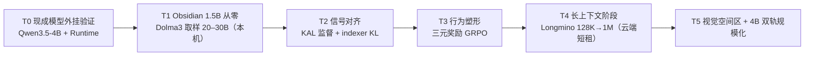

# TAIS Obsidian 细致框架设计文档（v0.5）

**tais-obsidian ｜ 泰斯人工智能复合体 · 黑曜石框架 —— 1.5B 原生 1M 上下文的自学习验证机**

- 日期：2026-07-24（v0.4：正式命名、原生 1M、数据集计划、Carbon 架构图；**v0.5：新增"原生集成收益分析与可行性交叉验证"（§8），KAL 等部件明确为骨干内生设计**）
- 配套图纸：《TAIS_Obsidian_架构详图.png》（InfraTech 式详图 × IBM Carbon 设计语言）
- 配套文档：《动态知识块记忆系统_设计文档》(v0.3)、《DKB-MS_实施规划与路线图》、《自我学习LLM框架构想_HippoK》(v0.2)
- 目标硬件：RTX PRO 4000 Blackwell SFF（24GB GDDR7、432GB/s）

> 命名：TAIS = 泰斯人工智能复合体（Tais AI Syndicate）；Obsidian = 黑曜石框架。模型谱系：TAIS Obsidian 1B / 1.5B /（远期）4B-A1B。

---

## 1. 框架总览

**Carbon 风格详图（PNG）**：


**Mermaid 总览（预览器可渲染）**：

```mermaid
flowchart TB
  subgraph BB["基础主干 28 层 = 7 × {3 GDN + 1 CSA-Attn}（~1.5B，原生 1M）"]
    direction TB
    EMB["Embedding（tied，vocab 129280）<br/>+ 视觉 token 接口 + 知识块注入点"]
    GDN["3 × GDN-MemBlock<br/>递归状态 = 工作记忆寄存器（原生无界）"]
    CSA["1 × CSA-AttnBlock<br/>stride-4 压缩 + indexer top-128 + 滑窗 512"]
    HEAD["RMSNorm → LM-Head（DoLa 开关）→ MTP"]
    EMB --> GDN --> CSA --> HEAD
  end

  KAL["知识感知层 KAL<br/>探针 ℓ10/14/18 → 三态 → ITI / DoLa / 回想"]
  HRL["海马路由层 HRL（类 MoE · 双向）<br/>DG 分离 → Indexer → 页表 ｜ CA3 PPR ｜ CA1 巩固门"]
  RT["DKB-Runtime<br/>API 网关 ｜ Pager ｜ BlockStore ｜ 注入中间件"]
  KB[("知识块库（双形态）")]
  MEM["L0 VRAM ↔ L1 DRAM ↔ L2 NVMe"]
  SLP["睡眠巩固器（离线）"]
  VIS["视觉空间区<br/>ViT → 3×3 → CSA ｜ &lt;|ref|&gt;/&lt;|box|&gt; 推理内交织"]

  BB -- "中层 hidden" --> KAL
  KAL -- "回想 query" --> HRL
  HRL <-- "TAIS Memory Bus" --> RT
  RT <-- KB
  KB -. "读通道注入" .-> BB
  RT --- MEM
  BB -. "W0 日志" .-> SLP
  SLP -. "固化新块" .-> KB
  VIS --> EMB
```

## 2. 模型配置（TAIS Obsidian 1.5B，初值待 scaling 校准）

| 项目 | 配置 |
|---|---|
| 规模 | ~1.5B dense（MoE 变体另列）；28 层 = 7×{3 GDN + 1 CSA-Attn}；hidden 2048 |
| 词表 | 129280，tied embedding（控制 embedding 占比） |
| GDN 层 | KDA 式 Gated DeltaNet，16 头 × 128，通道级门控，DPLR chunk kernel |
| CSA 层 | GQA 16Q/2KV × 128，partial RoPE；stride-4 学习压缩器；FP8 indexer top-128；滑窗 512 |
| 原生部件 | KAL 探针挂点（ℓ10/14/18，W[2048,3]）、知识块注入点、HRL 页表接口 |
| 上下文 | **原生 1M**（§3）；GDN 层无 KV cache，CSA 层 1M 时压缩 KV ≈ 0.1GB/层（FP8） |
| 变体 | Obsidian-MoE：FFN 换 64 专家选 4 + 1 共享（总 1.5B / 激活 ~0.5B），验证"知识块即专家" |

## 3. 原生 1M 上下文训练方案（v0.4 核心修订）

**原则：1M 能力在训练内获得，不依赖推理时缩放。** 依托三份配方证据：

1. **渐进长度课程**：预训练 32K → 中训练 128K → 长上下文阶段 1M。CSA 层使长序列训练成本近似线性（indexer 每 query 只算 O(L) 打分 + O(k) 精细注意力），GDN 层恒定成本——1M 训练在 1.5B 规模算力上可负担；
2. **长文数据**：采用 Dolma 3 **Longmino** 配方——639B token 长文档池（olmOCR 科学 PDF，含 26.9B token 的 1M+ 文档），34% 长文 + 66% 高质量短文混合，gzip 可压缩性过滤（去头尾各 20%），CLIPPER 式合成聚合任务增强，best-fit 文档打包 + 文档内掩码 [^179^][^178^]；
3. **位置编码**：CSA 层 partial RoPE + **训练内 YaRN**（OLMo 3 实证：只对全注意力层应用 YaRN 效果最佳 [^179^]）；GDN 层无位置外推问题（递归状态原生无界）。UltraLong 进一步证明：仅 ~1B token 的长上下文持续训练即可把窗口推到 1M–4M [^17^]。

**训练基建**：1M 阶段需要上下文并行（OLMo 3 用 8-way CP allgather 处理不规则掩码 [^179^]）——单机 24GB 做 1M 全序列训练不现实，**1M 阶段在云端短租执行**（估算：1.5B、50B token 长上下文阶段 ≈ 数十张 H100 数天，成本可承受）；本机完成 ≤128K 阶段。

## 4. 数据集计划（v0.4 新增）

以 **OLMo 3 全开放数据课程**为骨架（权重、数据、配方、checkpoint 全公开，Apache 2.0）：

| 阶段 | 数据集 | 规模 | 说明 |
|---|---|---|---|
| 预训练 | **Dolma 3 Mix**（9.3T 池 → 5.9T 混合）+ FineWeb-Edu 补充 | 本机取样 ~20–30B | 质量感知升采样（top 5% 重复 ~7×）[178] |
| 中训练 | **Dolma 3 Dolmino Mix**（100B：数学/代码/QA/指令/思维轨迹） | 取样 ~10B | 思维轨迹为后期 RL 打底 |
| 长上下文 | **Dolma 3 Longmino Mix**（639B 池） | ~5–10B（云端） | 34%/66% 长短混合 |
| 代码强化 | The Stack v2（67.5TB 池，Apache） | 按比例混入 | 覆盖 600+ 语言 |
| 后训练 | **Dolci**（SFT / DPO / RLVR 三套件） | 按需 | 与三元奖励 GRPO 管线对接 |
| 视觉空间 | 计数/空间关系/迷宫合成 + 开源空间数据集改造 | 自建 | §6 视觉原语训练 |

## 5. BF16 从零训练配方（沿 v0.3，证据增强）

bf16-mixed：bf16 计算 + FP32 主权重 + FP32 优化器 + FP32 梯度累积，16B/参数；OLMo 3 全程 bfloat16 训练达 41–43% MFU，为工业级先例 [^179^]。1.5B 全量训练约 24GB 刚好到顶，**建议启用 8-bit AdamW 留安全余量**；grad clip 1.0、warmup ≥2K 步、QK-Norm、发散自动回滚。禁止纯 bf16。

## 6. 逐模块与视觉空间区（沿 v0.3）

- **主干**：GDN-MemBlock（状态=工作记忆寄存器，预留 state_read/write）；CSA-AttnBlock（KV prefix 块仅注入本层）；注入点接受 LoRA/KV/steering 三载荷；
- **KAL（骨干内生，非外挂探针）**：三态头作为 checkpoint 内的原生权重，预训练阶段即以 P(IK) 式辅助目标参与训练（§8）；输出经**学习型投影**直接写入残差流；回想/空白/总结以**原生特殊 token**（`<|recall|>`、`<|blank|>`、`<|gist|>`，与 `<|ref|>/<|box|>` 同一"生成中的结构化动作"范式）发出；ITI 方向蒸馏为原生干预头。推理时**零外部服务依赖**；
- **HRL**：DG 模式分离 → FP8 分块归并 Indexer（不物化分数张量，StreamIndex 红线）→ 页表；CA3 PPR 联想 ε≈0.1；CA1 巩固门；预测预取器；
- **视觉空间区**：冻结 ViT + 3×3 压缩（→324 token/图）+ CSA 再压 4×；`<|ref|>/<|box|>` 推理内交织；视觉经验固化为空间记忆块（route_key 带坐标邻近度边）；V1 对齐 → V2 原语 SFT → V3 空间 RL。

## 7. 训练方案（T0–T5，修订）



**T1 首要观测指标**：1.5B 规模 KAL 探针 AUROC ≥ 0.8；T4 验收：RULER/HELMET @ 1M 达到同规模报告水平。

## 8. 原生集成的收益与可行性交叉验证（v0.5 新增）

### 8.1 "原生"的判定标准

KAL/HRL/知识块注入**不是外挂服务，而是 checkpoint 的一部分**：① 信号由模型自身前向计算产生（探针读自己的 hidden state，成本≈0）；② 决策以模型自己的 token 发出（`<|recall|>` 等在词表内）；③ 干预通过学习型投影写回残差流；④ 信用分配可端到端（RL 直接奖励"回想→答对"的行为链）。外挂路线（RAG + 外部探针 + prompt 工程）四条都做不到。

### 8.2 收益分析（原生 vs 外挂）

| 维度 | 外挂方案 | 原生方案（TAIS Obsidian） |
|---|---|---|
| 检测成本 | 额外前向 / 外部模型 | 同一次前向，读 hidden state ≈ 免费 |
| 回忆成本 | 重读 markdown（千级 prefill token） | 块注入 ≈ 0 额外 token；LoRA/KV 直接改变计算 |
| 信号质量 | 自报置信度（不可靠）、token 概率（受污染） | 内部状态探针（SAPLMA 71–83%，优于输出分布） |
| 行为塑造 | 提示词工程，脆弱 | RL 端到端塑造（Memory-R1/SEAL 证明可学） |
| 新能力 | 无 | 自我总结（gist 编译）、多时间尺度记忆（CMS 已在 1.3B 验证）、持续学习 |

### 8.3 可行性交叉验证（本轮新证据）

1. **知识感知可训练内化**：Kadavath et al.（Anthropic, 2022）证明模型**可以被训练**预测 P(IK)（"我是否知道"），且在无参考答案时仍有效、随上下文材料增多而合理上升、可部分跨任务泛化（arXiv:2207.05221）。这直接支撑 KAL 的 P(IK) 式辅助目标。注意论文同时发现新任务上校准会漂移——对应我们 T2 阶段的定期重校准设计。
2. **内部诚实 ≠ 口头诚实，且后训练会压垮它**：SAPLMA（71–83%）与 ITI（32.5%→65.1%）证明真实度信息存在于内部状态；"Uncertainty Collapse"（2026）进一步指出"我不知道"是**学来的、在后训练目标下脆弱**的行为——这既是 KAL 的动机，也是风险：三元奖励必须持续压制"自信编造"的吸引子。
3. **持续学习架构在同规模已验证**：HOPE（Nested Learning, Google）在 340M/760M/**1.3B** 上同时超越 Transformer、Gated DeltaNet 与 Titans，且 CMS（连续记忆系统）带来持续学习基准提升；其 NIAH 实验同时证明：纯参数化记忆在精确回忆上不如注意力——**这正是我们保留 CSA 全注意力层、而非纯线性架构的独立证据**。
4. **前向即学习的理论基础**：ICL≈隐式梯度下降（von Oswald et al., ICML 2023；及后续）为"写原语内置于前向计算"提供理论支撑。
5. **元认知不是可选项**：Agentic UQ 研究（2026）发现 LLM 仅有"有限但可用的内省觉察"，且执行后校准反而劣于执行前——系统性过度自信普遍存在，KAL 这类内生元认知是必要的而非锦上添花。

### 8.4 原生化清单（v0.5 冻结）

| 部件 | 原生形式 | 训练时点 |
|---|---|---|
| KAL 三态头 | checkpoint 内权重，P(IK) 辅助目标 | 预训练后期 + T2 |
| 回想/空白/总结 token | 词表内特殊 token | T2 SFT + T3 RL |
| ITI 干预 | 蒸馏为原生干预头（学习型投影） | T2 |
| 自我总结 | `<|gist|>` + ICAE 式压缩目标，产出 slot tokens | T2–T3 |
| HRL 索引器 | 原生轻量打分头（KL 对齐稠密分布） | T2（DSA warmup 式） |
| 知识块注入点 | 每层残差后标准接口（结构内预留） | 预训练即存在 |

## 9. 开放问题（v0.4）

1. 1.5B 的 KAL 探针信号强度（T1 首要观测）；
2. 本机 20–30B token 预训练的能力天花板——接受它，机制验证不与 OLMo 3 比通用分；
3. 1M 阶段上下文并行的最短云租成本测算（待 T4 前细化）；
4. GDN 层在 1M 下的状态饱和与"远古信息"衰减行为（线性注意力的已知弱点，CSA 层补偿是否充分）；
5. 沿用前文档：记忆归因评测、块粒度、人格演化边界、跨底座迁移、MoE 块即专家。

---

## 10. 与市面框架的对比与路径有效性复核（v0.6 新增）

### 10.1 市场现状（2026 年中，经检索核实）

- **OpenAI Dreaming V3**（2026.06）：后台进程自动综合记忆，取代 saved-memories 列表；记忆条目随时间自我更新（"将去新加坡"→"已去过"）；官方评测事实回忆 41.5%→82.8%（三年跨度），偏好遵循 31.4%→71.3%，时效性任务 9.4%→75.1%；成本降 5 倍后推向免费层。**本质是"睡眠巩固器"的工业版，但记忆形态仍是文本条目，不涉及权重。**
- **Claude Memory**（2026.03 起免费，07 改为逐条分类条目）：条目式、对话中更新、月度回顾；局限被普遍指出——是"画像不是记录"、不捕获决策与推理链、锁定单一产品、无团队共享。
- **Agent 记忆三强**：Mem0（向量优先，AWS Agent SDK 独家，2025Q3 处理 1.86 亿次调用）、Zep/Graphiti（时态知识图谱，事实带有效期窗口）、Letta/MemGPT（OS 式分页，agent 自管 core/recall/archival 三层）。评测基准收敛于 LoCoMo/LongMemEval/BEAM，但厂商自报与独立复测差距可达 45 分（Mem0 案例）——**评测方法学仍是战区**。BEAM 显示 1M→10M 时性能掉 ~25%，规模化的时态抽象仍是开放问题。
- **Eywa**（arXiv:2605.30771）：源证据为权威底材、抽取事实为可修订索引——与我们"markdown 源代码 = ground truth、编译产物 = 可失效缓存"的双形态设计完全同构。

### 10.2 逐维对比

| 维度 | 市面最佳实践 | TAIS Obsidian | 判定 |
|---|---|---|---|
| 离线记忆巩固 | OpenAI Dreaming（文本条目） | 睡眠巩固器（文本→权重编译） | 同路线，我们深一层 |
| 记忆分层 | Letta 三层（core/recall/archival） | L0/L1/L2 分页 + 苏醒序列 | 同构，我们多冷启动顺序 |
| 时态与版本 | Zep 有效期窗口 | 版本+时间戳+置信度仲裁 | 相当，需借鉴其双时态模型 |
| 溯源与可审计 | Eywa 源证据底材 | markdown 源代码形态 | 同构 |
| 记忆形态 | 全部是文本/图条目 | **权重级知识块（LoRA/KV/steering）** | **独占** |
| 元认知（知道自己不知道） | 无原生机制 | KAL 三态头 + ITI/DoLa + 三元奖励 | **独占** |
| 写通道（自我进化） | 无（权重冻结） | 双向接口（读同步/写异步） | **独占** |
| 跨域联想 | 向量近邻 | CA3 PPR 联想 + ε 探索 | 我们更激进，待验证 |
| 人格 | 无 | 人格块（persona vectors）常驻只读 | **独占** |
| 数据主权 | 厂商锁定 | 全栈自托管 | 独占（开源路线） |

### 10.3 路径有效性结论

1. **方向被工业界独立收敛验证**：离线巩固（Dreaming）、分层分页（Letta）、时态版本（Zep）、溯源底材（Eywa）——我们设计的四个支柱都在 2026 年被各自独立地做成产品，说明问题定义正确；
2. **差异化恰好在无人区**：所有市面方案的记忆形态都是**文本**，没有任何产品把记忆编译为权重、没有原生元认知、没有写通道——这正是 TAIS Obsidian 的研究贡献空间；
3. **必须借鉴的三点**：① 采用 LoCoMo/LongMemEval/BEAM 作为标准评测（否则无法对话）；② Zep 的双时态模型（valid_at/ingested_at）补进 Block Spec；③ 警惕厂商式自报分数——记忆归因评测必须第三方可复现。

---

*v0.6 与 Carbon 风格架构详图配套。旧版命名 HippoK 废止，统一为 TAIS Obsidian（tais-obsidian）。*
