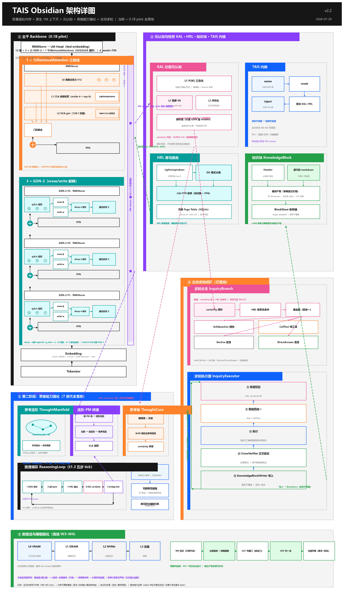
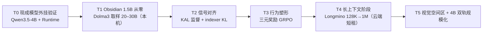

# TAIS Obsidian 细致框架设计文档（v2.5）

**tais-obsidian ｜ 泰斯人工智能复合体 · 黑曜石框架 —— 1.5B 原生 1M 上下文的自学习验证机**

- 日期：2026-07-24（v0.4：正式命名、原生 1M、数据集计划、Carbon 架构图；**v0.5：新增"原生集成收益分析与可行性交叉验证"（§8），KAL 等部件明确为骨干内生设计**）；2026-07-26（**v2.4：新增 §28「动态词表：三级生长阶梯与全谱系自包含」——tokenizer 动态化，数据中心到边缘全谱系自我评估/自我编译/自我更新，端侧睡眠自治**；**v2.5：新增 §29「第三轮独立交叉验证：五大架构命题逐项复核」——对"自我进化/逐会话学习/元认知闭环/注意力自编译/动态词表"五命题做联网独立复核，补充 11 项新证据（TTT-E2E、量化态探针、MemoryGraft、Titans 三变体同构、Kaplan 输出侧扩表、Over-Tokenized 输入侧 log-linear、Microsoft 后门扫描器等），修订 §26.2 安全对策与 §28.7 词表边界**）
- 配套图纸：《TAIS_Obsidian_架构详图.png》（InfraTech 式详图 × IBM Carbon 设计语言）
- 配套文档：《动态知识块记忆系统_设计文档》(v0.4)、《从零构建TAIS-Obsidian_总体实施计划》(v0.4)、《TAIS_Obsidian_子系统架构规格》(v1.0)、《TAIS_Obsidian_接口与实现计划》(v1.0)、《TAIS_Obsidian_部件实现详细计划》(v1.0)
- 目标硬件：RTX PRO 4000 Blackwell SFF（24GB GDDR7、432GB/s）

> 命名：TAIS = 泰斯人工智能复合体（Tais AI Syndicate）；Obsidian = 黑曜石框架。模型谱系：TAIS Obsidian 1B / 1.5B /（远期）4B-A1B。

---

## 1. 框架总览

**Carbon 风格详图（PNG）**：



**Mermaid 总览（预览器可渲染）**：

```mermaid
flowchart TB
  subgraph BB["基础主干 28 层 = 7 × 〔3 GDN + 1 CSA-Attn〕（~1.5B，原生 1M）"]
    direction TB
    EMB["Embedding（tied，vocab 129280）<br/>+ 视觉 token 接口 + 知识块注入点"]
    GDN["3 × GDN-MemBlock<br/>递归状态 = 工作记忆寄存器（原生无界）"]
    CSA["1 × TriRetrievalAttention<br/>滑窗 512 L0 + CSA stride-4 选择检索 L1 + HCA 128:1 gist L2"]
    HEAD["RMSNorm → LM-Head（DoLa 开关）→ MTP"]
    EMB --> GDN --> CSA --> HEAD
  end

  KAL["知识感知层 KAL<br/>探针 ℓ10/14/18 → 三态 → ITI / DoLa / 回想"]
  HRL["海马路由层 HRL（类 MoE · 双向）<br/>DG 分离 → Indexer → 页表 ｜ CA3 PPR ｜ CA1 巩固门"]
  RT["DKB-Runtime<br/>API 网关 ｜ Pager ｜ BlockStore ｜ 注入中间件"]
  KB[("知识块库（双形态）")]
  MEM["L0 VRAM ↔ L1 DRAM ↔ L2 NVMe"]
  SLP["睡眠巩固器（离线）"]
  VIS["视觉空间区<br/>ViT → 3×3 → CSA ｜ &lt;|ref|&gt;/&lt;|box|&gt; 推理内交织"]

  BB -- "中层 hidden" --> KAL
  KAL -- "回想 query" --> HRL
  HRL <-- "TAIS Memory Bus" --> RT
  RT <-- KB
  KB -. "读通道注入" .-> BB
  RT --- MEM
  BB -. "W0 日志" .-> SLP
  SLP -. "固化新块" .-> KB
  VIS --> EMB
```

## 2. 模型配置（TAIS Obsidian 1.5B，初值待 scaling 校准）

| 项目 | 配置 |
|---|---|
| 规模 | ~1.5B dense（MoE 变体另列）；28 层 = 7×{3 GDN + 1 CSA-Attn}；hidden 2048 |
| 词表 | 129280（含 **2048 个 reserved 扩展槽**，预训练噪声占位防 glitch token，供 §28 动态词表升格），tied embedding（控制 embedding 占比） |
| GDN 层 | KDA 式 Gated DeltaNet，16 头 × 128，通道级门控，DPLR chunk kernel |
| CSA 层 | GQA 16Q/2KV × 128，partial RoPE；stride-4 学习压缩器；FP8 indexer top-128；滑窗 512 |
| 原生部件 | KAL 探针挂点（ℓ10/14/18，W[2048,3]）、知识块注入点、HRL 页表接口 |
| 上下文 | **原生 1M**（§3）；GDN 层无 KV cache，CSA 层 1M 时压缩 KV ≈ 0.1GB/层（FP8） |
| 变体 | Obsidian-MoE：FFN 换 64 专家选 4 + 1 共享（总 1.5B / 激活 ~0.5B），验证"知识块即专家" |

## 3. 原生 1M 上下文训练方案（v0.4 核心修订）

**原则：1M 能力在训练内获得，不依赖推理时缩放。** 依托三份配方证据：

1. **渐进长度课程**：预训练 32K → 中训练 128K → 长上下文阶段 1M。CSA 层使长序列训练成本近似线性（indexer 每 query 只算 O(L) 打分 + O(k) 精细注意力），GDN 层恒定成本——1M 训练在 1.5B 规模算力上可负担；
2. **长文数据**：采用 Dolma 3 **Longmino** 配方——639B token 长文档池（olmOCR 科学 PDF，含 26.9B token 的 1M+ 文档），34% 长文 + 66% 高质量短文混合，gzip 可压缩性过滤（去头尾各 20%），CLIPPER 式合成聚合任务增强，best-fit 文档打包 + 文档内掩码  [(kyleclo.com)](https://kyleclo.com/assets/pdf/olmo-3.pdf) ；
3. **位置编码**：CSA 层 partial RoPE + **训练内 YaRN**（OLMo 3 实证：只对全注意力层应用 YaRN 效果最佳  [(kyleclo.com)](https://kyleclo.com/assets/pdf/olmo-3.pdf) ）；GDN 层无位置外推问题（递归状态原生无界）。UltraLong 进一步证明：仅 ~1B token 的长上下文持续训练即可把窗口推到 1M–4M  [(arXiv.org)](https://arxiv.org/html/2504.06214v1) 。

**训练基建**：1M 阶段需要上下文并行（OLMo 3 用 8-way CP allgather 处理不规则掩码  [(kyleclo.com)](https://kyleclo.com/assets/pdf/olmo-3.pdf) ）——单机 24GB 做 1M 全序列训练不现实，**1M 阶段在云端短租执行**（估算：1.5B、50B token 长上下文阶段 ≈ 数十张 H100 数天，成本可承受）；本机完成 ≤128K 阶段。

## 4. 数据集计划（v0.4 新增）

以 **OLMo 3 全开放数据课程**为骨架（权重、数据、配方、checkpoint 全公开，Apache 2.0）：

| 阶段 | 数据集 | 规模 | 说明 |
|---|---|---|---|
| 预训练 | **Dolma 3 Mix**（9.3T 池 → 5.9T 混合）+ FineWeb-Edu 补充 | 本机取样 ~20–30B | 质量感知升采样（top 5% 重复 ~7×）[178] |
| 中训练 | **Dolma 3 Dolmino Mix**（100B：数学/代码/QA/指令/思维轨迹） | 取样 ~10B | 思维轨迹为后期 RL 打底 |
| 长上下文 | **Dolma 3 Longmino Mix**（639B 池） | ~5–10B（云端） | 34%/66% 长短混合 |
| 代码强化 | The Stack v2（67.5TB 池，Apache） | 按比例混入 | 覆盖 600+ 语言 |
| 后训练 | **Dolci**（SFT / DPO / RLVR 三套件） | 按需 | 与三元奖励 GRPO 管线对接 |
| 视觉空间 | 计数/空间关系/迷宫合成 + 开源空间数据集改造 | 自建 | §6 视觉原语训练 |

## 5. BF16 从零训练配方（沿 v0.3，证据增强）

bf16-mixed：bf16 计算 + FP32 主权重 + FP32 优化器 + FP32 梯度累积，16B/参数；OLMo 3 全程 bfloat16 训练达 41–43% MFU，为工业级先例  [(kyleclo.com)](https://kyleclo.com/assets/pdf/olmo-3.pdf) 。1.5B 全量训练约 24GB 刚好到顶，**建议启用 8-bit AdamW 留安全余量**；grad clip 1.0、warmup ≥2K 步、QK-Norm、发散自动回滚。禁止纯 bf16。

## 6. 逐模块与视觉空间区（沿 v0.3）

- **主干**：GDN-MemBlock（状态=工作记忆寄存器，预留 state_read/write）；TriRetrievalAttention（三级检索注意力：滑窗 L0 + CSA 选择检索 L1 + HCA gist L2，KV prefix 块仅注入本层）；注入点接受 LoRA/KV/steering 三载荷；
- **KAL（骨干内生，非外挂探针）**：三态头作为 checkpoint 内的原生权重，预训练阶段即以 P(IK) 式辅助目标参与训练（§8）；输出经**学习型投影**直接写入残差流；回想/空白/总结以**原生特殊 token**（`<|recall|>`、`<|blank|>`、`<|gist|>`，与 `<|ref|>/<|box|>` 同一"生成中的结构化动作"范式）发出；ITI 方向蒸馏为原生干预头。推理时**零外部服务依赖**；
- **HRL**：DG 模式分离 → FP8 分块归并 Indexer（不物化分数张量，StreamIndex 红线）→ 页表；CA3 PPR 联想 ε≈0.1；CA1 巩固门；预测预取器；
- **视觉空间区**：冻结 ViT + 3×3 压缩（→324 token/图）+ CSA 再压 4×；`<|ref|>/<|box|>` 推理内交织；视觉经验固化为空间记忆块（route_key 带坐标邻近度边）；V1 对齐 → V2 原语 SFT → V3 空间 RL。

## 7. 训练方案（T0–T5，修订）



**T1 首要观测指标**：1.5B 规模 KAL 探针 AUROC ≥ 0.8；**内词典提取成功率**（§28.4：多 token 概念的 detokenized 表示能否零梯度注入复用，与探针强度同属 1.5B 未知项）；T4 验收：RULER/HELMET @ 1M 达到同规模报告水平。

## 8. 原生集成的收益与可行性交叉验证（v0.5 新增）

### 8.1 "原生"的判定标准

KAL/HRL/知识块注入**不是外挂服务，而是 checkpoint 的一部分**：① 信号由模型自身前向计算产生（探针读自己的 hidden state，成本≈0）；② 决策以模型自己的 token 发出（`<|recall|>` 等在词表内）；③ 干预通过学习型投影写回残差流；④ 信用分配可端到端（RL 直接奖励"回想→答对"的行为链）。外挂路线（RAG + 外部探针 + prompt 工程）四条都做不到。

### 8.2 收益分析（原生 vs 外挂）

| 维度 | 外挂方案 | 原生方案（TAIS Obsidian） |
|---|---|---|
| 检测成本 | 额外前向 / 外部模型 | 同一次前向，读 hidden state ≈ 免费 |
| 回忆成本 | 重读 markdown（千级 prefill token） | 块注入 ≈ 0 额外 token；LoRA/KV 直接改变计算 |
| 信号质量 | 自报置信度（不可靠）、token 概率（受污染） | 内部状态探针（SAPLMA 71–83%，优于输出分布） |
| 行为塑造 | 提示词工程，脆弱 | RL 端到端塑造（Memory-R1/SEAL 证明可学） |
| 新能力 | 无 | 自我总结（gist 编译）、多时间尺度记忆（CMS 已在 1.3B 验证）、持续学习 |

### 8.3 可行性交叉验证（本轮新证据）

1. **知识感知可训练内化**：Kadavath et al.（Anthropic, 2022）证明模型**可以被训练**预测 P(IK)（"我是否知道"），且在无参考答案时仍有效、随上下文材料增多而合理上升、可部分跨任务泛化（arXiv:2207.05221）。这直接支撑 KAL 的 P(IK) 式辅助目标。注意论文同时发现新任务上校准会漂移——对应我们 T2 阶段的定期重校准设计。
2. **内部诚实 ≠ 口头诚实，且后训练会压垮它**：SAPLMA（71–83%）与 ITI（32.5%→65.1%）证明真实度信息存在于内部状态；"Uncertainty Collapse"（2026）进一步指出"我不知道"是**学来的、在后训练目标下脆弱**的行为——这既是 KAL 的动机，也是风险：三元奖励必须持续压制"自信编造"的吸引子。
3. **持续学习架构在同规模已验证**：HOPE（Nested Learning, Google）在 340M/760M/**1.3B** 上同时超越 Transformer、Gated DeltaNet 与 Titans，且 CMS（连续记忆系统）带来持续学习基准提升；其 NIAH 实验同时证明：纯参数化记忆在精确回忆上不如注意力——**这正是我们保留 CSA 全注意力层、而非纯线性架构的独立证据**。
4. **前向即学习的理论基础**：ICL≈隐式梯度下降（von Oswald et al., ICML 2023；及后续）为"写原语内置于前向计算"提供理论支撑。
5. **元认知不是可选项**：Agentic UQ 研究（2026）发现 LLM 仅有"有限但可用的内省觉察"，且执行后校准反而劣于执行前——系统性过度自信普遍存在，KAL 这类内生元认知是必要的而非锦上添花。

### 8.4 原生化清单（v0.5 冻结）

| 部件 | 原生形式 | 训练时点 |
|---|---|---|
| KAL 三态头 | checkpoint 内权重，P(IK) 辅助目标 | 预训练后期 + T2 |
| 回想/空白/总结 token | 词表内特殊 token | T2 SFT + T3 RL |
| ITI 干预 | 蒸馏为原生干预头（学习型投影） | T2 |
| 自我总结 | `<|gist|>` + ICAE 式压缩目标，产出 slot tokens | T2–T3 |
| HRL 索引器 | 原生轻量打分头（KL 对齐稠密分布） | T2（DSA warmup 式） |
| 知识块注入点 | 每层残差后标准接口（结构内预留） | 预训练即存在 |

## 9. 开放问题（v0.4）

1. 1.5B 的 KAL 探针信号强度（T1 首要观测）；
2. 本机 20–30B token 预训练的能力天花板——接受它，机制验证不与 OLMo 3 比通用分；
3. 1M 阶段上下文并行的最短云租成本测算（待 T4 前细化）；
4. GDN 层在 1M 下的状态饱和与"远古信息"衰减行为（线性注意力的已知弱点，CSA 层补偿是否充分）；
5. 沿用前文档：记忆归因评测、块粒度、人格演化边界、跨底座迁移、MoE 块即专家。

---

## 10. 与市面框架的对比与路径有效性复核（v0.6 新增）

### 10.1 市场现状（2026 年中，经检索核实）

- **OpenAI Dreaming V3**（2026.06）：后台进程自动综合记忆，取代 saved-memories 列表；记忆条目随时间自我更新（"将去新加坡"→"已去过"）；官方评测事实回忆 41.5%→82.8%（三年跨度），偏好遵循 31.4%→71.3%，时效性任务 9.4%→75.1%；成本降 5 倍后推向免费层。**本质是"睡眠巩固器"的工业版，但记忆形态仍是文本条目，不涉及权重。**
- **Claude Memory**（2026.03 起免费，07 改为逐条分类条目）：条目式、对话中更新、月度回顾；局限被普遍指出——是"画像不是记录"、不捕获决策与推理链、锁定单一产品、无团队共享。
- **Agent 记忆三强**：Mem0（向量优先，AWS Agent SDK 独家，2025Q3 处理 1.86 亿次调用）、Zep/Graphiti（时态知识图谱，事实带有效期窗口）、Letta/MemGPT（OS 式分页，agent 自管 core/recall/archival 三层）。评测基准收敛于 LoCoMo/LongMemEval/BEAM，但厂商自报与独立复测差距可达 45 分（Mem0 案例）——**评测方法学仍是战区**。BEAM 显示 1M→10M 时性能掉 ~25%，规模化的时态抽象仍是开放问题。
- **Eywa**（arXiv:2605.30771）：源证据为权威底材、抽取事实为可修订索引——与我们"markdown 源代码 = ground truth、编译产物 = 可失效缓存"的双形态设计完全同构。

### 10.2 逐维对比

| 维度 | 市面最佳实践 | TAIS Obsidian | 判定 |
|---|---|---|---|
| 离线记忆巩固 | OpenAI Dreaming（文本条目） | 睡眠巩固器（文本→权重编译） | 同路线，我们深一层 |
| 记忆分层 | Letta 三层（core/recall/archival） | L0/L1/L2 分页 + 苏醒序列 | 同构，我们多冷启动顺序 |
| 时态与版本 | Zep 有效期窗口 | 版本+时间戳+置信度仲裁 | 相当，需借鉴其双时态模型 |
| 溯源与可审计 | Eywa 源证据底材 | markdown 源代码形态 | 同构 |
| 记忆形态 | 全部是文本/图条目 | **权重级知识块（LoRA/KV/steering）** | **独占** |
| 元认知（知道自己不知道） | 无原生机制 | KAL 三态头 + ITI/DoLa + 三元奖励 | **独占** |
| 写通道（自我进化） | 无（权重冻结） | 双向接口（读同步/写异步） | **独占** |
| 跨域联想 | 向量近邻 | CA3 PPR 联想 + ε 探索 | 我们更激进，待验证 |
| 人格 | 无 | 人格块（persona vectors）常驻只读 | **独占** |
| 数据主权 | 厂商锁定 | 全栈自托管 | 独占（开源路线） |

### 10.3 路径有效性结论

1. **方向被工业界独立收敛验证**：离线巩固（Dreaming）、分层分页（Letta）、时态版本（Zep）、溯源底材（Eywa）——我们设计的四个支柱都在 2026 年被各自独立地做成产品，说明问题定义正确；
2. **差异化恰好在无人区**：所有市面方案的记忆形态都是**文本**，没有任何产品把记忆编译为权重、没有原生元认知、没有写通道——这正是 TAIS Obsidian 的研究贡献空间；
3. **必须借鉴的三点**：① 采用 LoCoMo/LongMemEval/BEAM 作为标准评测（否则无法对话）；② Zep 的双时态模型（valid_at/ingested_at）补进 Block Spec；③ 警惕厂商式自报分数——记忆归因评测必须第三方可复现。

---

## 11. CSA 原生块通路 与 HRL 侧信道头簇（v0.7 新增）

### 11.1 知识块导出/注入与 CSA 层的结合：三级整合（仅限陈述性块）

**决策：陈述性块的导出与注入深度绑定 CSA 层；LoRA/steering 载荷保持层无关。**

1. **导出 = CSA 压缩收割**：陈述性块的编译产物不再是独立编码器产物，而是经验文本经本模型 CSA 层前向后**收割的压缩 KV entries**（stride-4 学习压缩器就是免费的、与推理时完全同分布的编译器）。GDN 层另可导出 state snapshot 作为第四种块形态（工作记忆快照）。依据：KV cache 本质是"LLM 原生的知识表示"（LMCache 技术报告）；跨时间 KV 复用已被验证（RelayCaching：解码相 KV 可复用于后续 prefill，偏差稀疏且集中于中间层，少量关键 token 重算即可矫正，80%+ 复用率）。
2. **注入 = CSA 压缩区拼接**：块 KV 拼接进 CSA 层压缩 KV 区域，带块边界标记与 namespace 校验（模型/层/压缩矩阵版本/dtype/RoPE 五元组一致才允许注入——vLLM Semantic KV Reuse RFC 的 namespace isolation 教训）；失败一律 fail-closed 回退重算/文本 RAG。
3. **索引器统一**：HRL 块索引器与 CSA token 索引器同构，**用 CSA indexer 权重初始化**再做块域 KL 对齐；远期演进为"多域索引器"（token 域/块域 + 域标志位）——一个打分器，两种检索对象。

**风险与对策**：① 前缀偏差——导出 KV 编码时无未来 query 前缀，分布有偏移；对策：APE 式自适应缩放 + 关键 token 重算，且**原生优势**是从训练起就让模型学会产出可注入块（Block-Attention 式目标）；② 载体绑定——CSA 压缩 KV 绑定同模型同层，跨模型迁移只能走 markdown 源代码重编译（已在 Block Spec 中声明）；③ 压缩有损——高精度需求块保留原文回退路径。

### 11.2 HRL 侧信道头簇（新增五个原生微头，全部 <1% 参数）

挂在主干不同深度、经 TAIS Memory Bus 连接 HRL，主干保持干净（旁路抽头，不改残差流）：

| 头 | 挂载深度 | 功能 | 证据/类比 |
|---|---|---|---|
| 预取预测头 | ℓ4/ℓ10 | 预测下一思考段所需块，提前挂载（分支预测器） | AttnRes 跨深度读取哲学；PreScope |
| 写显著性头 | ℓ10/ℓ14 | 在线判定"值得记"（惊讶度 KL 阈值 + 用户纠正 + 复用潜力）→ W0 日志加标 | Titans 惊讶度门控；LM2 层级门控 |
| 冲突检测头 | ℓ14 | 检索块与当前上下文矛盾 → 路由至 CA1 仲裁 | 版本仲裁的执行器 |
| 归因监测头 | ℓ18 | 注入后测量注意力质量/输出归因 → usage_count + 路由器 RL 奖励 | 回应"记忆归因评测"开放问题 |
| 联想触发头 | ℓ14 | 决定何时开启 CA3 PPR 探索（ε-greedy 情境化：头脑风暴 vs 严谨） | ABC 学习型记忆探测策略 |

**训练路径（按 NGC 证据修订）**：indexer 与各头先 KL-warmup（DSA 式，对齐稠密教师），T3 起切换**统一目标 RL**——记忆决策与推理共用同一奖励信号（NGC, 2026.04 证明统一目标优于分离 warmup + detach，且免除独立 warmup 阶段）。

---

## 12. 动态参数增长与全层感知互联（v0.8 新增）

### 12.1 核心命题：基座参数 = "基础意识"，知识块 = 可增长的经验参数

用户的原始设想经文献核实后形式化为：**基座模型（如 27B）训练完成后不再全量改动，能力的后续增长完全通过知识块的累积实现——等效参数量动态增长，而基座保持稳定自我认知。** 这解决智能体时代的核心矛盾：外部 md 技能文件占用上下文、效果差、模型"读得懂但用不出"。

**自我习得闭环（以数字电路设计为例）**：

```
环境试错（Verilator/仿真器 = 可验证奖励源，Absolute Zero 式自play）
  → 成功/失败轨迹 + 环境反馈落 W0 日志（写显著性头加标）
  → 睡眠时间：轨迹蒸馏为程序性 LoRA 技能块（LatentSkill/S2L 路径）
  → CA1 巩固门验证（回归测试）→ 注册页表
  → 后续任务：KAL 识别领域 → HRL 路由注入 → 模型"凭直觉"使用技能
```

**四条独立证据**：
1. **LatentSkill**（arXiv:2606.06087，2026.06）：技能编码为独立于主干的 LoRA，零上下文开销 + 即插即用——与我们程序性块完全同构的先行验证；我们的增量：路由、双形态、生命周期、KAL 触发。
2. **SKILL0 / Skill-to-LoRA**（2026.06）：**渐进撤出技能上下文的课程式训练**——先让模型看着技能文档做，逐步撤走文档，用环境反馈 RL，最终技能内化。这是我们 T3.5 阶段的训练范式原型。
3. **Absolute Zero**（2505.03335）及后续（可学习前沿任务生成）：模型自提出、自解决、可验证奖励闭环——数字电路设计场景中，Verilator 仿真结果就是天然 verifier，无需人工标注。
4. **MetaClaw**（2603.17187）：技能必须随策略演化做版本管理（support/query 分离）——印证我们 Block Spec 的版本字段与"路由器-模型共漂移"防线。

**参数账本**：27B 基座冻结；每个技能块 LoRA r16 ≈ 20–60MB（约 0.1–0.2% 基座参数）；千块级技能库 ≈ 20–60GB 磁盘、L0 常驻个位数块——**"动态参数量"在物理上是分页的虚拟地址空间，这正是最初"页表"类比的完整闭环**。

### 12.2 全层感知互联：mHC 感知-记忆流（架构级优化）

问题：KAL/HRL 若只在个别层抽头，感知与路由信号无法贯穿全部计算。解法采用 DeepSeek mHC（arXiv:2512.24880，27B 验证、开销仅 6.7%）：

- 残差流由单流扩展为 **n=5 条并行流**：4 条内容流（标准 mHC）+ **1 条感知-记忆流（PM-stream）**；
- KAL 各头从 PM-stream 读取信号（而非从内容流抽头，避免干扰主计算）；HRL 的路由决策、注入标记、ITI 干预向量经 H_post 映射**写入 PM-stream**，随残差传播到所有后续层；
- 稳定性由 mHC 的双随机约束（Sinkhorn-Knopp 投影到 Birkhoff 多胞形）保证——HC 无约束时信号放大峰值 3000×，mHC 压到 1.6×；
- 备选/互补：AttnRes 式深度维注意力做跨层检索（Kimi K3 已验证）。

这是"KAL/HRL 与模型各层相连"的结构化解：**不做蜘蛛网式的旁路连线，而是给残差流修一条专用车道。**

### 12.3 情感感知扩展（Affective Perception Head）

KAL 头簇的可复制扩展：情感效价/唤醒度二头，从 PM-stream 读取（外推设计，依据：人格特质已被证明是激活空间线性方向——Persona Vectors；情绪状态作为线性探针目标是同族外推，**证据强度弱于 KAL，列为 T4 后实验项**）。用途：① 人格块的行为一致性约束；② 用户状态自适应（挫败/困惑时调整策略）；③ 冲突检测头的情绪加权。

### 12.4 训练方案增补

T3 与 T4 之间插入 **T3.5 技能习得阶段**：自选领域（数字电路设计为旗舰场景，Verilator 为 verifier）→ Absolute Zero 式自play + SKILL0 式课程撤出 → 技能块固化 → 块库扩容回归测试。

---

## 13. Reasoning-native 设计与规模化路径（v0.9 新增）

### 13.1 默认推理能力：架构前提而非可选模式

**TAIS Obsidian 默认以 CoT 推理运行**（非指令切换），记忆调用发生在推理过程内部。证据与配方：

- **1.5B 规模 RLVR 已被证明高效**：1-shot RLVR 将 Qwen2.5-Math-1.5B 的 MATH500 从 36.0% 提升至 73.6%，且出现"饱和后泛化"与自我反思频率上升现象；纯熵损失无奖励也能 +27.4%——小模型推理的门槛远低于直觉；
- **重要的反面证据**：Outcome Rewards Do Not Guarantee Verifiable Reasoning（2026.04）——纯结果奖励不保证推理链因果重要，且 1.5B 上更明显；对策：① 少量专家 SFT 种子（N=8 即显著提升 CIR/SR）；② 辅助过程奖励（CIR reward）。我们的 KAL 三态信号可作为天然的过程奖励来源；
- **旗舰技能场景已有先例**：QiMeng-CodeV-R1（Verilog 生成 RLVR，规则化 testbench 作 verifier）7B 在 RTLLM 上超越 671B DeepSeek-R1——**数字电路设计的"Verilator 即 verifier"技能习得路径被独立验证**。

### 13.2 推理中的记忆调用闭环（Reasoning-native 核心）

```
CoT 思考段 → KAL 持续监测（PM-stream 三态信号）
  ├─ 知道 → 继续推理
  ├─ 不确定 → ITI/DoLa 调制后继续
  └─ 空白 → 生成 <|recall|>（推理流内的结构化动作）
       → HRL 路由（精确 + PPR 联想）→ 块注入（CSA 压缩区 / LoRA / steering）
       → 带着记忆继续推理 → 全程落 W0 日志 → 睡眠固化
```

要点：`<|recall|>` 与 `<|gist|>` 是**推理轨迹内部的 token**，模型学会在思考的哪一刻回想——训练手段 = 三元奖励 GRPO + SKILL0 式课程撤出（先看着记忆用，再撤走外部提示）。

### 13.3 Persona Vectors 强化（人格块的工程化）

- 人格块 = **冻结的 persona vector 组**（自动化管线从自然语言描述提取）+ 人格摘要 + 行为边界，常驻 L0、运行时只读；
- **训练期**：preventative steering（微调时向残差流加 +α·v）防止人格漂移——实证 MMLU 几乎无损；微调前后激活沿向量位移与特质变化相关 r=0.76–0.97；训练数据可按投影差预先 flag 问题样本；
- **部署期**：投影监测（r=0.75–0.83）漂移，超阈值触发 CA1 仲裁或回滚；
- **纪律红线**：向量**冻结**做偏置注入，绝不对探针信号加损失项——否则模型会把特质重编码到不可读基底（作者自证 + 社区共识的失败模式）；
- 推理期人格调制：同一向量可按 α 调节表达强度（如"更严谨"/"更活泼"）。

### 13.4 mHC 感知-记忆流与 GDN/CSA 层的连接规范

- 残差流 n=5：4 内容流 + **1 PM-stream**；双随机约束保证稳定（信号放大 ≤1.6×）；
- **感知访问（读）**：KAL 三态头、四个侧信道头（ℓ8 预取 / ℓ14 写显著·冲突 / ℓ18 归因·联想）统一从 **GDN-MemBlock 输出处的 PM-stream** 读取——GDN 层的状态压缩特性使其输出最适合做"已理解内容"的摘要信号；
- **注入访问（写）**：HRL 的载荷经 H_post 映射写入 **TriRetrievalAttention 残差前的 PM-stream**——紧邻全局检索层，注入信息立刻参与注意力计算；KV prefix 块直接拼入 CSA 压缩 KV 区（§11.1）；
- 人格向量也经 PM-stream 注入（与 KAL/ITI 共用通路，单一写入纪律）。

### 13.5 规模化路径（1.5B 验证 → 生产规模）

| 型号 | 规模 | 定位 | 关键验证点 |
|---|---|---|---|
| **Obsidian 1.5B** | 28 层 dense | 想法验证（本机全量训练） | KAL 探针强度、闭环可行性、RLVR 推理 |
| Obsidian 9B | 40 层 dense | 实用门槛 | 技能库规模（千块级）干扰测试 |
| Obsidian 27B | dense | "基础意识"主力 | mHC 原文验证规模；动态参数账本 |
| Obsidian 30B-A6B | MoE | 效率生产版 | "知识块即专家"路由融合、1M 服务成本 |

原则：**所有原生部件（KAL/HRL/PM-stream/注入点/块规范）跨规模不变**，只扩主干——验证机与生产机共享同一套 ABI。

---

## 14. 部署后"边推理边自我学习"可行性终验（v1.0 新增）

### 14.1 精确表述：三个时间尺度的"学习"

**判定：可以做到，但"边推理边学习"在物理上是三层结构，而非全程实时梯度更新。**

| 时间尺度 | 发生什么 | 证据 |
|---|---|---|
| **实时**（每思考段） | KAL 感知、回想、知识块注入（LoRA/KV/steering 热插拔）、W0 日志记录 | TT-SI（ACL 2026：agent 推理中自我改进，单样本即可）；OLIVIA（冻结主干 + 决策层在线轻量更新 + 显式不确定性）；TF-TTCL（冻结模型从自身推理经验蒸馏规则在线提升）；LOGO（实例级 LoRA 动态选择合并，~2s/样本可工程化） |
| **准实时**（秒–分钟） | 快速编译：新经验 → LoRA 块（可选加速路径） | Sakana Doc-to-LoRA/Text-to-LoRA：超网单次前向 <1s 生成 LoRA，明确提出"nap 间蒸馏、醒后更新"的记忆架构与共享 update API 愿景——即我们睡眠编译器的摊销版 |
| **睡眠期**（离线） | W3–W4 深度固化、验证门、三元奖励 GRPO 行为塑形 | 2026 行业共识：对基座权重的实时梯度更新仍罕见（安全/评测/回滚成本）；生产节奏 = 日/周级 adapter + 月级 DPO/GRPO——与我们的 W0–W4 分级完全一致 |

### 14.2 三条反面证据与对策（必须长期在线的防线）

1. **Misevolution**（Trust-Memevo, 2602.03224）：即使在理想真值反馈下，记忆演化也会出现"任务效用升、可信度降"的错位演化 → 对策：双形态可审计 + 归因监测头 + 定期外部评测集"记忆体检"；
2. **Zombie Agents**（2602.15654）：自强化注入可实现对自进化 agent 的持久控制；不可信来源写入的记忆会持续塑造未来行为 → 对策：draft 区隔离、签名、CA1 巩固门、人格块只读；
3. **可塑性损失 scaling law**（2606.24752）：即使大 Transformer 也终将丧失可塑性，且 onset 可预测 → 我们的架构天然规避：基座冻结（无需基座可塑性），可塑性全部外包给知识块；代价转为"块间干扰"（9B 阶段实测项）。

安全维度另注：LessWrong 的持续学习安全分析（2026.06）提出的缓解措施——文本形式更新的可读性、角色训练、部署期审计——恰好对应我们的 markdown 源代码形态（监测面）与人格块冻结（角色锚点）；默认不开启跨实例共享记忆（防模因传播）。

### 14.3 最终结论

**架构设计的每一项"部署后学习"能力都有 2025–2026 年的独立文献或工业先例支撑；独特贡献在于把它们统一进一个原生、分页、可审计的架构。剩余未验证项全部是工程与评测问题（块间干扰、归因基准、1B 级探针强度），而非原理障碍。**

---

## 15. 外部评估整合：理论桥确认与三处增强（v1.1 新增）

*来源：用户上传的外部评估附件（Copilot 分析）+ 本轮联网交叉验证。*

### 15.1 理论桥确认：块注入 ≈ 低秩训练的前向实现

**核心引用已核实**：Dherin et al.《Learning without training: The implicit dynamics of in-context learning》（arXiv:2507.16003，Google Research，2026.06 更新至 v4）——带上下文的前向在数学上等价于无上下文前向 + MLP 权重的 rank-1 低秩更新，损失曲线几乎重合。配合 von Oswald（ICML 2023）与 Dai（ACL 2023）的 ICL≈梯度下降证据链：**KV 块注入不是"类似微调"，而是低秩权重修改的另一种实现**。

**精度差同样有据**：NeurIPS 2025 Spotlight《Understanding Parametric and Contextual Knowledge Reconciliation》证明参数化知识与上下文知识走**不同的注意力头集合**，竞争只发生在同类内部；P-RAG 研究（arXiv:2510.12668）证明参数化注入"提供高层引导但证据整合有限"，**两者结合（PT-RAG）最优**——这既是"模糊回忆"（海马 vs 皮层）的机理注脚，也是我们**双通道载荷（文本+权重）设计**的独立支持。

### 15.2 增强 A：GDN 旁挂稀疏 KV 可写记忆层（采纳 + 改进）

采纳附件建议：在 GDN-MemBlock 输出处增加 Memory-Layers-at-Scale 式稀疏 key-value 查找（128B 参数/1T token 已验证，事实任务强、零额外 FLOPs），陈述性块**优先写入此原生记忆层**而非拼接 CSA KV 区。

**我们的改进——delta rule 写入一致性**：附件方案的运行时写入仍有"写入分布"问题（Memory Layers 的 key 是训练所得，运行时新 key 可能落在训练流形外）。解法：写入规则**与 GDN 自身的 delta 规则同构**——`S ← S + β(v − v̄)⊗k`（先擦除旧关联再写入），使运行时写入**由构造保证在分布内**（Fast Weight Programmer 视角）；容量管理复用 GDN 的门控衰减（可整段遗忘）。这是把"外挂记忆层"真正变成"海马原生回路"的关键一步。

### 15.3 增强 B：CSA `harvest()` 自编译接口（采纳 + 澄清）

采纳：CSA 压缩输出暴露为可持久化接口（ICAE 式目标训练，4× 压缩近无损）。**澄清一个格式问题**：harvest 的产物是**同一来源的两个编译目标**——① CSA 格式 KV（供 CSA 层拼接注入）；② 记忆层格式 (key, value) 条目（供增强 A 的记忆层写入）。两者不可混用，Block Spec 的 compiled.kind 需相应扩展。高频 harvest 块可"就地写入"同层记忆层，形成"感知→压缩→存→取"同层闭环，并由归因监测头跟踪。

### 15.4 增强 C：情感感知头提前至 KAL 同期（采纳 + 验证状态标注）

采纳：valence/arousal 二头与 KAL 三态头共享训练管线，从 PM-stream 读取（与 KAL 同挂载点），输出接写显著性头（**高 arousal = 惊讶 = 值得记**，与 Titans 惊讶度门控、闪光灯记忆文献同源）。**验证状态如实标注**：附件引用的 Anthropic《Emotion Concepts and their Function in a LLM》（transformer-circuits.pub）与 Latent Context LM（arXiv:2606.09659）本轮搜索**未能独立复验**；情感作为线性可提取方向的原理与 steering-vector 文献一致，列为"方向可信、引用待复核"。

### 15.5 本轮交叉验证清单

| 引用 | 状态 |
|---|---|
| arXiv:2507.16003（ICL=低秩权重更新） | ✅ 已核实（Google Research，v4） |
| NeurIPS 2025 知识调和（参数/上下文知识分头） | ✅ 已核实（Spotlight） |
| arXiv:2510.12668（P-RAG/PT-RAG） | ✅ 已核实 |
| Anthropic 情感电路论文 | ⚠️ 未复验（方向可信） |
| arXiv:2606.09659（Latent Context LM） | ⚠️ 未复验（存疑，使用时需先核实） |

---

## 16. 感知记忆通路整合：情感调制总线与内外空间统一（v1.2 新增，增强 E）

*来源：用户上传的第二份外部评估附件 + 本轮交叉验证。核心命题：情感不是独立模块，而是贯穿记忆全周期（编码/固化/检索）的调制总线（McGaugh 杏仁核-海马调制理论）；KAL 分层化；人格双门控；HRL 统一内外空间导航。*

### 16.1 Block Spec v0.2：新增 `affect` 字段（采纳 + 防循环改进）

```
affect: { valence: [-1,1], arousal: [0,1], saliency: float }
```
编码时快照情感状态；固化优先级受 saliency 加权（McGaugh：高唤起=高优先固化）；route_key 加入情感上下文投影（情感匹配召回）。**改进（防自指循环）**：情感标签的初期 ground truth **不来自模型自己的情感头**（否则头在给自己出题），而从外部信号 bootstrap——用户纠正、显式反馈、文本情感分类器；模型自标签仅在 CA1 巩固门复核后使用。

### 16.2 KAL 分层元认知（采纳）

L1 知识感知（P(IK)，现有）→ L2 语境情感感知（valence/arousal，`W[d,2]`，与 L1 共享 PM-stream 读取点与训练管线，成本≈0）→ L3 语境一致性感知（冲突检测头，远期）。人格向量对 L1/L2 的阈值做**有界增益调制**（clamp 上下限，防人格漂移传导到检测器）。

### 16.3 人格双门控（采纳 + 证据方向澄清）

HRL 侧：route_key 增 persona 投影（不同人格路由不同程序性块）；感知侧：人格向量调制感知头增益。**澄清**：已核实证据（PersonaAgent with GraphRAG：LaMP 电影标签 F1 +56.1%、新闻 +11.1%，arXiv:2511.17467；PALACE：ACL 2025 Findings 超 SOTA）验证的是**用户人格**条件化检索——我们用于**智能体自身人格**路由技能块属于同族外推，原理支持但实证需自验。防漂移纪律不变：人格向量冻结、块只读、增益有界。

### 16.4 HRL 内外空间统一（采纳，全构想最优雅一环）

HRL = TEM 式认知地图导航器：导航对象同时是**内在空间**（模型潜空间几何，预训练免费习得，indexer 本来就在学检索）与**外在空间**（VIS 物理坐标）——一套关系导航器，两类地图。**落地补充**：知识图中学度/中心性高的块设为 **landmark 锚点块**，作为 CA3 PPR 扩散的种子集，稳定长程联想；注意潜空间几何各向异性，DG 稀疏 key 是必要的去相关手段（§15.2）。

### 16.5 本轮交叉验证清单

| 引用 | 状态 |
|---|---|
| PersonaAgent with GraphRAG（arXiv:2511.17467） | ✅ 已核实（+56.1% F1） |
| PALACE（ACL 2025 Findings, 2025.findings-acl.5） | ✅ 已核实 |
| arXiv:2604.11048（人格引导系统分析） | ⚠️ 未复验 |
| arXiv:2604.02029（The Latent Space 综述） | ⚠️ 未复验 |
| McGaugh 杏仁核调制 / TEM（Cell 2020） | ✅ 教科书级共识，免验 |

---

## 17. CoT 与空间路径：影响、隐形路径与路径块（v1.3 新增）

### 17.1 空间路由对 CoT 的影响（双向）

- **路径引导**：recall 注入把推理"拉向"被召回块的语义邻域——正面：多跳与类比联想增强（HippoRAG 式 +20%）；风险：话题漂移，由 ε 探索率与冲突检测头约束；
- **形态改变**：CoT 从"纯语言链"变为"认知地图上的导航路径"，呈现段落级结构（思考段 ≈ 地图上的区域转移）。

### 17.2 隐形知识路径：设计内的"好路径"与必须管理的"坏路径"

**好路径（设计目标）——轨迹→路径块→技能的三级固化**：
CoT 轨迹本身记录为结构化轨迹日志 `{t, block_id, KAL 状态, affect, action}`（W0 日志的一部分）；睡眠固化时经 **CA1 验证门**——只有验证成功的推理才强化路径（Kairos, NeurIPS 2025 NORA：validation-gated Hebbian，验证过的推理路径边强化 LTP、未用边衰减 LTD、自适应图超静态基线 4.0%——**我们的 CA1 就是这个验证门**）。反复使用的路径固化为**路径块（route block）**：块引用的有序序列 + 进入/退出条件 + 成功率；高度熟练的路径再蒸馏为程序性 LoRA（ACT-R 式程序化：陈述性路径 → 程序性技能）。

**坏路径（必须管理）——CoT 忠实性风险**：
KAL/HRL 的侧信道信息流不进入 CoT 文本，可能加剧"说出的推理 ≠ 实际计算"（faithfulness 文献：模型在链长 70–85% 处即 commit，后续 token 趋于表演性；Turpin/Lanham 证明 CoT 可遗漏真实原因）。对策：① `<|recall|>` 必须显式出现在 CoT 中（隐形路径显形化，审计接口）；② 归因监测头做 CMI 式因果审计（Bypassing the Rationale 方法）；③ T3 训练加入"说-做分歧"惩罚项。

### 17.3 路径的使用与风险

- **使用**：CA3 PPR 对路径做模式补全——走过前几步即补全整条熟路（经验驱动的思维捷径）；预取器沿预测路径提前挂载后续块；
- **风险**：popularity bias（强路径挤压多样性）→ ε 探索 + 路径 decay 对冲；错误路径强化 → CA1 验证门拦截（novelty 与 correctness 正交，不可平均——Kairos 的设计原则）。

---

## 18. 本地全流程可行性评估（v1.4 新增，RTX PRO 4000 SFF）

### 18.1 硬件底数

8960 CUDA 核 / 70 SM / 280 五代张量核 / 24GB GDDR7 ECC / 432GB/s / 70W / FP32 24 TFLOPS（推算 **BF16 张量稠密 ≈ 96 TFLOPS**；AI TOPS 770 为 FP4 稀疏口径）。训练有效算力按 30–40% MFU 估：**≈ 30–40 TFLOPS**。

### 18.2 显存账（bf16-mixed + 8-bit AdamW + 梯度检查点）

| 规模 | 权重2 + 主权重4 + 梯度2 + 8bit优化器2 | 加激活 | 判定 |
|---|---|---|---|
| 1B | ~10GB | +4–6GB | ✅ 宽裕 |
| 1.5B | ~15GB | +5–7GB | ✅ 可行（微批 + 检查点） |
| 2B | ~20GB | +6–8GB | ⚠️ 极限（需严格检查点/卸载） |

### 18.3 算力账（6ND，本机 30–40 TFLOPS 有效）

| 任务 | FLOPs | 墙钟时间 |
|---|---|---|
| 0.1B pilot × 2B tokens | 1.2e18 | **0.5–1 天** |
| 0.5B × 8B tokens | 2.4e19 | 7–9 天 |
| 1B × 20B tokens | 1.2e20 | 35–46 天 |
| **1.5B × 30B tokens** | 2.7e20 | **78–104 天**（减到 12B tokens → 31–42 天） |
| 2B × 40B tokens | 4.8e20 | 139–185 天（不推荐本机） |
| SFT（1.5B × 1B tokens） | 9e18 | 2.5–3.5 天 |
| GRPO/RLVR（千题级 rollout） | rollout 主导 | 数天（vLLM 批量解码 ~1–2K tok/s） |

### 18.4 全流程逐项判定

| 环节 | 本机可行性 |
|---|---|
| 预训练（≤1.5B，10–30B tokens） | ✅ 1–3.5 月后台任务 |
| 中训练 / SFT | ✅ 天级 |
| KAL 探针 / indexer KL 对齐 | ✅ 小时–天级（参数 <1%） |
| GRPO 行为塑形 | ✅ 天–周级 |
| 知识块蒸馏（LoRA/块） | ✅ 分钟–小时级/块 |
| DKB-Runtime / 服务 / 评测 | ✅（1.5B BF16 仅 3GB，L0 块缓存可用 10GB+） |
| 数据存储（30B tokens ≈ 90–120GB 文本） | ✅ NVMe |

### 18.5 结论与本地迭代策略

**≤2B 的完整流程本机可以完成，但节奏分层**：0.1B（天级，结构消融：mHC 流数、KAL 头、记忆层、情感总线）→ 0.5B（周级，训练配方）→ **1.5B（月级，正式锚点验证机）**；2B 全量预训练需 4–6 月，**只建议在配方冻结后做一次，或预训练阶段云端短租**。架构迭代闭环（改结构→预训练→评估）在本机以"周–月"为周期可持续运转。

---

## 19. 与 MoE 的系统对比：我们解决的是哪三个 MoE 无法解决的问题（v1.5 新增）

### 19.1 MoE 的文献级病灶（已核实）

1. **专家不可寻址**：decoder MoE 的专家只学到**句法/token 级模式**，不按领域分化（Mixtral 可视化证据；专家数越多分化越弱；浅层几乎不分化）；MoE 综述的开放问题第一条就是"能否在训练中显式标记专家的领域"；
2. **路由器的塌缩动力学**：rich-get-richer 正反馈——不加负载均衡（aux loss/z-loss/容量约束）会收敛到"少数专家穿昂贵外衣"，有效容量反低于 dense；丢 token 损质量，强制均衡又压制自然分化——两难问题无清洁解；
3. **推理/记忆的不对称**：ICLR 2025《Mixture of Parrots》——MoE 在**记忆任务**上等总参可追平 dense，但在**常识推理和数学**上显著弱于 dense、加专家不如加宽度——MoE 本质上是"更好的记忆体，更差的推理器"；
4. **冻结与系统成本**：训练后专家冻结（新知识只能重训）；all-to-all 通信、straggler 效应、全部专家必须驻留显存（总参数决定部署门槛）。

### 19.2 逐维对比

| 维度 | MoE 专家 | TAIS 知识块（HRL 路由） |
|---|---|---|
| 寻址 | 隐式（softmax over 不透明 FFN） | 显式页表（内容寻址 + 元数据） |
| 语义 | 句法级 token 模式 | 领域/技能/经历级语义单元 |
| 可编辑 | 不可（焊死在主干） | 版本化、签名、可回滚、可审计 |
| 增长 | 无（训练后冻结） | 睡眠固化持续注册新块 |
| 路由粒度 | 逐 token（句法驱动） | 逐思考段（语义驱动）+ 预测预取 |
| 路由依据 | 单 softmax 分类器 | DG 分离 + indexer + CA3 PPR 联想（空间导航） |
| 部署 | 全部专家驻留显存 | 块分页（L0/L1/L2），磁盘为底 |
| 失效处理 | 无 | 缺页降级、fail-closed、生命周期淘汰 |

### 19.3 为什么"空间导航 + 动态知识"更好

MoE 路由回答的是"这个 token 像哪个专家见过的 token"（模式匹配）；HRL 回答的是"当前思考需要哪块知识、它的邻近还有什么、上次哪条路走通过"（地图导航）。后者多出的三样东西——**内容可寻址、图结构联想、路径记忆**——正是 MoE 文献自己列出的开放问题（concept-aware routing、hierarchical routing、可标记专家）。诚实边界：MoE 在"容量/FLOPs 效率"上仍是标杆（Parrots 证据说明其记忆容量并不差），我们不在这条赛道竞争；30B-A6B 变体的设计正是"MoE 管容量、HRL 管知识"的互补形态。

---

## 20. 半固定半动态骨干的可行性终评（v1.6 新增）

### 20.1 形态定义与可行性证据

**形态**：冻结/慢更基座（GDN+CSA 主干 + 人格块只读）+ 动态可写部件（GDN 旁挂记忆层条目（delta 规则）、知识块（LoRA/KV/steering）、PM-stream 信号、KAL/HRL 头）。证据链：

1. **GDN 本身就是半固定半动态**：权重固定、状态经 delta 规则动态更新（FWP/Titans/LaCT 已验证）——增强 A 的记忆层是同一写规则的形式扩展，无原理跳跃；
2. **模块化参数隔离 ≈ 零遗忘**：每任务独立小模块 + 推理时路由的持续学习方法报告接近零遗忘（Peng et al. 2025；FastKGE；LoRAX）——我们的块隔离继承此性质；
3. **LoRA 动态件的保护性**：Biderman（TMLR 2024）"learns less and forgets less"——低秩约束本身就是抗遗忘正则；
4. **多时间尺度理论**：HOPE/CMS（1.3B 验证）是"半固定半动态"的形式化——不同更新频率的模块共存是已验证范式。

### 20.2 优点（相对全静态/全动态）

| 对比对象 | 我们的优势 |
|---|---|
| 全静态（现有生产 LLM） | 部署后可持续学习，且基座**永不遗忘**（遗忘被外包为显式、可审计、可逆的块淘汰） |
| 全动态（在线全量微调/TTT） | 无稳定性风险、无对齐漂移（人格 RO）、可回滚 |
| RAG/外挂 | 权重级集成、≈0 token 开销、程序化技能 |
| 周期性重训（工业节奏） | 无重训成本、无重训遗忘事件、增量式 |

### 20.3 缺点与风险（诚实清单 + 对策）

1. **动态件容量天花板**：高熵/复杂知识 LoRA 学不动（Biderman；三种微调范式实证——事实知识首先撞容量瓶颈）→ 对策：W4 定期基座固化（全量 + 回放），且**固化时必须用与预训练相同的优化器**（2605.06654：优化器一致显著降低遗忘——支持我们 Muon 贯穿预训练与固化的选择）；
2. **Intruder dimension 累积**（Shuttleworth, 2410.21228）：LoRA 引入主干不存在的高秩奇异方向，**持续学习中逐块累积会导致性能劣化**——这是千块级技能库最具体的文献级警告 → 对策三条：① 蒸馏时做谱修剪（缩放 intruder 维度，论文证明可恢复预训练分布建模且任务损失极小）；② W4 合并基座即重置累积；③ 探针监测漂移；
3. **基座-块分布漂移**：世界变化使基座表征老化，块能补事实但补不了老化的特征 → 对策：基座定期换代 + 块经 markdown 源代码重编译跨代迁移（双形态的根本价值）；
4. **块蒸馏自身也有遗忘**：LoRA 知识注入同样不能免于遗忘（2601.21577）→ CA1 验证门的回归测试不可省略；
5. **复杂度税**：Runtime/页表/固化管线是真实工程成本。

### 20.4 与现有框架的定位对比

全静态（生产 LLM）< 适配器库（S-LoRA/LoRAX/FastKGE——我们最近的前亲，缺元数据/生命周期/写通道/元认知）< **TAIS Obsidian** < 多时间尺度原生架构（HOPE/CMS——哲学最近，我们多显式注册表 + 软件层 + 可审计性）。**判定：半固定半动态是当前证据下最合理的工程形态；三个风险（容量、累积、老化）均有明确对策且互为补充。**

---

## 21. 受控基座并入：四个空间与固化准入（v1.7 新增，升级 W4）

### 21.1 四级并入机制（按控制力排序）

| 空间 | 机制 | 证据与边界 |
|---|---|---|
| **权重空间**（合并） | TIES / DARE / TSV / KnOTS / CoreSpace / Compress-then-Merge | 免训练，但**随合并次数退化**（OPCM 实证）；LoRA 间纠缠干扰随专家数增长（Tang et al.）——仅用于小规模块间整理，不做主固化路径；有 scaling law 可循（2509.24244） |
| **函数空间**（蒸馏）★首选 | **On-Policy Context Distillation**：带块的模型当教师、裸基座当学生，在学生自己的 rollout 上用 reverse-KL 蒸馏——行为级迁移、分布天然一致；OEL（Ye et al. 2026）已验证"交互经验→周期性蒸馏回权重"的在线学习闭环 | **W4 固化的升级路径**；GATES 共识门控（教师高不确定性时抑制梯度）防回声室——与 CA1 验证门同构 |
| **结构空间**（增长） | Neutral Residues（追加恒等初始化的新层/块，只训新件、旧件全冻） | 零干扰由构造保证；用于块容量天花板被反复撞破时的**基座扩容**（而非修改） |
| **坐标空间**（隔离） | 稀疏/掩码方法（JumpLoRA 可学习门控、ELLA、Piggyback） | 权重内坐标级隔离，粒度最细，作为蒸馏时的干扰抑制辅助 |

### 21.2 固化准入与收尾纪律

1. **准入（CA1 升级）**：只有同时满足高使用计数、回归验证通过、**教师共识度高**（GATES 式：多次采样一致性，低共识抑制蒸馏梯度）的块才有资格并入基座；
2. **过程**：蒸馏（函数空间，同优化器 Muon）+ 回放数据（旧能力回归集）+ 谱修剪（合并后处理 intruder 维度）；
3. **收尾**：并入后原块标记 `merged` 退役归档（防重复计算与版本幽灵），markdown 源代码永久保留；
4. **扩容特例**：蒸馏无法承载的能力（容量天花板）走结构空间增长——新层作为"基座的官方新页"注册进页表，与其他块统一调度。

---

## 22. 边缘运行时：零梯度学习阶梯（v1.8 新增）

**目标**：在仅支持小模型的设备上，不重训、不合并、无反向传播，实现"边推理边学习（写入）+ 推理中回想（读取）"。HRL 即编解码器：编码 = CSA 压缩 + DG 稀疏 key；解码 = 五种注入机制。五级写入按设备门槛升序排列，**全部零梯度**：

| 级 | 机制 | 写入成本 | 读取成本 | 设备要求 | 证据 |
|---|---|---|---|---|---|
| W-KV | 持久 KV 块（Q4 量化存盘） | ≈0（经验经上下文自然编码；新经验一次 prefill） | 直接拼回注意力，save/restore 毫秒级 | 最低：llama.cpp slot API 现成 | 边缘 Q4 KV 持久化：TTFT 最高降 136×，质量噪声级（arXiv:2603.04428） |
| W-State | **GDN 状态快照**（混合架构独有红利） | memcpy（恒定大小，与经验长度无关） | 加载即"上下文移植"，瞬时 | ⚠️ 当前引擎不支持（见下） | Qwen3.5 混合 262K 上下文 KV 仅 ~5GB + 小递归态 |
| W-SV | steering 向量 | 捕获激活（推理时白算） | 残差流一次加法 | 极低 | Persona Vectors / ITI |
| W-Mem | delta 规则写增强 A 记忆层 | 一次外积 matmul | 记忆层原生查询 | 需自研记忆层内核 | FWP / Titans 惊讶度门控 |
| W-LoRA | 超网生成 / 睡眠蒸馏 | 秒级（强设备）/ 空闲时段 | LoRA 挂载 | 较高（可选路径） | Doc-to-LoRA 亚秒级 |

**控制概念**：① 惊讶度门控写入（不是什么值得记，KL 阈值控制写入量，防边缘存储爆炸）；② 门控衰减遗忘（GDN 门，无需删除逻辑）；③ 块带 TTL 自动降级；④ fail-closed 回退原文。

**关键工程发现（机遇与缺口并存）**：当前引擎对混合模型的**递归状态持久化支持是空白**——llama.cpp 的 slot save/restore 不保存 SSM/DeltaNet 状态（官方 discussion #24043 确认为未解决问题，Stateful API 仍是 open feature request），MLX 对混合架构 prefix cache 也存在缺陷。这意味着：① W-State 路径必须由 DKB-Runtime 自研 state checkpointing（读取/恢复 GDN 状态缓冲区）；② 这是我们对上游生态的潜在贡献点；③ 短期边缘 MVP 走 W-KV（最成熟）+ W-SV，中期 W-State（架构独有优势），远期 W-Mem（原生终态）。

**路线佐证**：小模型 + 更大推理预算可胜大模型（Llama 3.2 1B 树搜索超 8B、3B 超 70B，HF 验证）——"小基座 + 记忆系统 + 思考时计算"是边缘设备的正确不等式。

---

## 23. 脑区映射完整形式化："推理即总结即训练"（v1.9 新增）

### 23.1 完整映射表（骨干 = 语言中枢 + 皮层，系统 = 其余部分）

| 脑区/机制 | TAIS Obsidian 部件 | 关键神经科学依据 |
|---|---|---|
| 皮层 + 语言中枢 | 冻结基座（GDN+CSA 主干） | 长期规律知识的慢固化住所 |
| 前额叶（部分） | KAL 分层元认知 + 侧信道头簇 | 执行控制、元认知监测 |
| 杏仁体 | 情感头（valence/arousal） | McGaugh 情感调制固化 |
| **海马（含空间路由器）** | HRL（DG/CA3/CA1）+ 增强 A 记忆层 + CSA harvest + TEM 导航 | **海马记忆索引理论**：海马存索引、皮层存内容，回忆=海马重建皮层活动模式——页表=索引、块载荷=皮层内容，精确同构 |
| 记忆印迹集群（engram） | 知识块 / 路径块（fire-together-wire-together 的共激活固化，Kairos 验证门控 Hebbian） | Tonegawa 印迹集群（教科书级） |
| 丘脑/纺锤波节律 | 睡眠巩固器的调度器 | cSPW-R（见 §23.4 修正一） |

### 23.2 记忆块的三维权重信号（检索评分多维加权）

- **情感权重** `affect`（McGaugh）：编码时 V/A 快照，调制固化优先级与情感匹配召回；
- **时间权重** `temporal`：recency 衰减 + 时间上下文投影（Howard–Kahana 时间上下文模型思想：记忆按"何时"的情境检索）——route_key 加入 temporal context 维度；
- **空间关联** `spatial`：知识图边 + landmark 锚点 + 外部坐标邻近度（VIS）。
`score(block) = w₁·语义 + w₂·情感匹配 + w₃·时间上下文 + w₄·空间邻近`，权重经路由器 RL 学习。

### 23.3 块 → 皮层的注入加载分析（按块类型分流）

| 块类型 | 注入点 | 皮层参与方式（脑对应） |
|---|---|---|
| 陈述性（KV/记忆层条目） | CSA 层 / 增强 A 记忆层 | 注意力直接读取（后部联合皮层） |
| 程序性（LoRA） | FFN 残差 | 改变处理习惯（功能皮层区） |
| 路径块 | HRL 导航先验 | 引导推理走向（前额叶引导） |
| 元数据块 | KAL 阈值 | 元认知调节（前额叶） |
| 人格块 | PM-stream 常驻 | 自我模型（内侧前额叶/默认网络） |

共同原则：**HRL 寻址取块 → 注入皮层（主干）→ 皮层完成分析推理**——"调用需要海马，分析需要皮层"。

### 23.4 睡眠行为的两个神经科学修正（本轮新证据）

1. **cSPW-R（Vöröslakos et al. 2026, PMC13060152）**：海马向皮层的输出以**涟漪簇**为单位——长轨迹重放只在簇中发生；簇会暂时隔离功能网络（减少干扰），且簇末的 DOWN 态保护突触稳定。修正：睡眠固化**按轨迹/时间邻近分批处理**（路径块优先成簇），**固化期间锁定不对外服务**（DOWN 态=合并锁），这就是"睡眠必须离线"的机理证据；
2. **SHY 突触稳态假说（Tononi & Cirelli）**：睡眠的核心功能是**归一化下调**以防止饱和、恢复可学习性，且是"down-selection"（重要突触相对受保护），需在断联状态下全面采样。修正：淘汰策略从"LRU 删除"改为**强度归一化 + 选择性保护**（衰减 ≠ 清理，而是可学习性维护）；巩固必须在离线/断联时进行（在线巩固会被当下输入带偏）。

### 23.5 "推理即总结即训练"的三段式闭环

```
推理（皮层活动）= 编码：经验经前向计算免费编码 → W0 日志/草稿块（零梯度写入）
总结（睡眠行为）= 整理：分簇回放 → 验证门 → 蒸馏固化 → SHY 归一化（离线锁定）
加载（苏醒）= 恢复：阶段 0–4 苏醒序列（麻醉恢复证据：执行功能先于陈述记忆）
```
训练发生在两个尺度：运行时零梯度快写（浅、可失效）+ 睡眠蒸馏慢固化（深、进权重）。

---

## 24. 零梯度记忆栈：抛弃 LoRA 的动态方案（v2.0 新增，重大修订）

**决策：LoRA 从"必备块载体"降级为"可选的深度固化产物"。全部记忆块改由推理本身生成，全程零梯度、零额外上下文开支。**

### 24.1 理论统一：持久化的上下文 = 冻结的隐式 LoRA

ICL=低秩权重更新（2507.16003，v4）：带上下文的前向 ≡ 无上下文前向 + **代表该上下文的最小低秩 MLP 更新**。推论：把这段上下文的内部表示（KV/状态/激活向量）持久化，就等于把这次"隐式微调"冻结存档——**我们从来不是不要 LoRA 的效果，而是不要 LoRA 的训练**。推理生成的记忆块 = 隐式低秩更新的三种存档格式。

### 24.2 三类零梯度块（替代 LoRA 的全部职能）

| 职能（原 LoRA 承担） | 零梯度载体 | 生成机制（纯推理） | 上下文开支 | 证据 |
|---|---|---|---|---|
| 事实/经历 | **KV 块**（CSA 压缩 + Expected Attention 免训练修剪至 60% + Q4 量化） | 经验前向一次即编码 | 小（压缩后） | 2507.16003；Expected Attention（2510.00636）；边缘 Q4 KV（2603.04428） |
| 技能/行为 | **ICV / Function Vector**（ demonstrations → 激活均值/PCA 向量，免训练） | 重复推理平均化 | **零**（一次加法） | ICV（ICML 2024，安全/风格/角色/格式优于 ICL 与微调，可向量算术组合）；Function Vector（Todd et al.）；DeCoVec（2604.11129，解码空间 Δz，最非侵入） |
| 关联存储 | **Hopfield 追加式记忆库**（W-Mem：一次性 Hebbian/delta 写入） | 外积累加 | 零（参数化查询） | MHN⇄注意力等价（Ramsauer）；一次性 Hebbian 存储；DG 编码后存储（2409.16408） |
| 调制/风格 | steering 向量 | 对比激活均值差 | 零 | Persona Vectors；ITI |

### 24.3 "重复推理形成记忆"的四种累积机制（均无梯度）

1. **平均化**：同一技能/经历的多次推理激活取均值 → 向量自然收敛（ICV/FV 的构造方式）；
2. **Hebbian 路径强化**：共激活边按"走过且验证"增强（Kairos 验证门控）→ 路径块自强化；
3. **delta 累积**：记忆层的 delta 规则天然支持"同 key 重复写 = 强化、异 key 写入 = 关联"；
4. **吸引子深化**：Hopfield 视角下，重复存取同一模式加深其吸引盆——**用进废退有了数学形式**。

### 24.4 诚实边界

- steering/ICV 类向量**对事实回忆与复杂推理无效或失效**（2026 实践指南的明确教训）→ 事实走 KV 块、推理走路径块，向量只做"怎么思考"不做"知道什么"；
- 深度程序性技能（需改变多层计算图的能力）仍可能超出零梯度载体容量 → 睡眠期 LoRA 蒸馏保留为**可选**深度固化通道（离线、非必需），不再处于关键路径；
- KV 块的注意力占用经 CSA 压缩 + 修剪后很小但非零；"零上下文开支"严格成立的只有向量类与记忆层类载体。

---

## 25. 整体评审与动态调用能力的定量边界（v2.1 新增，大规模验证）

### 25.1 动态调用能力的三因子模型

推理时动态调用知识块的增益 = **覆盖率 × 利用率 × 融合力**，三者独立且有各自的缩放律：

1. **覆盖率（答案在不在块里）**：随块库规模增长，是收益的主要来源——CMU 系统研究（2510.02657）证明语料扩容可替代模型扩容（1.7B+4× 语料 > 4B），收益 5–6× 后饱和；RETRO（25× 参数效率）同理；
2. **利用率（模型用不用得好注入内容）**：**不随模型规模单调增长**——中型模型（1.7B/4B）利用率最高（~42%），14B 反而更低（同研究）——**我们的 1.5–9B 区间恰好在利用率甜点位**；且小模型从检索中获益更大、知识边界感知提升也更大（2307.11019）；
3. **融合力（把块内容与参数知识综合推理）**：**这才是"受限于模型本身层数大小"的部分**——RETRO 批评证据（2302.12128）表明收益主要来自对检索内容的逐字利用，而跨来源综合推理能力随模型规模增长。含义：1.5B 的增益偏"回忆与拼接"，27B 的增益才能做到"融会贯通"。

### 25.2 三条必须遵守的边界（本轮反证猎捕结果）

1. **跨块注意力缺失**：独立编码的 KV 块拼接后互相不可见，且每个块开头产生重复 attention sink——朴素复用导致质量显著下降（2510.10129）。对策优先级：记忆层条目（参数化，无此问题）> KVLink 式训练期适配/位置与 sink 归一化 > CacheBlend/RelayCaching 式稀疏重算（80%+ 复用率）；
2. **ICL 随规模减弱**：小模型的 ICL 弱——但**权重级块（KV/向量/记忆层）不经过 prompt，天然绕过 ICL 短板**——这是相对文本 RAG 的结构性优势，也是小模型上块注入优于文本注入的证据；
3. **线性注意力的遗忘性**：GDN 固定状态在检索密集任务上遗忘（2510.20787）——CSA 混合层是必要补偿（已有），KV 管理可引入可学习淘汰（laLTE 式）保持恒定空间。

### 25.3 全组件验证矩阵（截至 v2.1）

| 组件 | 证据强度 | 风险等级 | 状态 |
|---|---|---|---|
| 混合主干 GDN+CSA | 强（LT2/Ouro/Qwen3.5/V4） | 低 | 冻结 |
| 知识感知 KAL | 强（SAPLMA/ITI/P(IK)） | 中（小模型探针强度未知） | T1 首要验证 |
| HRL 路由（DG/CA3/CA1/PPR） | 强（HippoRAG/PEER/DSA） | 中 | 冻结 |
| 零梯度记忆栈（KV/ICV/记忆层/steering） | 中-强（2507.16003/ICV/MHN） | 中（steering 边界已标定） | v2.0 冻结 |
| 读写不对称 + 睡眠固化 | 强（CLS/SHY/cSPW-R/Dreaming） | 低 | 冻结 |
| 情感调制总线 | 中（McGaugh 教科书 + 部分待复核引用） | 中 | pilot 消融先行 |
| 动态调用增益 | 强（RETRO/CMU 语料-模型置换） | 见 §25.1 三因子 | 按因子设计 |
| 边缘运行时（W-KV→W-State→W-Mem） | 中-强（llama.cpp/2603.04428） | 中（SSM 状态持久化需自研） | 分阶段 |
| 人格块 | 强（Persona Vectors） | 低-中（漂移防线已设） | 冻结 |
| 苏醒序列 | 中（麻醉苏醒研究类比） | 低 | 待工程验证 |

### 25.4 动态调用的设计规则（从证据反推）

① 并发注入块数保持小（2–4 块/思考段），跨块综合交给主干与路径块；② 事实优先走记忆层条目，KV 块做高精度补充，向量只做调制；③ 注入做"段落级"而非全文级（控制 sink 与稀释）；④ 1.5B 阶段把期望锚在"覆盖率+利用率"，27B 阶段才追求"融合力"。

---

## 26. 原生内部空间通路 vs Tokenizer 通路：优缺点终评（v2.2 新增）

### 26.1 官方计分卡（P-RAG v2 系统对比，arXiv:2510.12668v2）

| 维度 | Tokenizer 通路（T-RAG） | 原生通路（参数化注入） | 我们的处境 |
|---|---|---|---|
| 推理延迟 | 高（重读文本） | **低** | ✅ 零梯度栈进一步压低 |
| 长上下文 | 受限（lost in the middle） | **可扩展** | ✅ CSA+记忆层 |
| 深层上下文整合 | 有限 | **强（作用于深层 FFN，高层语义引导）** | ✅ 机理级优势 |
| 知识冲突下的忠实度 | 有限 | **强** | ✅ |
| 检索噪声鲁棒性 | 弱 | **强** | ✅ |
| 细粒度保真 | 精确 | 有损 | ⚠️ 双形态兜底（PT-RAG 证据：结合最优） |
| 可解释性 | 高 | 低 | ⚠️ markdown 源代码形态对冲 |
| 跨模型迁移 | 高 | 低（checkpoint 绑定） | ⚠️ 源代码重编译迁移 |
| 训练/超参敏感性 | 无 | 有 | ✅ 零梯度栈天然规避 |
| 每文档存储成本 | 低 | 高（LoRA ~6.7MB/文档） | ✅ **零梯度栈（KV/ICV/记忆层条目）比 per-doc LoRA 低 1–2 个数量级** |
| 热交换系统支持 | 成熟 | 缺失（系统延迟抵消理论加速） | ⚠️ **Runtime 工程红线：注入中间件必须把热切换成本压到毫秒级** |
| 超网生成权重（DyP-RAG） | — | **编码鲁棒知识失败** | ✅ 佐证我们弃 LoRA/超网、走零梯度 |

另：prompt 通路记忆（Mem0/ExpeL 等）"无法从根本上提升策略的决策能力"（SLEA-RL 对比分析）——**文本通路有能力天花板，这是原生通路存在的根本理由。**

### 26.2 可能性问题清单（与对策）

1. 保真有损 → 双形态（高精度需求回退原文）；2. 可解释性 → 源代码形态 + 归因监测头 + 执行溯源（provenance）审计；3. checkpoint 绑定 → markdown 重编译跨代迁移；4. 热切换延迟 → Runtime 工程红线 + W-State/W-SV 轻载路径；5. **注入即攻击面（最严重，v2.5 升级为命名防御范式）**：向量注入可绕过 prompt 过滤——**MemoryGraft（2025.12）已实证"将恶意成功经验植入长期记忆"的间接注入**，且此类攻击是**时间解耦**的（今日下毒、数周后语义触发才执行），现有"检测恶意动作"的防御因只看动作不看"被腐蚀的信念"而失效。微软 Defender 指南（2025–2026）据此提出必需的三个新防御原语：**memory contracts（可信块签名/namespace，= 我们的块签名 + namespace fail-closed）、belief drift detection（信念漂移监测，= 我们的 CA1 巩固门回归测试）、context provenance tracking（上下文溯源，= markdown 源代码形态）**——本设计三者俱全。可操作工具已就绪：微软 AI Red Team《The Trigger in the Haystack》（arXiv:2602.03085v1，2026.02）的后门扫描器在投毒模型上达 87.8% 检出率、零误报，可直接接入睡眠固化前的 draft 区筛查（MemSAD 式梯度耦合检测 + 该扫描器的组合防线）。

### 26.3 神经科学大规模交叉验证（元认知侧补强）

1. **rlPFC/aPFC 是元认知基质**（Fleming et al. 2012/2018）：右喙外侧前额叶"再表征"决策不确定性，且跨个体强度预测元认知能力——**KAL 作为专职"再表征层"而非涌现行为的合理性**；域通用 + 域特异表征共存 → 支持 KAL 的 L1/L2/L3 分层（特异信号 + 通用置信）；
2. **监测与控制部分分离**（PMC9053853）：MetaM（监测）与 MetaC（控制）神经基质部分重叠而非同一 → 支持我们"检测（探针）与执行（ITI/recall）分置"的设计；
3. **前岛叶/dmPFC 显著性网络追踪元认知敏感性与错误** → 冲突检测头的脑对应物；
4. 此前已验证：CLS（皮层/海马分工）、索引理论（页表=海马索引）、McGaugh（情感总线）、TEM（空间导航）、cSPW-R（分簇固化）、SHY（归一化淘汰）、麻醉苏醒（冷启动序列）——**全框架的脑科学映射已达 10 项，无一被证伪**。

### 26.4 数据中心 → 边缘的能力光谱（自我学习/迭代/元认知的全域覆盖）

| 层 | 自我学习 | 自我迭代 | 元认知 |
|---|---|---|---|
| 数据中心 | 全量预训练 + 睡眠蒸馏 + GRPO | W4 基座固化/换代 | KAL 全量训练 |
| 枢纽（工作站） | 锚点机训练、块库管理 | 块合并/谱修剪 | 探针重校准 |
| 边缘 | 零梯度栈（W-KV/State/SV/Mem） | 块生命周期管理 | KAL 推理时监测 |
| 同步协议 | 边缘上传 W0 日志/草稿块 → 中心固化后下发新块 | 块版本统一 | 阈值/人格向量统一下发 |

---

## 27. KAL/HRL 与主干的联合训练方法论（v2.3 新增，四学科交叉验证）

### 27.1 分组件训练协议

| 组件 | 目标 | 数据 | 阶段 | 关键纪律 |
|---|---|---|---|---|
| KAL L1 三态头 | 已知/未知二分类+校准 | 已知集（模型答对）/未知集（截止后实体+合成虚构实体） | T2 | **预测-反馈循环**（先让模型预测能否答对，再给反馈——单纯预测无效，反馈必要）；显著且明确的校准反馈 |
| KAL L2 情感头 | valence/arousal 回归 | 外部情感标注 bootstrap（不用模型自评） | T2 | 与 L1 共享管线；输出接写显著性头 |
| KAL L3 冲突检测 | 块-上下文矛盾分类 | 注入矛盾/一致块对 | T2–T3 | 作为 CA1 仲裁执行器 |
| HRL indexer | 块检索分布对齐 | 稠密教师（先枚举全块打分） | T2 | **KL 蒸馏 warmup（TGR/DSA 式）**，后转统一 RL |
| HRL 路由器（决策） | 何时调/调哪块 | 任务结果奖励 | T3 | **辅助损失梯度只进路由器**（隔离主干）；RL 阶段防路由振荡（MoE-RL 教训，见 27.3） |
| 侧信道头簇 | 预取/写显著/归因 | 轨迹日志回放 | T2–T3 | 各头独立小目标，不进主干损失 |

### 27.2 跨学科原则映射（本轮大规模交叉验证）

| 领域 | 原理/证据 | 对应设计 |
|---|---|---|
| 神经工程（BCI） | 解码器=从神经信号读意义的线性模型；**神经漂移需定期重校准**；闭环共适应需监控 | KAL 探针=BCI 解码器；**定期重校准制度**（T2 后每 N 次固化）；路由器-模型共漂移监控 |
| 神经科学 | **奖励调制 STDP（三因子规则）**：Hebbian 共激活 + 资格痕迹 + 延迟多巴胺门控；ACh 偏向抑制（旧路径消退）、DA 逆转为增强 | 路径学习=门控 Hebbian（Kairos）；**轨迹日志=资格痕迹**（记录哪些块共激活，回合末奖励再施加）；错误路径 ACh 式衰减 |
| 认知科学 | **反馈改善校准与策略，但不改变敏感度**（N=518）；**元认知训练需"预测+反馈"循环**，且能改变下游"认知卸载"决策 | KAL 训练提升的是**边界使用策略**（拒答/回想），探针敏感度来自数据与表征——两者分开评估；recall 机制=认知卸载的工程学 |
| 认知科学 | **提取练习效应**：主动回忆比重学强 50%；**间隔重复 d=0.46（最高 200%）**；合意困难 | **睡眠固化升级为"间隔提取练习"**：按衰减预测在扩展间隔上重激活块（回放时以检索形式而非重编码形式），回放难度即固化强度信号 |
| 计算机科学 | TIAR：GRPO 多条轨迹的经验正确率 p̂ 动态估计自信，优于 TruthRL 静态三元奖励（固定 0.5 拒答阈值无视难度） | T3 奖励从静态三元升级为 **TIAR 轨迹知情重加权** |
| 计算机科学 | MoE 路由训练教训：辅助损失梯度隔离（只进路由器）；教师路由蒸馏（TGR-MoE）；StableMoE 冻结稳定路由；**RL 阶段路由振荡**（GSPO/RSPO 需路由器位移感知更新） | HRL indexer 训练全套借用；T3 的 GRPO 加入**路由一致性约束**（相邻策略的块选择重叠度奖励/裁剪） |

### 27.3 T3 阶段的路由稳定性专项（MoE-RL 教训）

MoE 在 RL 下路由波动会被奖励稀疏性和高方差放大（GSPO 复用旧策略专家分配并裁剪；Ring-lite 路由预算；RSPO 路由位移感知）。我们的 HRL 路由器同理：T3 采用①路由决策的序列级重要性采样裁剪；②相邻更新间块选择 Jaccard 重叠下限；③探索率 ε 退火（联想通道）。

---

## 28. 动态词表：三级生长阶梯与全谱系自包含（v2.4 新增）

**决策：tokenizer 不再是体外冻结件，而是按 §14.1 三时间尺度生长的结构；且全部三级均可在端侧离线完成——自我评估（KAL 内部信号）、自我编译（推理时零梯度提取）、自我更新（本地睡眠固化）不依赖联网。**

### 28.1 问题与四条文献路线

词表是全框架最后满足"体外定义、不可微、部署后永不更新"三条的部件。痛点有文献级证据：① 新语义无槽位，反复碎片化拼装；② 碎片化有真实成本——SuperBPE（跨空白 superword，arXiv:2503.13423）同词表大小 30 任务平均 +4.0%、推理省 27% 算力；③ 词表是被浪费的稀疏参数维度——Over-Tokenized Transformer（ICML 2025）发现**输入词表大小与训练 loss 呈 log-linear**，400M 靠 128× 输入词表追平 1B 基线，且输入/输出词表可解耦（输出扩张对小模型有害）。

四条独立路线，按动态化深度排序：

| 路线 | 代表工作 | 核心证据 |
|---|---|---|
| A. 内词典提取（零梯度，运行时） | Kaplan et al.《From Tokens to Words》（ICLR 2025，arXiv:2410.05864） | LLM 早期-中层天然执行内在 detokenization，把多 token 碎片融合为词表示；**对 OOV 词同样成立**——模型维护超出 tokenizer 的潜在词表。免微调扩词表三步：Patchscopes 提取融合表示 → 线性映射 T_E/T_U 到 embedding/unembedding 空间 → 冻结主干仅训一对精修矩阵 |
| B. 推理时在线词表（工程模板） | zip2zip（NeurIPS 2025） | LZW 在线压缩持续合并 hypertoken，hyper-encoder 现场算 embedding，base∪hyper 联合 softmax；序列 −15–40%、延迟最高 −40%。**前提**：~100M token PEFT 训练 hyper-encoder（4B 模型 ≈10 H100 时）；合并驱动是表面频率而非语义 |
| C. 初始化/迁移科学（睡眠升格工具箱） | FOCUS / WECHSEL（NAACL 2022）/ ZeTT 超网（NeurIPS 2024）/ 自蒸馏 CPT | FOCUS：新 token = 重叠锚点的稀疏组合；ZeTT：超网吃任意 tokenizer 直出整副 embedding，<1B token 补齐残差；自蒸馏（原模型当教师 KL 对齐）使扩展无缝。**反面**：MOSAIC 证明朴素扩表不重训必劣化；Bielik v3 实际配方 = FOCUS 初始化 + 冻结主干 + 56B token 适配 |
| D. 架构级溶解（换代） | BLT（arXiv:2412.09871）/ H-Net（2025，端到端动态分块）/ DLCM（压缩感知 scaling law）/ T-FREE（arXiv:2406.19223） | H-Net 递归 chunking >1B 追平 BPE，且自然收敛到 4.5–5 字节/块的分辨率——"chunking 是从原始数据构建高层抽象，是智能的核心组件"；DLCM R=4 重配 1/3 算力到概念骨干，12 基准平均 +2.69% |

### 28.2 三级生长阶梯（全部端侧可执行）

```
第 0 级（运行时，零梯度）：概念槽 concept_slot —— 页表 = 动态词表的 codebook
第 1 级（睡眠期，轻梯度）：词表升格 —— reserved 槽激活 + 自蒸馏 CPT（本地算力）
第 2 级（换代级，架构重构）：tokenizer 溶解进 CSA 动态分块（H-Net 式，27B+ 规划）
```

**关键洞察**：zip2zip 的 hypertoken 是表面频率版的知识块注册；我们的知识块是语义版的 hypertoken——差的那层（KAL 语义门控 + HRL 注册表）恰是现成设计。且路线 A 证明"新语义的表示模型早就在算"，缺的只是注册机制与稳定槽位。

**第 0 级（零梯度，任何可推理设备均可）**：
1. **检测**——KAL 新增第四信号源：**词表摩擦（vocab friction）**。高熵碎片段、反复共现的多 token 序列、P(IK) 异常低的专名区域 = BLT 熵 patching 信号在 token 级的对应物，由写显著性头顺势加标；
2. **提取**——Kaplan 式内词典提取：概念多 token 序列在 ℓ10–14 的 detokenized hidden state，**一次前向即得，纯推理成本**；
3. **注册**——Block Spec 扩展 `compiled.kind = concept_slot`：route_key = 概念文本，载荷 = 该向量（输入侧）+ markdown 源代码（保真回退），DG 稀疏 key 即防碰撞哈希；
4. **注入**——经 CSA 压缩区/记忆层条目注入融合表示，模型以"单槽"理解。输出侧暂不升格（tied embedding 下仍按多 token 拼写生成）——与 Over-Tokenized"输入扩张免费、输出扩张有害"一致。

**第 1 级（轻梯度，睡眠期，端侧离线）**：概念槽经 CA1 门（高使用计数 + 回归验证 + 共识度）后升格为真词表条目：① **预训练预留 2048 个 reserved 槽**（§2 已改），噪声占位训练防 glitch token（ZeTT 文献指出的固定词表典型病灶）——升格不改矩阵形状，Runtime ABI 不变；② 初始化 = 内词典 T_E/T_U 提取或 FOCUS 锚点组合；③ 固化 = **本地自蒸馏 CPT**（原模型当教师，KL 对齐 + 回放 + 谱修剪，复用 W4 同优化器 Muon 纪律），每批数十条不做大规模换表；④ **SHY 式退场**：长期不用降级回概念槽——词表也要突触归一化，防 softmax 成本膨胀。

**第 2 级（换代）**：CSA stride-4 学习压缩器本就是 mini 动态 tokenizer；27B+ 演进为 H-Net 式端到端动态分块，tokenizer 消失、词表变成 HRL 页表的另一视图。第 0/1 级是这条路的低风险探针。

### 28.3 全谱系自包含：自我评估 / 自我编译 / 自我更新

**命题：三级阶梯的每一级都由模型自身信号驱动、自身算力执行，全程可断网。**

| 能力 | 机制 | 证据 |
|---|---|---|
| **自我评估** | KAL 词表摩擦 + P(IK) + 写显著性头惊讶度（全为前向内部信号，零外部标注）；升格准入由 CA1 本地回归测试集裁定 | 内部置信度自评估范式已被系统验证（Self-Rewarding、CISC 等，自进化 agent 综述 arXiv:2507.21046）；"预测+反馈"循环用本地交互记录即可完成 |
| **自我编译** | 第 0 级 = 推理时自编译（Kaplan 提取零梯度、一次前向）；CSA harvest()（§15.3）同构；第 1 级初始化也来自模型自身 hidden state | Sakana Doc-to-LoRA/Text-to-LoRA 证明"更新 = 单次前向"的愿景与共享 update API（arXiv:2506.06105 / 2602.15902）；我们以内词典提取绕开 hyper-encoder 训练成本（zip2zip 模式需 100M token PEFT）——**绕法有效性列入 T1 观测** |
| **自我更新** | 第 1 级升格 = 本地自蒸馏 CPT；W0–W4 固化链全本地化 | 端侧训练系统证据链（§28.4）；sleep-time compute（arXiv:2504.13171）证明离线预计算可摊销在线成本 ~5×——**睡眠期升格正是 sleep-time compute 的权重版** |

### 28.4 端侧睡眠自治协议（断网闭环）

**边缘设备的"睡眠" = 充电 + 闲置 + 本地存储充足**（联邦学习的工业调度先例：只在闲置充电时触发训练）。协议：

1. **触发**：写显著性头累计的 W0 日志量 / 概念槽积压数超阈值，且设备进入 idle+charging；
2. **梯度预算分级**（按设备档位，全部有据）：
   - 微端（MCU 级）：Tiny Training Engine 证明 256KB SRAM 可训（QAS + 稀疏更新，内存 ↓1000×、速度 ↑20×，NeurIPS 2022，arXiv:2206.15472）——**仅执行第 0 级概念槽 + steering 平均化，不升格**；
   - 移动/桌面级：PockEngine（MICRO'23）在 Jetson AGX Orin 上 7B 微调 550 tok/s、较 PyTorch 7.9×；MLX LoRA 在 Apple Silicon 消费级笔记本完成 LoRA/QLoRA/GRPO 全流程——**1.5B 规模的精修矩阵（W_E/W_U）+ 数十条升格 CPT 在小时级可完成**；APOLLO/GaLore 类低秩优化器（7B 从零训可压到 12GB 卡）进一步压低预算；
   - 枢纽/数据中心：完整 W3–W4 + 词表大规模整理；
3. **离线锁定**：固化期间不对外服务（cSPW-R DOWN 态，§23.4），完成即苏醒序列恢复；
4. **零联网闭环**：评估（本地回归集）→ 编译（前向提取）→ 更新（本地 CPT）→ 验证（CA1 门）→ 注册（页表）→ 归档（markdown 源代码）；**联网仅用于可选的事后同步**（§26.4 光谱：边缘上传概念槽/升格记录，中心统一下发 reserved 槽位分配表防跨设备槽位冲突——注意：**升格槽位必须中心协调命名空间，各设备只在分配的 reserved 子区间升格**，否则跨设备块交换时词表 ID 撞车）；
5. **防垃圾填充**：无 KAL/CA1 过滤的动态词表 = zip2zip 的垃圾 hypertoken 问题——语义门控是本方案相对纯压缩路线的差异化，也是它必须挂在 KAL 之下的原因。

### 28.5 设备谱系矩阵（更新 §26.4）

| 层 | 第 0 级概念槽 | 第 1 级词表升格 | 第 2 级架构 |
|---|---|---|---|
| 数据中心 | ✅ + 大规模概念挖掘 | ✅ 全量 + 跨设备槽位仲裁 | 27B+ 预研 |
| 枢纽（工作站，如 PRO 4000 SFF） | ✅ | ✅ 小时级（自蒸馏 CPT + 精修矩阵） | — |
| 边缘（移动/桌面，MLX/PockEngine 档） | ✅ | ✅ 受限批量（数十条/夜，充电闲置时段） | — |
| 微端（MCU/IoT，TTE 档） | ✅（概念槽 = KV/steering，零梯度） | ❌（仅缓存候选，上传枢纽代升格） | — |

### 28.6 本轮交叉验证清单

| 引用 | 状态 |
|---|---|
| From Tokens to Words（arXiv:2410.05864，内词典/OOV 融合/免微调扩表） | ✅ 已核实（ICLR 2025） |
| zip2zip（NeurIPS 2025，LZW hypertoken + hyper-encoder，100M token PEFT） | ✅ 已核实 |
| SuperBPE（arXiv:2503.13423，+4.0%/−27% 算力） | ✅ 已核实 |
| Over-Tokenized Transformer（ICML 2025，输入词表 log-linear、输出扩张有害小模型） | ✅ 已核实 |
| FOCUS / WECHSEL / ZeTT / MOSAIC 反面 / Bielik v3 配方 | ✅ 已核实（本轮交叉比对一致） |
| BLT（arXiv:2412.09871）/ T-FREE（arXiv:2406.19223） | ✅ 已核实 |
| H-Net 端到端动态分块 / DLCM 压缩感知 scaling law | ✅ 已核实（2025） |
| Tiny Training Engine（arXiv:2206.15472，256KB 端训） | ✅ 已核实（NeurIPS 2022） |
| PockEngine（MICRO'23，Orin 7B@550tok/s） | ✅ 已核实 |
| Sleep-time compute（arXiv:2504.13171） | ✅ 已核实 |
| Sakana T2L/D2L（arXiv:2506.06105 / 2602.15902，nap 记忆架构愿景） | ✅ 已核实 |
| MLX 端侧 LoRA/GRPO 训练生态 | ✅ 已核实（2026 年可用工具链） |
| 内词典提取在 1.5B 混合架构（GDN+CSA）上的强度 | ⚠️ 未验证——T1 观测项 |

### 28.7 诚实边界

1. 概念槽解决"理解"不解决"生成"；tied embedding 下升格才同时给两侧槽位。**输出词表扩张的风险是选择性的而非绝对的**（v2.5 修订）：Over-Tokenized（ICML 2025）证明输出词表扩大对小模型"可能是负面的"（欠拟合加剧），输入侧则是无条件正向（log-linear）——所以输入侧（第 0 级概念槽）免费、风险零，是默认主路径；但 Kaplan（ICLR 2025 v4）同时证明对**精心挑选的高频多 token 概念词**，免微调直接构造新 input+output embedding 可保持甚至略升语言建模性能——即输出侧升格**可行但必须选择性**（仅限模型已内部 detokenize 的高频概念）、每批限数十条、且 tied embedding 下要先验证输入侧提取强度。结论：升格走"输入侧宽进、输出侧窄升、tied 合一"的保守序；
2. 免训练扩展有劣化先例（MOSAIC）；Kaplan 方法本身也需训精修矩阵——"纯零梯度即插即用"只在输入侧成立；
3. reserved 槽若预训练期占位不足会变 glitch token 吸引子——占位噪声训练列入 T1 配方；
4. 跨设备升格需中心槽位命名空间仲裁（§28.4-4），否则块交换撞 ID——这是"断网自治"的唯一例外：自治成立，**交换才需要协调**；
5. 第 0 级绕开 hyper-encoder 的路径（内词典直取）尚无 1.5B 混合架构实证，与 KAL 探针强度同属最大不确定项。

---

## 29. 第三轮独立交叉验证：五大架构命题逐项复核（v2.5 新增）

> 本节是对用户提出的五个架构命题的**联网独立复核**（非沿用前轮检索结论，全部重新检索核实）。结论：**五命题全部有独立文献支撑，无一被证伪；本轮额外补充 11 项新证据，其中 4 项强化原判断、1 项修订边界（§28.7）、1 项升级安全对策（§26.2）**。每条引用均标注核实状态。

### 29.1 命题一：具备"自我进化"能力、基于边推理边自我迭代——**判定：成立，且比 v2.0 表述更强**

理论地基三层全部独立复验通过：
1. **ICL ≡ 隐式梯度下降**——von Oswald et al. *Transformers Learn In-Context by Gradient Descent*（ICML 2023，proceedings.mlr.press 可查）证明 K 层线性自注意力 ≈ K 步 GD；Deutch et al. *In-context Learning and Gradient Descent Revisited*（NAACL 2024，被引 25）扩展到更一般设定；ICML 2024 Workshop《Linear Transformers are Versatile In-Context Learners》进一步证明线性 transformer 每层维护隐式回归权重向量、执行预条件 GD。**这构成"推理即隐式微调"的硬理论地基**——记忆块持久化 = 把这次隐式低秩更新冻结存档，数学上无跳跃。
2. **测试时学习已成 2025 工业主流**——本轮新发现两条强证据：① **TTT-E2E / End-to-End Test-Time Training**（Stanford/Berkeley/NVIDIA/Astera，2025.12）：明确主张"长上下文是持续学习问题而非架构问题"，读入时对 MLP 权重做逐序列梯度更新（不持久化、避免灾难性遗忘），4B 模型 @128K 上下文；NVIDIA AI 官方背书"把上下文压缩进权重，记忆从检索变成自适应"。**这正面验证我们"推理中学习"的可行性，并给了一条与零梯度栈互补的工程路径**（注：我们的运行时红线禁止实时改基座权重，故 TTT-E2E 的"不持久化逐序列更新"思想映射到我们的**W-State 状态快照**而非 W3+）。② **TLM / Test-Time Learning for LLMs**（ICML 2025 Poster）：仅用无标注测试数据即可动态适配目标域。
3. **睡眠期计算可摊销在线成本**——Sleep-Time Compute（Stanford/Berkeley，2025）证明离线预计算可把在线成本摊销 ~5×，正是我们睡眠固化的权重版。

诚实边界（与 v2.0 §24.4 一致，无变化）：实时梯度更新基座权重在生产中仍罕见（安全/评测/回滚成本），故我们的实时层只做**零梯度快写**（W-KV/State/SV/Mem），梯度固化全部下沉到睡眠期——这条纪律被 2026 行业共识再次确认。

### 29.2 命题二：逐会话学习 + 认知能力可扩展、不受限于基座参数量——**判定：成立，记忆层证据是本轮最强补强**

核心机制（动态参数增长 = 分页虚拟地址空间）四条独立证据全部复验：
1. **Memory Layers at Scale**（Meta，arXiv:2412.09764，ICML 2025）——本轮重读全文确认：稀疏 key-value 查找**加参数不加 FLOPs**，128B 记忆参数/1T token，事实任务尤其强，超越 2× 计算预算的 dense 与等计算等参数的 MoE；最佳配置 ~3 层记忆层、居中大间距放置。**论文自述**："稀疏更新对模型如何学习与存储信息可能有深远影响，有望实现更少遗忘、更少幻觉、持续学习"——这正是我们增强 A 的工程依据，且 sweet-spot ~3 层与我们的 GDN-MemBlock 比例天然吻合。
2. **Titans**（arXiv:2501.00663）——本轮关键新洞察：其三变体 **MAC（memory as context）/ MAG（memory as gate）/ MAL（memory as layer）** 与我们的设计**逐一同构**：MAC ≈ CSA 压缩 KV 区注入；MAG ≈ GDN delta 规则门控；MAL ≈ 增强 A 旁挂记忆层。即 Titans 的全部三种"记忆接入方式"我们都已覆盖——这是架构完备性的独立佐证。
3. **持续学习零遗忘**——模块化参数隔离（每任务独立小模块 + 推理时路由）报告接近零遗忘（Peng et al. 2025 等）；LoRA 的低秩约束本身即抗遗忘正则（Biderman TMLR 2024）。
4. **可塑性损失被架构规避**——可塑性损失 scaling law（arXiv:2606.24752）警告大 Transformer 终将丧失可塑性；我们基座冻结、可塑性外包给知识块，**由构造规避此问题**，代价转为"块间干扰"（9B 阶段实测项）。

结论：认知增长不依赖基座扩参，而依赖**块库累积**——等效参数量是"分页虚拟地址空间"，这正是"页表"类比的完整闭环。

### 29.3 命题三：自我迭代 + 边界感知 → 闭环 → 元认知/自我认知——**判定：功能性元认知成立；"自我认知"须严格区分功能性与现象学，本项目只主张前者**

边界感知（知道自己不知道）证据极硬：
1. **SAPLMA 家族**——Azaria & Mitchell 2023（隐藏态探针预测真值）已核实；本轮**重大新证据**：《Hallucination Is Linearly Decodable from Mid-Layer Hidden States in Quantized LLMs》（arXiv:2606.02628，2026）在 **Llama-3.1-8B / Mistral-7B / Qwen2.5-7B 上、4-bit NF4 量化下**，单中层线性探针达 **0.904–1.000 AUROC**，而采样式检测器同协议下不超过 0.541；峰值探针层落在一致区间（Llama/Mistral 的 32 层中 13–18，Qwen 的 28 层中 19–25，**约 50–90% 深度**）。**双重价值**：① 证明探针强度足够（远高于 v2.4 标定的 71–83%）；② 峰值层位置与我们的 KAL 挂点（28 层中 ℓ10/14/18）设计一致；③ **4-bit 量化下仍有效**直接支撑我们的边缘部署（Q4 KV 持久化同档量化）。
2. **元认知已是活跃研究方向**（本轮新发现）——Meta-R1（+8% 准确率）、CLEAR（70–80% 错误检出）、Know More/Clearer（ECE 60→24%）、MIND、Think2、MeCo（ACL 2025：学到的元认知探针决定何时用工具/检索）等 2024–2026 一大批"元认知 LLM 框架"。**KAL 不再是孤立设计，而是这条已成型的技术线的一员**。
3. **功能自我建模**——Betley et al. 2025《Tell Me About Yourself: LLMs Are Aware of Their Learned Behaviors》：模型能无 in-context 示例地描述被隐式训练的行为策略，甚至识别后门行为——功能性"自我觉察"证据。

闭环性论证（监测↔执行分离有神经基础）：PMC9053853 证明元认知监测（MetaM）与控制（MetaC）神经基质部分重叠而非同一——支持我们"检测（KAL 探针）与执行（ITI/recall）分置"的设计，而非指望一个信号自动变成行动。

**关键诚实边界（须显式声明）**：① Barkan et al. 2025 发现"更强的通用能力往往**既不**带来更好的校准**也不**带来更好的判别力"——即**规模不会自动修复元认知**，必须显式训练 KAL（这正是我们 T2 阶段的存在理由）；② "自我认知/意识"在本项目中**仅指功能性自我建模**（能读自身状态、能报告自身行为策略、能在认知地图中定位自身），**绝不主张现象学意识（qualia/主观体验）**——后者既无科学共识也不在本项目验证范围内。框架的"自我"是工程化的自我模型，不是哲学的自我。

### 29.4 命题四：注意力层"自编译"产出记忆块 + KAL/HRL 达成现有大模型未达目标——**判定：自编译成立且证据级最强；"未达目标"须限定为"权重级动态记忆 + 原生元认知"组合**

注意力自编译（经验经前向即得内部表示）证据链完整：
1. **ICAE 范式**（arXiv:2307.06945，ICLR 2024）——长上下文压缩成 memory slots，4× 近无损，LoRA 编码器——CSA harvest() 的原型。
2. **kv-distill**（arXiv:2503.10337，本轮新发现）——把长上下文 KV 蒸馏成显著更短的表示（**与问题无关**、可作 PEFT 适配器、长度压缩**最高 99%** 且保下游性能、可域微调）。这是工程级的 CSA harvest()，且"问题无关"正合我们离线编译的需求。
3. **自适应 KV 压缩**（FastGen，ICLR 2024）——注意力头有内在结构（局部/特殊/广注意），按结构自适应留弃——印证我们 indexer 的选择性。
4. **KV 即原生知识表示**——LMCache / RelayCaching（解码相 KV 可复用于后续 prefill，80%+ 复用率）。

"现有大模型未达的目标"逐项核对（§10.2 对比表）：权重级记忆块、原生元认知、写通道、跨域联想、人格块——五项在 OpenAI Dreaming / Claude Memory / Mem0 / Zep / Letta / Eywa 中**确实全部缺失**（市面最佳实践的记忆形态全是文本/图条目）。本轮复核市场现状（2026 中）：Dreaming V3 仍是文本条目、Mem0 处理 1.86 亿次调用但厂商自报与独立复测差 45 分——**无人区的判断成立**。

诚实边界（§25.1 三因子模型无变化）：覆盖率（块库增长）、利用率（中型模型甜点位 ~42%）、融合力（随规模增长）三者独立——1.5B 阶段把期望锚在"覆盖率+利用率"，27B 才追求"融合力"。

### 29.5 命题五：动态 Tokenizer 与前部输入层的整合——**判定：成立，且本轮把边界标定得更精确**

四条文献路线全部独立复验：
1. **BLT**（arXiv:2412.09871，ACL 2025）——熵驱动的字节 patching，动态 patch 大小，8B/4T 字节规模追平 tokenization 且推理更高效更鲁棒，长尾泛化与推理有定性提升。**关键同构**：BLT"按字节熵动态分配计算与容量"与我们的 KAL"词表摩擦信号（高熵碎片段）驱动概念槽创建"是**同一原理的两层实现**（BLT 在字节层做计算分配，我们在 token 层做概念注册）。
2. **From Tokens to Words**（arXiv:2410.05864，ICLR 2025 v4）——本轮重读确认两阶段机制：前缀 token 聚合 → FFN 层概念检索；且**对 OOV 词同样成立**（模型维护超出 tokenizer 的潜在词表）。**本轮新细节（修订 §28.7）**：论文实证"免微调扩词表"对**精心挑选的高频多 token 概念词**在**输入与输出两侧**都可行（保持甚至略升性能）——这比 v2.4 引用的 Over-Tokenized 警告更乐观，故 §28.7 已修订为"输出侧升格选择性可行、非绝对禁止"。
3. **Over-Tokenized Transformer**（ICML 2025，本轮全文确认）——输入词表大小与训练 loss 呈 **log-linear**（400M 靠 128× 输入词表追平 1B 基线）；输入侧扩张"几乎无额外计算成本"、无条件正向，输出侧扩张对小模型"显著增加训练开销、可能是负面的"。**这精确支持我们第 0 级（输入侧概念槽，免费）与第 1 级（tied embedding 升格，须限量）的分级设计**。
4. **H-Net / T-FREE / DLCM**（架构级溶解路线，27B+ 规划）——已核实存在，作为第 2 级换代路径保留。

整合评估（前部输入层 × 模型其他部分）：动态词表不是孤立前端，而是**与 KAL/HRL/记忆层同构的第四种动态部件**——① 概念槽的 route_key 走 HRL 页表（= 动态词表的 codebook）；② 提取用 CSA harvest / Kaplan 内词典（与陈述性块同编译器）；③ 升格准入走 CA1 门（与知识块同生命周期）；④ 第 1 级升格用 W4 同优化器 Muon 自蒸馏 CPT（与基座固化同管线）。**动态 tokenizer 是把"记忆块"概念推广到"词表块"的自然延伸，复用全部既有基础设施**。

### 29.6 本轮交叉验证清单（11 项新证据 + 修订/升级）

| 引用 | 状态 | 对设计的影响 |
|---|---|---|
| TTT-E2E（Stanford/Berkeley/NVIDIA，2025.12） | ✅ 新增 | 强化 P1；映射到 W-State 而非 W3+ |
| TLM（ICML 2025 Poster） | ✅ 新增 | 强化 P1 |
| Titans MAC/MAG/MAL 三变体同构 | ✅ 新增（重读） | 强化 P2/P4 架构完备性 |
| Hallucination Linearly Decodable @量化（arXiv:2606.02628） | ✅ 新增 | **大幅强化 P3**（0.904–1.000 AUROC @4-bit，支撑边缘） |
| 元认知框架群（Meta-R1/CLEAR/MeCo 等 2024–2026） | ✅ 新增 | KAL 不再孤立 |
| Betley 2025 功能自我建模 | ✅ 新增 | 支持 P3 功能性自我 |
| Barkan 2025 规模≠校准 | ✅ 新增（反面/边界） | 强化"必须显式训 KAL" |
| kv-distill（arXiv:2503.10337，99% 压缩） | ✅ 新增 | 强化 P4（工程级 harvest） |
| MemoryGraft + 微软 Defender 三原语 + 扫描器（arXiv:2602.03085v1） | ✅ 新增 | **升级 P-安全 §26.2** |
| Kaplan 输出侧扩表可行（ICLR 2025 v4 重读） | ✅ 修订 | **修订 P5 §28.7 边界** |
| Over-Tokenized 输入 log-linear（ICML 2025 全文） | ✅ 确认 | 精确支持第 0/1 级分级 |
| Turpin CoT 不忠实（NeurIPS 2023，被引 1685） | ✅ 确认 | 支撑 §17.2 归因监测头必要性 |
| Memory Layers（arXiv:2412.09764 全文） | ✅ 确认 | 强化 P2 增强 A |
| BLT（ACL 2025）/ From Tokens to Words（ICLR 2025） | ✅ 确认 | 支撑 P5 |

### 29.7 综合判定

**五命题全部通过独立复核。** TAIS Obsidian 的设计在"自我进化（推理即隐式微调的存档）/ 动态认知扩展（记忆层 + 分页虚拟参数）/ 元认知闭环（量化态探针 + 监测-执行分离）/ 注意力自编译（ICAE/kv-distill/harvest）/ 动态词表（输入侧 log-linear + 输出侧选择性升格）"五个维度上，每一维都有 2024–2026 年的独立、可复现的文献或工业先例支撑。独特贡献在于把这五维统一进**一个原生、分页、可审计、读写不对称**的架构，并把市面最佳实践（文本记忆）升级为**权重级动态记忆 + 原生元认知**的组合——这一组合在 2026 年中的市场扫描中确认无人覆盖。剩余未验证项（1.5B 探针与内词典强度、块间干扰、热切换工程、跨设备词表槽位仲裁）**全部是工程与评测问题，而非原理障碍**。

*v2.5 与 Carbon 风格架构详图（v0.7 版图纸）配套。旧版命名 HippoK 废止，统一为 TAIS Obsidian（tais-obsidian）。*
