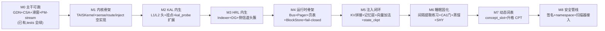

# TAIS Obsidian 部件实现详细计划（v1.0）

**tais-obsidian ｜ 逐部件的 7 维工程落地手册**

- 日期：2026-07-26
- 配套：《接口与实现计划 v1.0》、《子系统架构规格 v1.0》、《细致框架设计文档 v2.5》、`article_ref/`
- 定位：把 v1.0 的接口骨架展开为**每个部件的完整实现规格**——按统一 7 维模板（是什么 / 做什么 / 怎么实现 / 怎么训练 / 注意什么 / 捕捉信号 / 需要数据），含 dataclass、损失公式、数据 schema、信号 tensor、实现顺序。
- 约定：🔧 红线；🧠 承重神经映射；📐 代码/数据结构；📉 损失/算法公式；📡 日志信号；📊 数据；⭐ 已核实文献；🔗 依赖（须先实现的部件）。

---

## 0. 实现路线图（阶段化 milestone，绑定 T0–T5）



**关键依赖链**：M2→M3（HRL Indexer 用 CSA indexer 权重初始化）；M3→M4（内生头产出 route_scores 喂运行时）；M4→M5；M5→M6（睡眠固化消费 W0 日志）；state_ckpt 可与 M4 并行（关键缺口，越早越好）。

---

## Part A · 主干计算子系统（冻结基座）

> 部件级实现：A1 输入层 / A2 GDN / A3 CSA / A4 HCA / A5 滑窗 / A6 PM-stream / A8 LM-Head。

### A1 · 输入与动态词表层
- **是什么**：字节→token id→embedding 的入口 + reserved 槽 + concept_slot 注入点。🔗 无前置依赖。
- **做什么**：标准 tokenize；reserved 2048 槽噪声占位（防 glitch）；concept_slot 输入侧向量经 Procrustes T_E 投到 embedding 空间注入。
- **怎么实现** 📐：`Embedding(vocab=129280, d=2048)` tied；`register_concept_slot(text, vec_e)` 把概念槽写入一个 side-table，前向时若输入含触发 token 则把 `vec_e` 加到对应 embedding（输入侧加法，零风险）。
- **怎么训练** 📉：预训练期 reserved 槽做**噪声占位训练**（每个 step 给 reserved id 喂随机 embedding 梯度，避免成为 glitch 吸引子）；T1 观测内词典提取强度（1.5B 未知项）。
- **注意** 🔧：① 输出侧扩张选择性（仅高频多 token 概念，每批≤数十条，§28.7）；② tied embedding 下升格须先验输入侧提取强度。
- **捕捉信号** 📡：reserved 槽激活率、概念槽命中频率、glitch token 检出（低频异常激活）。
- **需要数据** 📊：预训练语料；高频多 token 概念候选（语料共现统计 top-k）。
- ⭐ Over-Tokenized（ICML 2025）/ Kaplan（ICLR 2025）/ BLT（ACL 2025）。

### A2 · GDN-MemBlock（工作记忆寄存器）
- **是什么**：3/4 层（21 层）的递归状态线性注意力，状态 S=工作记忆。🔗 已有 `model/gdn.py`。
- **做什么**：delta rule 状态更新 `S←S+β(v−S·k)⊗k` + forget gate；PM-stream 读点；增强A记忆层旁挂。
- **怎么实现** 📐：16 头×128 维，通道级门控，`naive_recurrent` + `chunked` 双路径（tests/test_gdn.py 对拍 <1e-4）。`forward(x, state)→(out, new_state)`；暴露 `state_read()/state_write()` 挂点。
- **怎么训练** 📉：T1 预训练（next-token LM loss）；线性注意力遗忘性由 CSA 补偿。
- **注意** 🔧：① GDN 无 KV cache，W-State 须自研 state checkpointing（见 E4）；② 固定状态在检索密集任务遗忘（arXiv:2510.20787）→ CSA 必须存在。
- **捕捉信号** 📡：状态范数 ‖S‖（饱和监测）、forget gate 均值、递归稳定性（naive vs chunked 偏差）。
- **需要数据** 📊：FineWeb-Edu shards（已有 `data/memmap.py`）。
- 🧠 前额叶工作记忆（递归状态）；⭐ Gated DeltaNet（arXiv:2412.06464）/ Titans MAL 同构。

### A3 · CSA-AttnBlock（情景检索 L1）
- **是什么**：1/4 层（7 层）的全局压缩稀疏注意力，陈述性块 KV 注入原生落点。🔗 已有 `model/attention.py`。
- **做什么**：stride-4 压缩（m=4）→ FP8 indexer top-128 选择 → 精细注意力；`harvest()` 自编译收割压缩 KV；块 KV 拼接注入（namespace 校验）。
- **怎么实现** 📐：GQA 16Q/2KV×128，partial RoPE + YaRN；双 KV 流 + 重叠 2m-softmax。`harvest(ctx_tokens)→kv_block`；`inject(kv_block, ns)→modified_kv`（namespace 不匹配 fail-closed）。
- **怎么训练** 📉：T1 预训练；indexer 权重初始化 HRL Indexer（T2 块域 KL 对齐）。
- **注意** 🔧：① stride-4 压缩器训练期学、推理期冻结——**W-State 不得在其上游改残差**（Part Z）；② 前缀偏差（导出无未来 query）→ APE 自适应缩放 + 关键 token 重算。
- **捕捉信号** 📡：indexer top-k 命中率、压缩比、注入 namespace 失败率、harvest 块质量（重建 ppl）。
- **需要数据** 📊：长文档（Longmino）训压缩器；块校验集。
- 🧠 CA3 模式补全；⭐ DeepSeek V4 CSA / NSA / ICAE 4× / kv-distill 99%。

### A4 · HCA 重压缩（L2 gist）
- **是什么**：128:1 重压缩全局摘要，`<gist>` 架构级载体，块注入原生落点。
- **做什么**：128 token→1 条目稠密注意；高 arousal 触发更激进压缩。
- **怎么实现** 📐：m′=128 单流无 indexer；压缩矩阵冻结。
- **怎么训练** 📉：T1 预训练；arousal 调压缩率（接 KAL L2，运行时只调不训）。
- **注意** 🔧：**块注入应发生在 HCA 内部/之后**（注入即读自己写的），绝不在其上游改残差——否则 128:1 池化冲刷注入信号（Part Z 最高风险）。
- **捕捉信号** 📡：HCA 压缩重建误差、arousal-压缩率相关性。
- 🧠 CA1→皮层 gist；⭐ DeepSeek V4 HCA / DLCM。

### A5 · 滑窗注意力（L0 精确）
- **是什么**：512 token 近期精确全注意力。
- **做什么**：保证近期上下文精确；attention sinks 作缺页声明。
- **怎么实现** 📐：标准 SDPA + 可学习 sink logits。
- **怎么训练** 📉：T1；sink logits 与主干同训。
- **注意**：与 CSA/HCA 三路融合；TTT-E2E 刻意只用滑窗避学习型压缩冲突（间接证据）。
- **捕捉信号** 📡：sink 权重分布、滑窗 vs 压缩一致性。
- 🧠 感觉皮层近期表征。

### A6 · PM-stream（mHC 感知-记忆专用道）
- **是什么**：残差流 n=5（4 内容 + 1 PM）的专用感知记忆道。🔗 已有 `model/pmstream.py`（恒等初始化 <1e-6）。
- **做什么**：KAL/侧信道头读 GDN 输出 PM-stream；HRL/ITI/人格写 CSA 残差前 PM-stream。
- **怎么实现** 📐：mHC 双随机约束（Sinkhorn-Knopp→Birkhoff）；`pm_read(layer)→tensor`、`pm_write(layer, payload)→tensor`。
- **怎么训练** 📉：恒等初始化开机即用；T1 消融 PM 数；T3 PM 携带 HRL 决策标记。
- **注意** 🔧：n=5 是 DeepSeek n=4 的独创延伸，**无先例，需 pilot**（logs_train_pm.txt 正在做）。
- **捕捉信号** 📡：PM-stream 范数（信号放大应 ≤1.6×）、内容流-PM 相关性。
- 🧠 丘脑皮层环路；⭐ mHC（arXiv:2512.24880）。

### A8 · LM-Head + MTP + 动作 token
- **是什么**：RMSNorm→tied LM-Head（DoLa）→MTP；原生动作 token 发出点。
- **做什么**：token 生成；`<|recall|>/<|blank|>/<|gist|>/<|ref|>/<|box|>` 发出；DoLa 由 KAL 不确定态触发。
- **怎么实现** 📐：动作 token 在词表内（特殊 id）；`forward` 返回 logits + action_flags。
- **怎么训练** 📉：T2 SFT 动作 token；T3 RL（TIAR）；DoLa 开关由 KAL 阈值控制。
- **注意** 🔧：**`<|recall|>` 必须显式出现在 CoT**（隐形路径显形化，审计）。
- **捕捉信号** 📡：各动作 token 频率、DoLa 触发率。
- 🧠 运动皮层+语言产出。

---

## Part B · KAL 感知与元认知子系统（内生）

> 🔧 **监测/执行分置红线**：探针只读 GDN 输出层；干预只写 CSA 残差前层。🧠 前额叶元认知（Fleming aPFC）。🔗 依赖 A6（PM-stream）。

### B1 · L1 三态头（P(IK)）
- **是什么**：读 GDN 输出 PM-stream，输出 知道/不确定/空白 三态 + 校准概率。🔗 A2、A6。
- **做什么**：推理中持续监测；空白→`<|recall|>`；不确定→ITI；作 T3 过程奖励。
- **怎么实现** 📐：
  ```python
  self.L1 = nn.ModuleList([nn.Linear(d,3) for _ in cfg.kal_layers])  # ℓ10/14/18
  def forward(self, pm_out_per_layer):
      logits = [head(pm) for head,pm in zip(self.L1, pm_out_per_layer)]
      return weighted_sum(logits, self.auroc_weights)  # 多挂点 AUROC 加权融合
  ```
- **怎么训练** 📉：
  - 预训练后期：辅助损失 `L_PIK = CrossEntropy(三态 logits, 真值标签) + λ·ECE(softmax(logits), accuracy)`（⭐ Kadavath P(IK) 范式）。
  - T2：预测-反馈循环监督（先预测→给反馈，单纯预测无效）。
  - 校准对准绝对值（⭐ Barkan：瓶颈在校准）：Brier + ECE。
  - 定期重校准（每 N 次睡眠固化重训探针，⭐ BCI 解码器制度）。
- **注意** 🔧：① **探针冻结**，不对其加生成损失（防重编码到不可读基底，NeurIPS 激活监控警示）；② 不靠自报置信度（⭐ Turpin）；③ 评测避开"配对标签 vs 采样检测器"误配。
- **捕捉信号** 📡：P(IK) 三态概率时序、ECE/Brier、AUROC（vs token 概率/自报置信度基线）、FPR95/AURC（⭐ AutoMeco 协议）、各挂点 AUROC。
- **需要数据** 📊：已知集（模型答对的事实）/未知集（Wikidata 截止日后实体 + 合成虚构 FECAM + 边界例）/预测-反馈对 `(问题,预测能否答对,实际是否答对)`。
- ⭐ SAPLMA 2304.13734（⚠️71–83% 是 accuracy）/ 2606.02628（0.904–1.000 AUROC @4-bit）/ Kadavath 2207.05221 / Barkan 2512.24661 / Know More Clearer 2602.12996（mastered/confused/missing 同构）。

### B2 · L2 情感头（valence/arousal）
- **是什么**：输出效价/唤醒度。🔗 A6（与 L1 同读点）。
- **做什么**：arousal→写显著性头；valence→route_key；调 HCA 压缩率。
- **怎么实现** 📐：`self.L2 = nn.Linear(d,2)`；输出 `(valence∈[-1,1], arousal∈[0,1])`（tanh/sigmoid）。
- **怎么训练** 📉：T2 回归损失 `MSE((valence,arousal), 外部标注)`；**ground truth 不来自模型自评**（防自指循环）。
- **注意** 🔧：情感头不得给自己出题；模型自标签仅 CA1 复核后用。
- **捕捉信号** 📡：valence/arousal 时序、与写显著性头相关性、固化优先级 vs saliency。
- **需要数据** 📊：外部情感标注（文本情感分类器在交互日志输出 + 用户显式反馈）。
- 🧠 杏仁核（McGaugh）；⭐ Anthropic 情感电路 ⚠️待复核。

### B3 · L3 冲突检测头
- **是什么**：检测检索块与上下文矛盾。🔗 C5（CA1 仲裁执行器）。
- **做什么**：矛盾→路由 CA1 仲裁（版本+时间戳+置信度三路）；冲突不静默覆盖。
- **怎么实现** 📐：`self.L3 = nn.Linear(d,1)`；输入 `(ctx_hidden, block_hidden)` 拼接。
- **怎么训练** 📉：注入矛盾/一致块对，BCE 损失。远期项。
- **注意**：与 MOSAIC 式 active conflict detection 思路一致（⭐ 2607.16211）。
- **捕捉信号** 📡：冲突概率、CA1 仲裁触发率。
- **需要数据** 📊：矛盾/一致块对（合成 + 真实版本冲突）。
- 🧠 前岛叶/dmPFC 显著性网络。

### B4 · ITI 干预头（执行通道）
- **是什么**：把真实度方向写 CSA 残差前 PM-stream。🔗 A6（写点）。
- **做什么**：不确定态时平移激活提升真实度（⭐ ITI 32.5%→65.1%）。
- **怎么实现** 📐：`self.iti = nn.Linear(d, d)` 投影冻结方向；`inject(pm_pre, α) = pm_pre + α·iti_dir`。
- **怎么训练** 📉：T2 蒸馏（数百样本定位方向，离线睡眠期廉价重训）。
- **注意** 🔧：**向量冻结做偏置注入，绝不对探针信号加损失项**（否则特质重编码到不可读基底）；真实度-有用性权衡可调 α。
- **捕捉信号** 📡：ITI 触发率、注入前后真实度变化、有用性损失。
- **需要数据** 📊：TruthfulQA 式真值对（数百样本）。
- ⭐ ITI 2306.03341。

### B5 · 原生动作 token
- **是什么/做什么**：`<|recall|>`（空白→HRL）/`<|blank|>`（诚实降级声明）/`<|gist|>`（自我总结→harvest）。
- **怎么实现** 📐：词表内特殊 id；CoT 中显式。
- **怎么训练** 📉：T2 SFT + T3 RL（TIAR 轨迹知情 GRPO）；T3 加"说-做分歧"惩罚。
- **注意** 🔧：必须显式出现在 CoT（审计接口）。
- **捕捉信号** 📡：各动作 token 频率、recall→答对转化率。
- **需要数据** 📊：带 recall/blank/gist 标注的 CoT 轨迹（T3 rollout 产生）。

---

## Part C · HRL 海马路由子系统

> 🧠 海马（DG/CA3/CA1）+ 内嗅；⭐ 海马索引理论。**学习型头内生（🟢），数据/算法运行时（🟡）**（用户选方案 B）。🔗 依赖 A3（CSA indexer 权重）、A6。

### C1 · DG 模式分离（🟢 内生投影）
- **是什么**：route_key 稀疏化去相关防碰撞。🔗 C2。
- **做什么**：`sparse_key = topk(ReLU(proj(query)), k)`；landmark 锚点块作 CA3 种子。
- **怎么实现** 📐：`self.proj = nn.Linear(d, dg_dim)`；`forward(x)=sparse_topk(self.proj(x))`。
- **怎么训练** 📉：与 Indexer 联合（T2 KL warmup）；稀疏正则。
- **注意**：潜空间几何各向异性 → DG 稀疏 key 是必要去相关。
- **捕捉信号** 📡：key 碰撞率、稀疏度。
- 🧠 齿状回 pattern separation。

### C2 · 统一 Indexer 打分头（🟢 内生）
- **是什么**：块域/token 域同构打分头。🔗 A3（权重初始化）。
- **做什么**：FP8 分块归并 top-k（🔧 不物化全分数张量）；用 CSA indexer 权重初始化再做块域 KL 对齐。
- **怎么实现** 📐：
  ```python
  class HRLIndexer(nn.Module):
      def __init__(self, cfg): self.score = nn.Linear(d, 1)
      def forward(self, query, candidates):
          scores = self.score(candidates @ query)  # 分块归并
          return topk(scores, k)  # 🔧 不物化全分数
  ```
- **怎么训练** 📉：T2 KL 蒸馏 warmup（稠密教师枚举全块打分，学生 KL 对齐）；🔧 **辅助损失梯度只进 Indexer，禁止污染主干**（`detach` 主干输入）；T3 统一 RL。
- **注意** 🔧：T3 防路由振荡（序列级重要性裁剪 GSPO、相邻块选择 Jaccard 下限、ε 退火——⭐ MoE-RL 教训）。
- **捕捉信号** 📡：recall@k、Indexer-教师 KL、路由 Jaccard、路由熵。
- **需要数据** 📊：稠密教师打分（离线枚举全块）；任务-块弱标注（任务成败反推）。
- 🧠 内嗅皮层；⭐ Titans 内生 / Memory Layers 训练参数 / MoE router 同训。

### C3 · 页表 Block Spec（🟡 运行时）
- **是什么**：块注册表 + 元数据。🔗 E1。
- **做什么**：内容寻址 + 双形态（markdown 源=ground truth，编译产物=可失效缓存）；动态词表 codebook。
- **怎么实现** 📐：
  ```python
  @dataclass
  class BlockSpec:
      block_id: str; route_key: str
      affect: dict  # {valence,arousal,saliency}
      temporal_ctx: Tensor; spatial_coord: Tensor|None
      namespace: tuple; version: int; signature: bytes
      ttl: float; usage_count: int
      compiled_kind: Literal["kv","mem_entry","icv","steering","concept_slot","lora","gist","route"]
      factual_recall: bool  # 🔧 载体能力边界
      merged_flag: bool; valid_at: float; ingested_at: float  # ⭐ Zep 双时态
  ```
- **怎么训练**：无（数据结构）；查询经 SQLite + 向量库。
- **注意** 🔧：双时态 `valid_at/ingested_at`（⭐ Zep）；markdown 源永久保留（审计/回滚）。
- **捕捉信号** 📡：块库规模、TTL 到期率、merged 占比。
- 🧠 海马索引（Teyler-DiScenna）。

### C4 · CA3 PPR 联想（🟡 运行时算法）
- **是什么**：块图上 Personalized PageRank 扩散联想检索。🔗 C2（分数种子）。
- **做什么**：多跳/类比联想（⭐ HippoRAG +20%）；路径块模式补全。
- **怎么实现** 📐：`ca3_ppr(query, scores, graph, ε=0.1)→expanded_scores`；landmark 锚点块（中心性高）作种子。
- **怎么训练**：无（图算法）；ε 退火与 C2 同步。
- **注意**：ε-greedy 情境化（头脑风暴 vs 严谨）。
- **捕捉信号** 📡：PPR 命中、联想跳数、ε 探索率。
- 🧠 CA3 自动联想；⭐ HippoRAG / TEM。

### C5 · CA1 巩固门（🟡 运行时逻辑）
- **是什么**：固化准入 + 验证门 + 信念漂移监测。🔗 F2（睡眠固化）、H（安全）。
- **做什么**：① 升格/并入准入（高 usage_count + 回归验证 + ⭐ GATES 共识度）；② 验证门（⭐ Kairos NORA 2025：验证通过才强化路径）；③ 信念漂移监测（⭐ MemoryGraft）；④ 后门扫描（⭐ MS 2602.03085）。
- **怎么实现** 📐：
  ```python
  def ca1_gate(candidate, regression_set, teacher_consensus):
      if candidate.usage_count < θ_use: return REJECT
      if not regression_pass(candidate, regression_set): return REJECT
      if teacher_consensus < θ_cons: return REJECT  # GATES
      if belief_drift(candidate) > θ_drift: return QUARANTINE  # MemoryGraft
      if backdoor_scan(candidate) == POISONED: return DROP
      return PROMOTE
  ```
- **怎么训练**：无（规则）；回归集随块库更新。
- **注意** 🔧：novelty⊥correctness 正交不可平均（⭐ Kairos）；MS 扫描器具体检出率数字待全文。
- **捕捉信号** 📡：准入率、拒绝原因分布、漂移距离、扫描器报警率。
- **需要数据** 📊：回归测试集；投毒块对（⭐ MemoryGraft 范式）；后门样本。
- 🧠 CA1 巩固；⭐ Kairos（workshop PoC，配 Ramsauer ✅）/ MOSAIC 2607.16211（66% 冲突检出）/ MemoryGraft 2512.16962 / MS 2602.03085。

### C6 · 侧信道头簇 ×5（🟢 内生）
- **是什么/做什么**：见下表。🔗 A6（各挂点）。
| 头 | 挂点 | nn.Linear | 信号用途 |
|---|---|---|---|
| 预取预测 | ℓ4/10 | `(d, n_blocks)` | 下一思考段所需块 |
| 写显著性 | ℓ10/14 | `(d,1)` | 惊讶度 KL→W0 加标 |
| 冲突检测 | ℓ14 | `(d,1)` | →CA1（与 B3 互补）|
| 归因监测 | ℓ18 | `(d,2)` | 注入质量/usage_count |
| 联想触发 | ℓ14 | `(d,1)` | ε-greedy 开 CA3 |
- **怎么训练** 📉：各头独立小目标，不进主干损失；写显著性接 KAL L2 arousal（⭐ Titans 惊讶度门控）；T2-T3。
- **注意** 🔧：不进主干损失；归因监测头做 CMI 式因果审计（⭐ CoT 忠实性）。
- **捕捉信号** 📡：预取命中率、写显著性分布、归因注意力质量。
- **需要数据** 📊：轨迹日志回放（W0）。
- ⭐ Titans 惊讶度门控 / LM2 层级门控。

---

## Part D · 记忆载体子系统

> 🔧 **载体能力边界（⭐ 已核实）**：token 寻址（KV/记忆层）能事实召回；位置不变向量（ICV/steering）不能。Block Spec 标 `factual_recall`。

### D1 · KV 块（CSA harvest）
- **是什么**：陈述性事实/经历的压缩 KV。🔗 A3。
- **做什么**：经验前向→harvest 压缩 KV；Expected Attention 修剪 60%；Q4 量化存盘。
- **怎么实现** 📐：`harvest(ctx) = csa.compress(ctx).kv`；存 `(K,V)+namespace`。
- **怎么训练**：无（前向即得）；harvest 质量靠 CSA 预训练。
- **注意** 🔧：namespace 五元组校验 + fail-closed；前缀偏差→APE 缩放 + 关键 token 重算。
- **捕捉信号** 📡：harvest 重建 ppl、注入命中率、Q4 量化误差。
- **需要数据** 📊：经验文本（交互日志）。
- ⭐ ICAE 4× / kv-distill 99% / Expected Attention / RelayCaching 80%。

### D2 · 增强 A 记忆层（GDN 旁挂 delta）
- **是什么**：product-key KV 可写记忆层，陈述性块优先写入处。🔗 A2。
- **做什么**：delta 写入 `S←S+β(v−v̄)⊗k`（与 GDN 同构，分布内）；门控衰减容量管理。
- **怎么实现** 📐：`MemoryLayer(keys, values)` product-key top-k；`write(k,v)=delta_update`；sweet-spot ~3 层居中。
- **怎么训练** 📉：keys/values 预训练（⭐ Memory Layers）；运行时 delta 写零梯度。
- **注意** 🔧：写入分布由构造保证（FWP 视角）；W3+ 离线写入基底。
- **捕捉信号** 📡：记忆层查询命中率、key 利用率、衰减率。
- **需要数据** 📊：事实对（key→value）。
- 🧠 海马 DG/CA3；⭐ Memory Layers 2412.09764（128B/1T）/ Titans MAL。

### D3 · 向量块（ICV/steering）
- **是什么**：技能/行为/风格/人格调制向量。🔗 A6（PM 加法）/ A8（logit Δz）。
- **做什么**：**只能 steer 行为，不能事实召回**；可向量算术组合。
- **怎么实现** 📐：ICV = PCA top-1 of `h(y)−h(x)`（⭐ 2311.06668）；DeCoVec = `logits(few)−logits(zero)`（⭐ 2604.11129）；注入 `pm += α·v`。
- **怎么训练**：零梯度（激活提取）；人格块冻结只读。
- **注意** 🔧：人格块冻结常驻 L0；steering 运行时可写限 W2；**不对探针加损失**。
- **捕捉信号** 📡：向量范数、α 强度、行为一致性。
- **需要数据** 📊：demonstrations（行为对）。
- ⭐ ICV 2311.06668 / FV / DeCoVec / Persona Vectors。

### D4 · 路径块 / 概念槽
- **路径块**：块引用有序序列 + 进入/退出条件 + 成功率；熟练路径→D5 LoRA（ACT-R 陈述性→程序性）。⭐ Kairos 验证门控。
- **概念槽**：见 G1（动态词表第 0 级）。
- **捕捉信号** 📡：路径复用率、概念槽命中。
- **需要数据** 📊：成功轨迹序列；高频多 token 概念候选。

### D5 · LoRA 程序性块（可选）
- **是什么**：深度程序性技能（v2.0 降级，退出关键路径）。
- **怎么做**：睡眠蒸馏（W3）；r16 ≈ 20–60MB。
- **注意** 🔧：intruder dimension 累积（⭐ Shuttleworth 2410.21228）→ 谱修剪 + W4 重置。
- ⭐ Biderman / LatentSkill 2606.06087 / SKILL0。

---

## Part E · 运行时与存储子系统

### E1 · DKB-Runtime
- **是什么**：TAIS Memory Bus 服务端（API 网关/Pager/BlockStore/注入中间件）。🔗 所有 🟡 部件。
- **做什么**：缺页处理 + namespace 校验 + fail-closed 回退 + 热切换（🔧 毫秒级）。
- **怎么实现** 📐：`runtime/bus.py`；进程内调用（本机）或 RPC（分布式）。
- **注意** 🔧：热切换红线（llama.cpp slot 1.4ms 已证明可行）。
- **捕捉信号** 📡：缺页率、热切换延迟、fail-closed 触发率。

### E2 · 存储层级 L0-L3
- **是什么**：VRAM(L0,个位数块)/DRAM(L1,概念槽)/NVMe(L2)/远端(L3) 分页。
- **怎么做**：`runtime/blockstore.py` LRU + usage_weighted 淘汰。
- **注意**：淘汰非 LRU，是 SHY 归一化（见 F2）。
- 🧠 记忆层级。

### E3 · 苏醒序列
- **是什么**：冷启动按序恢复（麻醉苏醒证据：执行功能先于陈述记忆）。
- **顺序**：阶段0 路由器/接口 → 1 人格块+元数据 → 2 高频陈述性 → 3 长尾惰性 → 4 声明"记忆部分加载"（诚实降级）。
- **捕捉信号** 📡：各阶段延迟、缺页。
- 🧠 麻醉恢复。

### E4 · 热切换 + state checkpointing（🔧 关键缺口）
- **是什么**：GDN 状态 save/restore（混合架构独有，当前引擎空白）。
- **怎么做** 📐：`runtime/state_ckpt.py`：`save(gdn_states)→bytes`、`restore(bytes)→gdn_states`（读/恢复递归状态缓冲区）。
- **注意** 🔧：llama.cpp slot 不存 SSM 状态（discussion #24043）→ **必须自研**；这是对上游生态的潜在贡献点。越早实现越好（M4 并行）。
- **捕捉信号** 📡：state save/restore 延迟、状态一致性误差。

---

## Part F · 写通道与进化子系统

### F1 · W0-W4 写通道分级（🔧 读写不对称红线）
| 级 | 机制 | 时点 | 🧠 对应 |
|---|---|---|---|
| W0 | 轨迹日志追加（资格迹）| 运行时 | ACh 惊讶标记 |
| W1 | steering 向量 | 运行时 | — |
| W2 | KV prefix / 记忆层 delta | 运行时 | 海马快存 |
| **W3+** | LoRA 梯度 / 合并 | **仅离线** | DA 门控 |
| W4 | 基座并入 | 离线 | 皮层慢固化 |
- **注意** 🔧：页保护位——人格块只读；元数据块写入需验证门；draft 区隔离。
- 🧠 三因子 STDP（ACh 暂不固化/DA 升级，⭐ Brzosko 2017 最硬）。

### F2 · 睡眠巩固器（🔧 离线锁定）
- **是什么**：间隔提取练习→验证门→蒸馏→SHY 归一化。
- **怎么实现** 📐：
  ```python
  def sleep_consolidate(w0_log, block_lib, regression_set):
      for cluster in cluster_by_temporal(w0_log):  # 🧠 cSPW-R 簇分批
          for item in spaced_retrieval_practice(cluster):  # ⭐ 提取练习 d≈0.46
              if ca1_gate(item, regression_set, ...):       # C5
                  distilled = on_policy_distill(item)        # F3
                  sh normalize(block_lib)                    # ⭐ SHY 归一化非 LRU
      lock_offline()  # 🔧 固化期不服务 (🧠 DOWN 态合并锁)
  ```
- **怎么训练**：无（离线算法）；间隔按衰减预测。
- **注意** 🔧：① 离线锁定（⭐ cSPW-R DOWN 态=合并锁，全文已核升回🟢）；② 淘汰=归一化非 LRU（⭐ SHY）；③ 提取练习（检索形式非重编码）。
- **捕捉信号** 📡：固化块数、回归通过率、归一化前后范数、固化耗时。
- **需要数据** 📊：W0 日志；回归集。
- 🧠 SHY + CLS + 提取练习（三项承重）；⭐ cSPW-R 714843。

### F3 · 受控基座并入 W4
- **是什么**：四级并入（权重合并/函数蒸馏★/结构增长/坐标隔离）。
- **怎么做** 📐：首选 On-Policy Context Distillation（带块模型当教师、裸基座当学生，reverse-KL，GATES 共识门）。
- **注意** 🔧：固化用**同优化器 Muon**（⭐ 2605.06654 降遗忘）；谱修剪 intruder；并入后原块标 `merged` 退役。
- **捕捉信号** 📡：蒸馏 KL、intruder 维度数、回归损失。
- ⭐ OEL / GATES / Shuttleworth intruder。

---

## Part G · 动态词表子系统

### G1 · 第 0 级 concept_slot（运行时零梯度）
- **是什么**：输入侧概念槽，页表=动态词表 codebook。🔗 A1、KAL 词表摩擦、C3。
- **做什么**：检测→提取→注册→注入。
- **怎么实现** 📐：
  ```python
  def promote_concept_slot(text, model):
      if kal.vocab_friction(text) > θ:           # 检测：高熵碎片+低P(IK)
          r = model.extract_inner_lexicon(text)   # Kaplan：末token ℓ5-15 detokenized
          slot = BlockSpec(route_key=text, payload=r, compiled_kind="concept_slot",
                           factual_recall=False)
          pagetable.register(slot)                # 输入侧注入（零风险）
  ```
- **怎么训练**：零梯度（一次前向）；绕开 zip2zip ~10 GPU-h PEFT（**T1 观测有效性**）。
- **注意** 🔧：输入侧免费（⭐ Over-Tokenized log-linear）；输出侧暂不升格。
- **捕捉信号** 📡：词表摩擦分布、concept_slot 命中、提取成功率。
- **需要数据** 📊：高频多 token 概念候选。
- ⭐ Kaplan 2410.05864 / Over-Tokenized / BLT / zip2zip / OMP 2506.06607（⚠️数值 token 损数学）。

### G2 · 第 1 级 词表升格（睡眠期轻梯度）
- **是什么**：concept_slot→真词表条目（reserved 槽激活 + 自蒸馏 CPT）。
- **怎么做** 📐：CA1 门通过→激活 reserved 槽→初始化（Kaplan Procrustes T_E/T_U / FOCUS / ZeTT）→本地 CPT 仅训 `W_E/W_U`（20M token，复用 W4/Muon）→SHY 退场。
- **注意** 🔧：① 输入宽进/输出窄升（⭐ Over-Tokenized 输出有害 + Kaplan 精选可行）；② 跨设备 reserved 槽命名空间中心协调（断网自治唯一例外）。
- **捕捉信号** 📡：升格数、CPT loss、退场率。
- **需要数据** 📊：升格候选 + 回归集。
- ⭐ FOCUS（⚠️EMNLP 2023）/ ZeTT / MOSAIC（⚠️勘误：2607.16211 是 agent 记忆非词表）。

### G3 · 第 2 级 架构溶解（换代 27B+）
- **是什么**：H-Net 式端到端动态分块，tokenizer 消失。
- **怎么做**：CSA stride-4 压缩器→H-Net；第 0/1 级是低风险探针。
- ⭐ H-Net 2507.07955 / BLT / DLCM。

---

## Part H · 安全子系统（横切，§26.2 命名防御范式）

> **威胁**（⭐ MemoryGraft 2512.16962 已实证）：写通道是真实攻击面；攻击腐蚀**信念/策略**非动作；**时间解耦**（今日下毒数周后触发）。

**微软 Defender 三原语 ↔ TAIS 实现**：
| 原语 | 实现 |
|---|---|
| memory contracts | 块签名 + namespace fail-closed（五元组）|
| belief drift detection | CA1 回归测试 + 探针漂移监测 |
| context provenance tracking | markdown 源代码形态（永久审计/回滚）|

**工具链**：MS 后门扫描器（⭐ 2602.03085 机制已核；87.8% 待全文）接入睡眠固化 draft 区 + MemSAD 式梯度耦合检测。
**EXP-PERSONA 沙箱例外**：仅 MCB 道德约束块作闸门时分级开放人格写（§8A）；MCB 自身永不可写。
**捕捉信号** 📡：draft 异常率、签名失败、漂移距离、扫描器报警。

---

## I. 数据集总清单 📊

| 部件 | 数据 | 来源 |
|---|---|---|
| 主干预训练 | Dolma3/FineWeb-Edu/Longmino | OLMo3 |
| KAL L1 | 已知/未知集/预测-反馈对 | Wikidata 截止+FECAM+模型自答 |
| KAL L2 | 外部情感标注 | 情感分类器+用户反馈 |
| KAL L3/CA1 | 矛盾/一致块对 | 合成+版本冲突 |
| HRL Indexer | 稠密教师打分/任务-块弱标注 | 离线枚举+任务反推 |
| 块固化 | 回归集/环境反馈 | Verilator 等 verifier |
| 概念槽 | 高频多 token 候选 | 语料共现统计 |
| 安全 | 投毒块对/后门样本 | MemoryGraft 范式 |
| ITI | 真值对（数百）| TruthfulQA 式 |

---

## II. 信号总清单 📡（tensorboard / W0 日志 schema）

```python
# 每步记录的信号字典（示例）
signals = {
  # 感知
  "kal/pik_known": float, "kal/pik_blank": float,
  "kal/valence": float, "kal/arousal": float,
  "kal/write_salience": float, "kal/conflict": float,
  "kal/vocab_friction": float,
  # 路由
  "hrl/indexer_recall_at_k": float, "hrl/teacher_kl": float,
  "hrl/routing_jaccard": float, "hrl/ca3_ppr_hits": float,
  # 注入
  "inj/usage_count": int, "inj/attn_quality": float,
  "inj/ns_fail_rate": float,
  # 校准（周期）
  "calib/ece": float, "calib/brier": float, "calib/auroc": float,
  "calib/fpr95": float, "calib/aurc": float,
  # 安全
  "sec/draft_anomaly": float, "sec/sig_fail": int, "sec/belief_drift": float,
  # 系统
  "sys/page_fault": int, "sys/hot_swap_ms": float, "sys/state_ckpt_ms": float,
}
```

---

## III. 风险红线总表

| # | 红线 | 依据 |
|---|---|---|
| 1 | CSA/HCA↔运行时学习：只从 HCA 输出读或独立 KV 分支注入，绝不改冻结压缩器下游残差 | Part Z / TTT-E2E |
| 2 | 监测/执行分置：探针读 GDN，干预写 CSA，不同层 | PMC9053853 |
| 3 | 探针冻结：不对探针加生成损失 | NeurIPS 激活监控 |
| 4 | 载体能力边界：向量不能事实召回；Block Spec 标注 | ⭐ ICV/FV |
| 5 | 读写不对称：W3+ 仅离线；人格块只读 | 三因子 STDP |
| 6 | 注入即攻击面：签名+namespace+CA1 漂移+扫描器；离线筛查 | ⭐ MemoryGraft |
| 7 | CoT 忠实性：`<|recall|>` 必须显式；归因因果审计 | ⭐ Turpin |
| 8 | 跨设备词表槽位：中心协调命名空间 | ID 撞车 |
| 9 | HRL Indexer 梯度隔离：辅助损失只进 Indexer | MoE-RL |
| 10 | 固化同优化器 Muon + 谱修剪 intruder | ⭐ 2605.06654/2410.21228 |

---

## IV. 实现顺序与里程碑检查点

| Milestone | 交付物 | 退出标准 |
|---|---|---|
| M0 主干可跑 | GDN+CSA+滑窗+PM-stream | tests 全绿（已有）|
| M1 内核骨架 | TAISKernel sense/route/inject 空实现 | 前向不崩、PM 读写通 |
| M2 KAL 内生 | L1/L2 头+挂点+kal_probe | 探针 AUROC≥0.8 @0.1B |
| M3 HRL 内生 | Indexer+DG+侧信道头簇 | 块域 KL 收敛、梯度隔离验证 |
| M4 运行时骨架 | Bus+Pager+页表+BlockStore+state_ckpt | 缺页 fail-closed、state 往返<1e-5 |
| M5 注入闭环 | KV拼接+记忆层+向量加法 | 注入后人效不降、热切换<5ms |
| M6 睡眠固化 | 间隔提取+CA1门+蒸馏+SHY | 回归通过、归一化稳定 |
| M7 动态词表 | concept_slot+升格 CPT | 输入侧提取成功、输出侧限量 |
| M8 安全管线 | 签名+namespace+扫描器 | 投毒检出、漂移报警 |

🔧 **首要观测**（T1）：① KAL 探针强度（1.5B 未知）；② 内词典提取强度；③ PM-stream n=5 稳定性；④ 运行时记忆位置∈{HCA前/HCA后/并行}消融（Part Z）。

---

## V. 关键不确定项（诚实标注）

1. **1.5B KAL 探针强度**（§9 开放问题 #1）——间接证据乐观（线性+早出+Kadavath 可训），但无 1.5B 直接数据。
2. **内词典提取在 1.5B 混合架构**——绕开 zip2zip PEFT 的零梯度路径无实证。
3. **PM-stream n=5**——DeepSeek n=4 的独创延伸，无先例，pilot 消融中。
4. **CSA/HCA↔W-State 干扰**——机制推理有冲突风险，D-0 pilot 验证。
5. **MS 扫描器 87.8%**——机制已核，具体数字待全文。
6. **Kairos**——workshop PoC，配 Ramsauer/Hopfield 加固。

*v1.0 与接口与实现计划 v1.0、子系统架构规格 v1.0、设计文档 v2.5 配套。HRL checkpoint 采用方案 B。所有文献标注见 article_ref/。*
