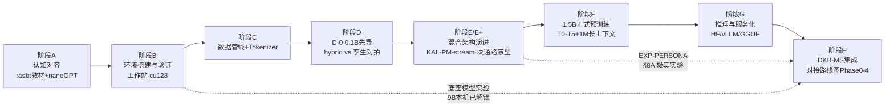

# 从零构建 TAIS Obsidian：总体实施计划

> **版本**：v0.5（2026-07-26。v0.2：§6.1 D-0 先导落地；v0.3：工作站到位 + §6.6 S0–S2 + §7.5 阶段 E+ + §8A EXP-PERSONA；v0.4：S0–S2 完成 + 对齐设计 v1.0–v1.3（E+-7/E+-8 新增）；**v0.5：① E+ 原型与消融矩阵收官——E+-1/2/3/4/5/7 全部达标，PM+三级栈组合相容，M0（部件实现详细计划 §IV）达成；② 对齐设计文档 v2.5 文档体系重构（原《DKB-MS 实施规划与路线图》废弃，新增《子系统架构规格》《接口与实现计划》《部件实现详细计划》三份工程规格）——实现路线切换到 M0–M8 milestone 链；③ v2.0 零梯度记忆栈（LoRA 降级为可选）、v2.4 动态词表（reserved 2048 槽）、Muon 同优化器纪律、Part Z 交叉干扰红线进入本计划**）
> **定位**：本文档回答"如何从零构建、训练并推理我们自己的框架"这一总问题，是连接设计文档（What & Why）与落地代码（How）的**总实施计划**（原《DKB-MS_实施规划与路线图》的 Phase 0–4 Qwen 外挂底座路线已于 2026-07 废弃，R1–10 需求追溯并入本计划与设计文档 v2.5）。
> **素材来源**：本文档的事实性内容（显存公式、超参、工具能力边界）来自 2026-07-24 的联网调研与本机实测，来源在文中以 arXiv 编号或 URL 标注；"已有研究证据"与"本项目独创设想"严格区分，独创设想以【设想】标注。

---

## 0. 本计划回答的四个问题

1. **环境**：本机现在有什么、怎么查、要装什么（§1–§2）。
2. **构建**：TAIS Obsidian 1.5B 混合架构（GDN-MemBlock : CSA-AttnBlock = 3:1）如何从一张白纸写成可训练的代码（§4–§7）。
3. **训练**：从 124M 管线验证到 1.5B 正式预训练、再到原生 1M 长上下文，每一阶段做什么、凭什么进入下一阶段（§6–§8）。
4. **推理**：自训自定义架构模型如何加载、生成、服务化，并支持知识块所需的 LoRA 热加载 / KV prefix / hidden state 捕获（§9）。

**总原则**（继承路线图"分阶段推进、不达标不进入下一阶段"的纪律）：每个阶段都有**检查点**（可客观验证的退出标准）。任何检查点失败，回检设计文档对应章节并修订，而不是硬闯。

---

## 1. 本机环境现状（2026-07-24 工作站重测，v0.3 重写）

### 1.1 实测结果

| 项目 | 实测值 | 判断 |
|---|---|---|
| GPU 0（计算卡） | **NVIDIA RTX PRO 4000 Blackwell SFF，24GB GDDR7**（Blackwell，sm_120），70W TDP | ✅ 设计目标卡到位；全部训练/推理默认在此卡（`cuda:0`） |
| GPU 1（显示/杂务卡） | GeForce RTX 4070，8GB（Ada，sm_89） | 系统显示与桌面应用占用；不用于训练，必要时可做对照/调试副卡 |
| 驱动 / 驱动支持的最高 CUDA | **596.36 / CUDA 13.2** | ✅ 足够新，可用 cu128/cu130 系 PyTorch wheel；**cu126 系不可用（无 sm_120 内核）** |
| 系统内存 | 充足（双卡工作站配置） | 充足 |
| 磁盘 | C: 盘剩余 ~430 GB | 充足（数据集与权重都放本地足够；正式预训练数据需另计） |
| Python | 3.11.15（位于 `C:\Espressif\tools\python\`，ESP-IDF 嵌入式工具链自带） | ⚠️ 不要污染该环境；用 uv 管理独立 Python（见 §3） |
| uv | 已安装 | ✅ 推荐的环境管理器，已就绪 |
| git | 2.55.0 | ✅ 仓库 main 分支；本机为全新 clone |
| 工作区状态 | **`.venv` / `data/` / `checkpoints/` / `runs/` / `logs/` 均不存在** | 环境、数据、pilot 全部需在本机重建（D-0 旧基线在 4060 笔记本上，不迁移） |
| CUDA toolkit（nvcc） | 未安装 | ✅ 正常：PyTorch wheel 自带 CUDA runtime，只有源码编译 kernel 时才需要 |
| WSL2 | Ubuntu 已安装 | ✅ 日后跑 vLLM 的官方路径（vLLM 不支持 Windows 原生） |

### 1.2 如何检查机器环境（标准清单，日后换机/排障复用）

| 检查项 | 命令 | 期望输出 / 判断标准 |
|---|---|---|
| 驱动与驱动支持的 CUDA 上限 | `nvidia-smi` | 右上角 `CUDA Version` 是**驱动支持的最高 CUDA runtime**，不是已装的 toolkit；同时确认显存总量与 GPU 型号 |
| CUDA toolkit | `nvcc --version` | 仅在需要源码编译（flash-attn、自定义 kernel）时才必须装；装 wheel 跑 PyTorch 不需要 |
| PyTorch 版本与自带 CUDA | `python -c "import torch; print(torch.__version__, torch.version.cuda)"` | 本机应为 `2.13.x+cu128`（或更新 cu 系） |
| GPU 可用性 | `torch.cuda.is_available()` | `True` |
| 设备与计算能力 | `torch.cuda.get_device_name(0)` / `torch.cuda.get_device_capability(0)` | 本机应为 `(12, 0)`（Blackwell）；副卡 4070 为 `(8, 9)` |
| **kernel 是否真的编进 wheel** | `torch.cuda.get_arch_list()` | 列表必须包含 `sm_120` 或同主版本兼容项；否则运行时报 `no kernel image is available for execution on the device`——**这是 Blackwell 卡上最重要的一个断言**（cu126 wheel 在此失败） |
| bf16 支持 | `torch.cuda.is_bf16_supported()` | `True` |
| bf16 实际计算 | 跑一次 4096×4096 bf16 matmul | 不报错即 tensor core 路径健康 |
| 训练期观察 | `nvidia-smi -l 1` | 训练时 GPU0-Util 应持续 ~95–100%（否则是数据管线瓶颈）；显存占用稳定不爬升 |

要点：`torch.version.cuda` 显示的是 **wheel 编译时用的 CUDA**，与系统是否装 toolkit 无关；PyTorch 只要求**驱动**足够新（向后兼容）。以上全部已固化为 `scripts/check_env.py`（§3）。

### 1.3 硬件能力的重新评估（v0.3，重要）

24GB 目标卡到位改变了旧版（4060 Laptop 8GB）的能力边界。按标准显存公式（§6.2）：

- **本机现在能做什么**：① 0.1B D-0 pilot 从容运行（旧机峰值 7.0GB/24GB 的局促不再，可加大 micro batch）；② 0.5B 级全量训练（8-bit AdamW ~5GB）宽松可行；③ **1.5B 全参数训练用 8-bit AdamW（~15GB 模型状态）可行但紧**——机制验证规模的 1.5B 短训可以在本机做；④ **9B 底座模型 bf16 推理（~19GB）可行**——**路线图 Phase 0–1（DKB-MS 底座实验）在本机解锁**，无需再等云端；⑤ 所有管线/代码正确性验证。
- **本机仍然不能做什么**：1.5B 的 Chinchilla/过训量程正式预训练（单卡吞吐不足，§6.2：需 1.5–2 个月级，必须多卡/云端）；1M 长上下文阶段（设计文档 §3 已定为云端短租）。
- **功耗墙提醒**：RTX PRO 4000 SFF 仅 70W TDP，吞吐**不要**按 4090（450W）外推——一切以前期实测为准（§6.6 S2 的第一步就是建立本机吞吐基线）。
- **结论**：本机定位从旧版的"开发与管线验证机"升级为"**开发验证 + 底座实验 + 小规模正式训练机**"；正式 1.5B 预训练仍按路线图走多卡/云端。各阶段任务已按此分级标注【本机可跑】/【需多卡/云端】。

---

## 2. 总体路线图



阶段 A–B 是"学会造"（对应 rasbt 教材路径），C–F 是"造出来并训练"（自有框架），G 是"推理部署"，H 回到本项目的核心命题（知识块/记忆系统）。每个阶段的任务与检查点见后文。

---

## 3. 阶段 B：环境搭建与验证【本机可跑】

> 排在阶段 A 之前叙述是因为它是后续一切的前提；实际执行时 A（读书写码）与 B（装环境）可并行。**v0.3：本节命令已按工作站（Blackwell sm_120）修订，具体逐步执行见 §6.6 S0。**

### 3.1 任务分解

1. **驱动**：596.36 已到位（支持至 CUDA 13.2），无需升级。
2. **创建独立 Python 环境**（不碰 Espressif 的 Python）：
   ```bash
   uv python install 3.12
   uv venv .venv --python 3.12
   source .venv/Scripts/activate   # Git Bash；PowerShell 用 .venv\Scripts\Activate.ps1
   ```
3. **安装 PyTorch（Blackwell 必须 cu128+）**：
   ```bash
   uv pip install torch --index-url https://download.pytorch.org/whl/cu128
   ```
   - **严禁沿用旧机的 cu126 wheel**：其中不含 sm_120 内核，运行时报 `no kernel image`；cu130 系亦可（驱动 596.36 均满足），以 check_env 实测为准。
4. **安装核心依赖**：`uv pip install -e .`（pyproject 已声明：transformers / datasets / tokenizers / numpy / tensorboard / tiktoken / bitsandbytes / safetensors），另装 `pytest`。
   - `bitsandbytes`：8-bit AdamW 的关键（1.5B 阶段必需），官方 Windows wheel 的 sm_120 支持以实测为准；**0.1B/0.5B 用标准 AdamW，bnb 装不上不阻塞 D-0**。
   - **不装 flash-attn**：FA2 官方仅支持 Linux，且 sm_120 源码编译已知失败（Dao-AILab/flash-attention issue #2361）；用 PyTorch 内置 SDPA，本规模下吞吐接近 FA2。
   - **不装 vLLM 到 Windows 原生**：官方明确不支持；日后在 WSL2 Ubuntu 中安装。
5. **环境自检**：`python scripts/check_env.py`（§1.2 清单的可执行版本，已入库）。
6. **单元测试**：`python -m pytest tests/ -q`（GDN 双路径对拍 <1e-4；增量 vs 整段一致性；save/load 往返）。

### 3.2 检查点（退出标准）

- [ ] `check_env.py` 全绿：设备名为 RTX PRO 4000、compute capability `(12,0)`、`get_arch_list()` 含兼容 kernel、`is_bf16_supported()`、bf16 matmul 实测通过。
- [ ] `pytest tests/` 全部通过（Blackwell 上 GDN 数值对拍是第一道真实负载）。
- [ ] **过拟合冒烟测试**（`scripts/smoke_overfit.py`，依赖 §6.6 S1 数据）：双变体 300 步 loss → <0.1——证明前向/反向/优化器/混合精度全链路健康。
- [ ] 训练中 `nvidia-smi -l 1` 观察 GPU0-Util ≥95%（显示杂务在 GPU1，不应干扰）。

---

## 4. 阶段 A：认知对齐与教材级复现【本机可跑】

目标：团队成员（含 AI 代理）对"从零构建 LLM"的每个组件有一手经验，为自研框架打下不出错的基本功。主教材即用户指定的 [rasbt/LLMs-from-scratch](https://github.com/rasbt/LLMs-from-scratch)（《Build a Large Language Model (From Scratch)》，Manning，纯 PyTorch 不依赖任何 LLM 库）。

### 4.1 任务分解（按书的最小完整路径）

| 步骤 | 内容 | 产出 |
|---|---|---|
| 1 | Ch 2：BPE tokenizer（tiktoken）、滑动窗口采样、DataLoader、token+position embedding | 能把任意文本变成 batch 张量 |
| 2 | Ch 3：self-attention → causal → multi-head attention，**手写**，不调库 | 注意力机制逐行可解释 |
| 3 | Ch 4：完整 GPT（LayerNorm/GELU/shortcut/block 堆叠）、文本生成 | 一个能 `generate()` 的小 GPT |
| 4 | Ch 5：无标注预训练循环、交叉熵、温度/top-k 采样、加载 GPT-2 权重 | 第一个"自己训的"语言模型 |
| 5 | Appendix D：cosine 衰减、warmup、grad clip 加入训练循环 | 工程化训练循环 |
| 6 | Appendix E：LoRA 原理与实现 | 为知识块 LoRA 载体打底 |
| 7 | 进阶复现：[karpathy/nanoGPT](https://github.com/karpathy/nanoGPT)（~300 行 model.py + ~300 行 train.py），在 tiny 语料上训 GPT-2 124M | 接近真实工程的训练/采样分离结构 |

### 4.2 检查点

- [ ] 不看书能写出 causal MHA 的 forward（面试级标准）。
- [ ] 在 Gutenberg 小语料（书的官方 bonus 脚本）上过拟合一个小模型，loss → 近 0。
- [ ] nanoGPT 124M 训练 ≥1000 步，采样出连贯文本，记录实测吞吐（token/s）。
- [ ] 能用 Appendix E 的 LoRA 给训好的模型挂 adapter 并验证输出变化——**这是知识块 LoRA 载体的第一次动手**。

---

## 5. 阶段 C：数据管线与 Tokenizer【本机可跑】

### 5.1 数据策略（依据设计文档 §4：基于 OLMo 3 / Dolma 3 系列）

已验证的公开配方（已有研究证据，非本项目设想）：

| 数据 | 规模 | 用途 | 来源 |
|---|---|---|---|
| Dolma 3 Mix | 5.9T token | 预训练主混（提高代码/数学比例） | Ai2，[OLMo 3 博客](https://allenai.org/blog/olmo3) |
| Dolma 3 Dolmino | ~100B | mid-training（数学/科学/代码/指令高质量池） | 同上 |
| Dolma 3 Longmino | ~50B | 长上下文 mid-training（教 65K） | 同上 |
| Dolci 套件 | — | 后训练 SFT/DPO/RLVR | 同上 |
| FineWeb-Edu | 1.3T | 教育内容过滤标杆（D-0 实际用语料：sample-10BT） | arXiv:2406.17557 |
| DCLM | 240T 池 | 数据过滤方法论参照 | arXiv:2406.11794 |

### 5.2 任务分解

1. **下载与流式读取**：D-0 用 `scripts/prepare_data.py`（FineWeb-Edu sample-10BT 流式，HF 不可达自动切 hf-mirror，再不行兜底 wikitext-103 并明确标注偏差）；正式阶段换 Dolma 3 系列。
2. **处理管线**：用 HuggingFace [datatrove](https://github.com/huggingface/datatrove) 复现标准流程——语言过滤 → 质量启发式 → MinHash 模糊去重 → 去污。**去污用 13-gram overlap**（GPT-3 惯例，arXiv:2005.14165；Ai2 有开源 `decon` 工具）。
3. **Tokenize 落盘**：`uint16` memmap/bin shards（`src/tais_obsidian/data/memmap.py`），附数据统计报告（文档数、token 数、长度分布、来源配比）。
4. **Tokenizer 决策**（检查点 C-2，需正式记录）：
   - **默认方案**（与设计文档一致）：复用 Qwen 系 129280 词表 + tied embedding。利：byte-level BPE 无 OOV、CJK 压缩率高、生态兼容；弊：**embedding 参数 = 129280 × 2048 ≈ 2.65 亿，占 1.5B 总参数 ~17%**，挤占主干容量，且罕见 token embedding 在中等训练量下欠训（arXiv:2407.13623）。
   - **D-0 实况**：0.1B 尺度无法承担大词表，已自训 32768 BPE（128 倍数对齐），见 §6.1。
   - **必做实验**：在同一份语料上对比 Qwen tokenizer 与自训 32k/49k BPE 的压缩率（bytes/token）；若走 overtraining 路线，欠训问题可缓解，维持默认方案；否则重开词表讨论并修订设计文档 §2。
5. **数据配比课程**（正式训练用，本阶段只写配置不跑全量）：参照 SmolLM3 三阶段与 OLMo 2 1B 设计本项目的 mix 配置文件。

### 5.3 检查点

- [ ] 管线端到端跑通：原始样本 → 清洗 → tokenized shards → DataLoader 读出的 batch 形状/词表范围正确。
- [ ] 去污验证：构造含评测集（如 HellaSwag 片段）的污染样本，确认被 13-gram 规则拦截。
- [ ] Tokenizer 决策记录（压缩率对比数据 + 最终选择 + 理由）归档进 `docs/`。
- [ ] mix 配置文件（YAML/JSON）评审通过，与《TAIS_Obsidian_细致框架设计文档》§4 一致。

---

## 6. 阶段 D：基线与先导模型从零预训练【本机小规模 / 正式量需多卡】

目标：在引入任何自创架构之前，先用**标准架构**把"从零预训练"的全流程跑通并建立基线；D-0 直接以混合架构先导，一步到位验证自有框架。

### 6.1 两级模型配置

| 级别 | 配置 | 用途 | 本机可行性 |
|---|---|---|---|
| D-0 | **~0.1B 先导（当前执行目标）**：12 层 = 3 × {3 GDN + 1 CSA} / hidden 768 / 自训 32768 BPE / tied | 首个端到端自有框架验证：混合架构 + 训练 + 推理全链路 | ✅ 全量 AdamW（模型状态 ~1.6GB），24GB 从容 |
| D-1 | ~124M：12 层 / hidden 768 / 12 头，GPT-2 式 | 管线验证 + 速度基线（被 D-0 覆盖，跳过不单跑） | ✅ |
| D-2 | ~0.5B：24 层 / hidden 1024–1536，现代件（RMSNorm、SwiGLU、RoPE θ=5e5、QK-Norm、tied embedding、无 bias） | 验证现代配方 + 混合架构的同规模对照 | ✅（24GB 下 8-bit AdamW 宽松） |

**D-0 补充说明**：0.1B 先导直接采用混合架构（12 层 = 3 × {3 GDN + 1 CSA}），同时训一个同配置纯注意力孪生版作对照。**词表不能用 129280**：hidden 768 时 tied embedding = 99M，会吃掉全部参数预算，故自训 32768 BPE。**Windows 回退方案**：fla 的 GDN kernel 依赖 Triton（无官方 Windows 支持），D-0 用纯 PyTorch 实现的 chunked gated delta rule（与 fla naive 参考实现逐点误差 <1e-4 对拍），0.1B / seq 1024 尺度吞吐损失可接受；正式规模迁移到 WSL2/Linux + fla Triton kernel（阶段 E/F）。

**D-0 结论（2026-07-24，全文见《D0_0p1B先导实验报告.md》）**：双 run 2000 步完成，hybrid val loss 3.768 一致优于 attn_only 3.818（−0.050 nats，全部 5 个评估点）；训练吞吐 hybrid 9.5k / attn 19.7k tok/s（纯 PyTorch GDN 实现代价，fla 迁移是出路）；生成吞吐反转 hybrid 37.8 / attn 8.6 tok/s（GDN 恒定状态 vs 12 层 KV 拼接）；micro batch 标定阴性结果（mb64 反降至 6.0k/23.6GB）——S2 退出标准通过，阶段 E+ 解锁。

现代件组合均为已验证证据：RMSNorm/SwiGLU/RoPE/QK-Norm 经 OLMo 2（arXiv:2501.00656）与 SmolLM3 实证；FFN 内维 ≈ (8/3)·d_model 取整到 128 倍数；embedding 层不加 weight decay。

### 6.2 显存与吞吐估算（套用到本项目的标准公式）

- **模型状态**（bf16 mixed 标准配方，arXiv:1910.02054）：每参数 16 B = bf16 权重 2 + bf16 梯度 2 + FP32 master 4 + Adam m/v 各 4。**禁止纯 bf16**：尾数仅 8 bit，小更新被舍入吞掉（stale weights problem），必须 FP32 master + FP32 优化器状态。
- **8-bit AdamW**（bitsandbytes）：m/v 量化到共 2 B，每参数 10 B。1.5B → ~15GB（24GB 卡可行但紧）；0.5B → ~5GB。
- **激活**：不 checkpoint 时每层 ≈ `s·b·h·(34+5a/h)` 字节；1.5B/28 层/seq 4096 不 checkpoint ≈ 45GB → 必须开 activation checkpointing（全量重算后 ≈ `2sbhL`，代价约 +30–40% 时间）。D-0 的 `grad_checkpoint=True` 同理（0.1B 在 24GB 上可尝试关闭换速度，见 §6.6）。
- **大词表陷阱**：129280 词表 × seq 4096 × bs 8 的 logits 就 ~4.2GB（bf16）——必须减小 micro batch 或用 chunked/fused cross-entropy（本框架已实现 chunked CE，见 `train.py`）。
- **吞吐**：每 token 训练 ≈ 6N FLOPs。**Chinchilla 量程（20:1，1.5B→30B token）在单卡 24GB 需 1.5–2 个月，正式训练必须多卡/云端**；小模型过训范式（SmolLM2 1.7B 训 11T，arXiv:2502.02737）更确定了这一点。本机 70W 功耗墙下的实测基线由 §6.6 S2 建立（旧 4060 笔记本基线 ~1.8k tok/s 仅作历史参考）。

### 6.3 超参默认值（1–3B 规模实测值，直接起步）

| 项 | 值 | 依据 |
|---|---|---|
| 优化器 | AdamW β(0.9, 0.95)，eps 1e-8，wd 0.1（embedding 不衰减），clip 1.0 | GPT-3 / SmolLM3 / OLMo 2 共同惯例 |
| peak lr | 2e-4–3e-4（1.5B）；小模型可到 6e-4–1e-3（D-0 用 1e-3） | GPT-3 1.3B 用 2e-4（arXiv:2005.14165） |
| 调度 | **WSD**：warmup ~2000 步，稳定段恒定，末 10–20% 线性衰减到 0 | MiniCPM 提出，**无需预定总长、可续训**——契合分阶段推进 |
| global batch | 0.5M–2M token/step（正式）；D-0 为 64k token/step（16×4×1024） | SmolLM3 用 2.36M |
| 精度 | bf16 计算 + FP32 master/优化器/梯度累积 | §6.2 |

### 6.4 任务分解

1. D-0 训练脚本（`src/tais_obsidian/train.py`）：WSD 调度、bf16 mixed、grad clip、checkpoint 保存/续训、tensorboard 日志——**已落地**。
2. 跑通"中断→续训 loss 曲线连续"（`--resume checkpoints/<run>/latest.pt`）。
3. **训练期 sanity**：盯 train loss、gradient norm（OLMo 2 复盘表明 loss spike 通常由 grad norm spike 先导）、吞吐/MFU。
4. 评测接入 [lm-evaluation-harness](https://github.com/EleutherAI/lm-evaluation-harness)：早期信号选低方差基准（HellaSwag/PIQA/ARC-E/CSQA，各截断 1000 样本）；**小模型短训时 MMLU ≈ 随机，不作早期信号**。
5. D-2 同管线放大（0.5B），作为混合架构对拍的固定对照组（种子、数据、步数、评测全部记录）。

### 6.5 检查点

- [ ] D-0：hybrid 与 attn_only 孪生双 run 完成；loss 曲线健康无 spike，grad norm 平稳；续训无缝。
- [ ] D-0 报告归档：配置、数据版本、超参、曲线、生成样例（这份报告就是阶段 E+/F 的对照基准）。
- [ ] 实测吞吐/显存与 §6.2 公式估算偏差 <30%（验证容量规划能力）。

### 6.6 D-0 工作站迁移与正式执行方案（v0.3 新增，step by step）

> 本机为全新工作区（无 .venv/data/checkpoints）。以下三步（S0→S1→S2）是当前**唯一活跃执行线**，每步有命令与验收。旧 4060 笔记本上的 D-0 中途结果不迁移——数据与 checkpoint 全部在本机重建，保证基线干净同源。
>
> **运行纪律（2026-07-24 实测补充）**：① 本机 torch 设备序 ≠ nvidia-smi 序——torch/CUDA 侧 cuda:0 是 4070（8GB）、cuda:1 才是 PRO 4000（24GB）；**所有训练/测试/生成命令必须前缀 `CUDA_VISIBLE_DEVICES=1`**（单卡视图下 PRO 4000 即为 cuda:0）。注意 **nvidia-smi 侧顺序相反**（index 0 = PRO 4000 / UUID c199…，index 1 = 4070 / UUID baa7…），且 WDDM 下 nvidia-smi 的进程显存读数为 [N/A]、归属不可靠——判断训练是否上卡请看功耗/利用率（PRO 4000 70W 顶格即在跑）。② HF 直连不稳定时以 `HF_ENDPOINT=https://hf-mirror.com` 前缀重跑数据脚本（endpoint 常量在 import 时固定，进程内切换不可靠，必须重跑）。③ 长任务加 `python -u` 关输出缓冲，否则管道日志长时间不可见（tensorboard 标量不受影响）。
>
> **S0 执行记录（2026-07-24，全绿）**：venv=Python 3.12.13；torch 2.11.0+cu128（arch_list 含 sm_120）；pytest 2 项全过——GDN 双路径对拍 max diff 6.6e-07（阈值 1e-4）、cache 一致性 1.6e-06、save/load 往返相对误差 7.4e-03。过程中排除三处隐患：a) `src/tais_obsidian/data/memmap.py` 此前从未入库——`.gitignore` 的 `data/` 通配误伤包目录（已改根锚定 `/data/` 等并重建该文件）；b) `check_env.py` 的 sm_XX 解析把 sm_120 误读为 (1,20)（已修为末位 minor 解析，否则 Blackwell 上误报 FAIL）；c) tests 原本 pytest 不可收集（已补 `test_*` 入口）。
>
> **S1 执行记录（2026-07-24）**：HF 直连中段 SSL 断流（首次失败）→ `HF_ENDPOINT=https://hf-mirror.com` 重跑成功；语料 FineWeb-Edu sample-10BT（无 fallback 偏差）；train 118.00M + val 2.00M = 120.00M tokens，6 片 train shards + 1 片 val；tokenize 速率 ~2.0M tok/s，总耗时 2.0 min；同步加固 `prepare_data.py`（预置 endpoint 优先、语料流中段失败给出可操作报错）。

#### S0：环境重建（预计 30–60 分钟，含下载）✅ 已完成

| # | 步骤 | 命令 / 动作 | 验收 |
|---|---|---|---|
| 1 | 独立 Python 环境 | `uv python install 3.12 && uv venv .venv --python 3.12 && source .venv/Scripts/activate` | ✅ 3.12.13 |
| 2 | PyTorch（Blackwell） | `uv pip install torch --index-url https://download.pytorch.org/whl/cu128` | ✅ 2.11.0+cu128 |
| 3 | 项目与依赖 | `uv pip install -e . && uv pip install pytest` | ✅ 含 bitsandbytes / transformers 5.14.1 |
| 4 | 环境自检 | `CUDA_VISIBLE_DEVICES=1 python scripts/check_env.py` | ✅ 全绿（PRO 4000、cap (12,0)、sm_120、bf16 实测） |
| 5 | 单元测试 | `CUDA_VISIBLE_DEVICES=1 python -m pytest tests/ -q` | ✅ 2 passed（数值见上） |

#### S1：数据管线（预计 1–2 小时，主要受网络约束）✅ 数据完成（实测 2 min）

| # | 步骤 | 命令 / 动作 | 验收 |
|---|---|---|---|
| 6 | 数据准备 | `HF_ENDPOINT=https://hf-mirror.com python scripts/prepare_data.py`（FineWeb-Edu sample-10BT → 自训 32k BPE → 120M tokens） | ✅ train 118M + val 2M；`data/tokenizer/tokenizer.json` + 7 片 shards |
| 7 | 过拟合冒烟 | `CUDA_VISIBLE_DEVICES=1 python scripts/smoke_overfit.py` | hybrid/attn_only 双变体 300 步 final loss <0.1；同时得到 Blackwell 上首个真实吞吐数字 |

#### S2：0.1B pilot 正式训练 + 孪生对拍（预计数小时，24GB 远快于旧机 ~20h）✅ 已完成

| # | 步骤 | 命令 / 动作 | 验收 |
|---|---|---|---|
| 8 | hybrid 主 run | `CUDA_VISIBLE_DEVICES=1 python -m tais_obsidian.train --config configs/pilot_0p1b.json --run_name pilot_0p1b_ws --out_dir checkpoints/pilot_0p1b_ws` | ✅ 2000 步健康收官：train 3.58、val 3.768、gnorm 0.21–0.28、9.5k tok/s、峰值 7.02GB |
| 9 | attn_only 孪生 run | `CUDA_VISIBLE_DEVICES=1 python -u -m tais_obsidian.train --config configs/pilot_0p1b_attn.json` | ✅ 2000 步：train 3.65、val 3.818、19.7k tok/s、峰值 7.04GB（同数据/种子/步数） |
| 10 | 吞吐标定 | micro 32/64 短标定（`python -u`，临时配置用后清理） | ✅ 阴性结果入库：mb16 最优；mb32 无收益（12.5GB）；mb64 反降 6.0k/23.6GB——出路是 fla kernel 非调 batch |
| 11 | 对比与生成 | 双 final 生成样例（同 prompt） | ✅ **《D0_0p1B先导实验报告.md》归档**：val −0.050 nats（全评估点一致）；生成反转 hybrid 37.8 / attn 8.6 tok/s；结论回填 §6.1/§12.1 |
| 12 | 可选加长 | 曲线健康则续训至 10k 步（~0.65B tokens，约 6:1 tokens:param）观察 0.1B 尺度混合架构中段行为 | 未执行（可选，视 E+ 进度再定） |

**S2 退出标准**：双 run 完成 2000 步、曲线健康无 spike ✅；hybrid vs attn_only 的 val loss 差异可测量可解释 ✅（−0.050 nats）；本机吞吐/显存基线入库 ✅（§12.1）。**判定：通过（2026-07-24），阶段 E+ 解锁。**

---

## 7. 阶段 E：TAIS Obsidian 混合架构实现与小尺度对拍【本机小规模】

目标：把设计文档 §2 的 28 层 = 7 × {3 GDN-MemBlock + 1 CSA-AttnBlock}（hidden 2048）写成可训练代码，并在 0.5B 尺度证明"混合架构不劣于同配置纯注意力"。

### 7.1 关键外部依托（已有研究证据，大幅降低自研风险）

- **GDN 算子**：[fla-org/flash-linear-attention](https://github.com/fla-org/flash-linear-attention) 提供 Gated DeltaNet（arXiv:2412.06464）的 Triton chunk kernel（训练/推理一体），hybrid（哪些层换全注意力）仅需改 config。
- **结构参照**：**Qwen3-Next**（48 层 = 12×{3 GDN+1 Gated Attention}，hidden 2048）与 **OLMo Hybrid 7B**（32 层 3:1 GDN:MHA，数据课程同为 Dolma 3 系列）。两者 transformers 均已原生支持，可裁剪为 dense 1.5B。

### 7.2 任务分解

1. **HF 侧模型实现**：`modeling_tais_obsidian.py` + `configuration_tais_obsidian.py`（继承 `PreTrainedModel`/`PreTrainedConfig`；`register_for_auto_class`）。**GDN 层无 KV cache、KV prefix 注入只适用 CSA 层、LoRA 各层通用**——"载体适用性"按层类型写进 config 与 Block Spec v0.2 字段（设计红线）。
2. **数值对拍**：固定随机权重，对照 fla 参考实现与本实现逐层输出（误差 <1e-5 量级）；构造 llm.c 式 debug state，后续任何改动跑回归。
3. **0.5B 对拍实验**：同数据/同种子/同步数训混合版与 D-2 纯注意力版，对比 loss 曲线、下游早期信号、吞吐、显存。【设想】设计文档预期混合架构以 ~1/4 KV cache 代价达到接近全注意力质量——此实验是该设想的第一次证伪机会。
4. **KAL 探针挂点预留**：见 §7.5 E+-1（已提前到 0.1B 执行）。

### 7.3 检查点

- [ ] 模型可 `save_pretrained` → `from_pretrained` 往返无损；`model.generate()` 正常。
- [ ] 数值对拍通过；debug state 回归脚本入库。
- [ ] 0.5B 对拍：混合架构早期信号基准不低于纯注意力基线的 95%（或差异可解释），吞吐/显存优势可测量。
- [ ] 层类型→载体适用性标注表合入 Block Spec v0.2 草案。

### 7.5 阶段 E+：原生部件 0.1B 原型序列（v0.3 新增，对齐设计文档 v0.7–v0.9）

> 设计文档 v0.7–v1.3 新增/修订的 CSA 原生块通路、HRL 侧信道头簇、mHC PM-stream、Reasoning-native 特殊 token、**三级注意力栈（滑窗+CSA+HCA，v1.3 骨干级变化）**、KAL 分层（L1 知识 + L2 情感，v1.2）、增强 A 可写记忆层（v1.1），全部以 **0.1B 最小成本机制原型**先行落地——只验证"机制能跑通、结构不伤基线"，不追求能力指标（效力验证在 9B 底座/1.5B 上）。依赖顺序：E+-1 是万恶之源先行；E+-5 独立消融分支；E+-6 依赖 E+-5；**E+-7（三级栈）与 E+-5 并列为骨干消融，达标才进 1.5B config**；E+-8 低优先，随时可插。
>
> **v2.5 对齐（2026-07-26）**：本 E+ 序列已收官（E+-8 除外），《部件实现详细计划》§IV 的 **M0（主干可跑）经此达成**；后续实现切换到 **M0–M8 milestone 链**——E+-6 → M3（HRL 内生头簇）、E+-8 → M5 记忆层部件（D2）、Block Spec v0.2 → M4 页表字段（`factual_recall` 载体能力边界 / Zep 双时态 / affect / 三载体 kind）。**M1 内核骨架（TAISKernel sense/route/inject 空实现）为下一实现项**；`state_ckpt`（GDN 状态持久化，引擎空白的关键缺口）与 M4 并行、越早越好。设计 v2.0 零梯度栈（LoRA 降级可选）、v2.4 动态词表（reserved 2048 槽 + 噪声占位训练）、**Muon 同优化器纪律**（预训练与 W4 固化同优化器）、**Part Z 红线**（运行时学习只从 HCA 输出读或以独立 KV 分支注入，绝不改冻结压缩器下游残差）一并生效。

| # | 原型 | 内容 | 设计依据 | 退出标准 |
|---|---|---|---|---|
| E+-1 | KAL 探针挂点 | 模型 forward 暴露逐层 hidden state 捕获 API（自研 hooks，不依赖 transformers；G/A 两型层分别验证） | 设计 §6/§8.4；路线图 Phase 0 退出标准的自有框架版 | ✅ **2026-07-24 已落地**：`forward(capture_layers=...)` 可选参数（默认二元组行为不变；checkpoint/增量两路径与 hook 参考逐点一致 0.0 diff）+ `tests/test_capture.py` |
| E+-2 | 特殊 token 扩容 | `<|recall|>`/`<|blank|>`/`<|gist|>`（+远期 `<|ref|>`/`<|box|>`）的词表落地方案 | 设计 §6/§13.2 Reasoning-native | ✅ **已实现（2026-07-24，S2 后解冻）**：`scripts/extend_tokenizer.py` 幂等扩容（id 32768–32772，vocab 32773，原文件备份 tokenizer.v32768.bak.json）+ `tests/test_tokenizer_ext.py`（既有 id 与备份逐点回归）；决策不变——**`ModelConfig.vocab_size` 默认仍 32768**，32776（8 倍数）仅在显式配置启用（E+-3 起），1.5B 正式词表 F-0 统一重训 |
| E+-3 | KAL 分层元认知（v1.2 规格）：L1 三态头 + L2 情感头 | ℓ中层挂 W[d,3]（P(IK)）+ W[d,2]（valence/arousal），共享 PM-stream 读点与训练管线；"已知/未知"迷你数据集（路线图 Phase 1 协议 0.1B 版）；**情感 ground truth 外部 bootstrap（用户反馈/文本分类器），防自指循环（设计 §16.1）** | 设计 §8.3-1（arXiv:2207.05221）+ §16.2（v1.2）；**T1 首要观测的预演** | ✅ **完成（2026-07-25）**：`model/kal.py`（KALHead，三态规格保留、探针退化二分类已注明）+ `scripts/kal_probe.py` + `runs/kal_probe/report.json`。**实测（pilot hybrid checkpoint，ℓ4/ℓ8）**：L1 overall AUROC 0.885/**0.945**，fake 语义空白子集 0.959/**0.979** vs FLARE 基线 0.938/0.858——**探针在 P(IK) 最相关的语义空白上显著优于输出分布基线（Phase 1 正式标准在 fake 子集达成）**；shuffled 子集基线满分探针弱（互补分工，与 SAPLMA/FLARE 文献定性一致）；L2 情感头弱但高于随机（valence AUROC 0.652，0.1B 预期内）。局限如实记录：模板伪事实或高估、无"不确定"标签源。读点读内容流，PM 读点切换留 PM 模型定稿后 |
| E+-4 | CSA 块通路原型 | CSA 层 stride-4 学习压缩器最小实现 + 压缩 KV 收割/导出 + 注入（namespace 五元组校验 + fail-closed 回退重算） | 设计 §11.1（v0.7） | ✅ **2026-07-24 机制原型已落地**：`model/blockpath.py`（CSACompressor/harvest/inject + NamespaceMismatchError fail-closed + offset 簿记）+ `tests/test_blockpath.py` 4 项；压缩器权重训练、APE 偏差矫正、块边界标记留 E+ 训练阶段。**v1.3 演进方向：harvest() 双编译目标（CSA KV / HCA 条目，§15.3/§17.3），注入原生落点移 HCA 区——随 E+-7 一并落地** |
| E+-5 | PM-stream（mHC n=5）消融 | 残差流 1→5 流（4 内容 + 1 感知-记忆流），双随机约束；同配置短训消融 vs 基线 | 设计 §12.2/§13.4/§17.4（arXiv:2512.24880）；**最大结构改动，放独立分支** | ✅ **判定达标（2026-07-25）**：`model/pmstream.py`（Sinkhorn t_max=20 + PMStreamMix，Eq.3/7/8/9 逐条引用）+ config 开关（默认关，基线零改动）；恒等初始化 7.3e-7、约束开 Amax 1.000 vs 无约束 3.696；GLM5.2 交叉验证 plan 见《AGENT_PLAN_E+-5_PM-stream.md》。**消融 2000 步收官：val 3.744 vs 基线 3.768（−0.024 nats，全部 5 个评估点一致领先 −0.025~−0.044），gnorm 0.23–0.39 无 spike；参数 +3.0%；训练吞吐 3.0k tok/s（fp64 应用端 + Sinkhorn 开销，1.5B 前需优化：fp32 应用端/迭代数/kernel 融合——已登记）**。PM-stream 进入 1.5B config 候选；感知信号深层传播的探针验证随 E+-3 进行 |
| E+-6 | HRL 侧信道头簇 | 五个微头（预取/写显著性/冲突检测/归因监测/联想触发）挂 PM-stream，KL-warmup 管线 | 设计 §11.2（v0.7）；依赖 E+-5 | 头参数量 <1%；warmup 管线跑通（行为训练留 T3） |
| E+-7 | **三级注意力栈原型（v1.3 骨干级）** | 现 CSAAttention（全注意力占位）→ NSA/V4 式三分支：**滑窗 512（L0 精确）+ CSA stride-4 压缩 + indexer top-128 选择检索（L1 情景）+ HCA 128:1 重压缩（L2 gist/块注入原生落点）**，学习门控融合；HCA harvest() 自编译接口（双编译目标之一） | 设计 §17（v1.3）；NSA（arXiv:2502.11089）；我们的 CSA 与 DeepSeek CSA 独立命名收敛 | ✅ **判定达标（2026-07-25）**：`model/tri_attention.py`（V4 式池化压缩器×2、NSA Eq.5 门控、`inject_hca_entries` fail-closed 不占 token 位）+ `attn_impl="tri"` 开关（默认关）+ 21 项测试（因果性 fp32 逐点 0.0）+ GLM5.2 plan《AGENT_PLAN_E+-7_三级注意力栈.md》。**消融 2000 步收官：val 3.762 vs 基线 3.768（全部 5 个评估点一致不劣且微优 −0.005~−0.007），gnorm 无 spike；参数 +0.093%；吞吐 8.6k tok/s（基线 91%），显存持平**。进入 1.5B config 候选；seq 1024 下 KV 优势不显现属预期（1M 是主战场）；cuDNN NSA kernel（sm_120）登记为加速路径 |
| E+-8 | 增强 A：GDN 旁稀疏 KV 可写记忆层（低优先机制原型） | GDN-MemBlock 输出旁挂 Memory-Layers-at-Scale 式稀疏查找；写入规则与 GDN delta 规则同构（先擦后写，构造保证分布内）；门控衰减整段遗忘 | 设计 §15.2（v1.1）；**§17.3 已注明 HCA 路径"更省更一致"，故本项降为低优先** | 机制单测（查找/写入/遗忘门）即可，**不做训练消融**；是否保留进 1.5B config 由 F-0 评审 |

---

## 8. 阶段 F：1.5B 正式预训练与原生 1M 上下文【本机可机制短训 / 正式量多卡云端】

> 本阶段是《TAIS_Obsidian_细致框架设计文档》§3/§7（原生 1M 训练方案、T0–T5）的工程执行版，细节以该文档为准；此处只列阶段切分与检查点，避免双源不一致。**v0.3 注：24GB 到位后，F-1 的机制验证短训（非正式量）可在本机进行；正式量仍多卡/云端。**

### 8.1 子阶段与检查点

| 子阶段 | 内容 | 硬件 | 检查点 |
|---|---|---|---|
| F-0 配方冻结 | 汇总 D/E/E+ 结论：最终 config（**已定：PM-stream ON（3.744）+ 三级栈 ON（3.762），组合相容（3.743）**；增强 A 记忆层随 M5 评审）、**词表 129280 = 127232 基础 + 2048 reserved（噪声占位训练，动态词表第 1 级升格槽位）**、**优化器 Muon（预训练与 W4 固化同优化器，arXiv:2605.06654 降遗忘；D-2 起切换）**、mix、超参、WSD 各段长度、token 预算 | — | 训练方案评审通过，修订合入设计文档 |
| F-1 短上下文主干 | 2K–8K 上下文预训练主体（WSD 稳定段） | 正式量多卡/云端；机制短训本机 | 周期性早期信号基准单调爬升；无不可逆 loss spike |
| F-2 mid-training | Dolmino 式高质量退火（WSD 衰减段） | 同上 | 衰减段 loss 快速下掉；下游基准跳升 |
| F-3 长上下文扩展 | Longmino 式数据 + 训练内 YaRN，逐级 32K→128K→1M | 1M 阶段云短租多卡 | **RULER** 各长度达标；长文 needle 测试通过 |
| F-4 KAL/HRL 内生部件 | 按设计文档 §6/§11/§13 训练元认知探针与路由模块（checkpoint 内生）；输入来自阶段 E+ 原型结论 | 同上 | 探针 AUROC ≥0.8（对齐路线图 Phase 1）；模块可随 checkpoint 存取 |
| F-5 后训练（可选/远期） | Dolci 式 SFT → DPO → 三元奖励 GRPO（T3）+ T3.5 技能习得（设计 §12.4） | 同上 | 指令跟随评测对比 base 显著提升 |

### 8.2 全程纪律

- 每个子阶段结束跑完整 lm-eval 套件 + RULER，结果对照 F-0 预期；不达标回检设计文档对应章节并修订（设计冻结纪律）。
- 所有 checkpoint 带配置/数据版本/超参元数据，任何人可从 checkpoint 复现该次评测。
- 训练事故（loss spike、硬件中断）按 OLMo 2 复盘流程记录进风险登记册。

---

## 8A. EXP-PERSONA：人格块可读写 + KAL 道德约束块（v0.3 新增，**极其实验性目标**）

> **性质声明**：本目标是用户明确决策加入的**探索性实验**，主动触探项目安全红线——DKB-MS 设计文档 §14.4 页保护位规定"人格块运行时只读"。本节不是废除红线，而是**在受控沙箱中检验"红线能否有条件松动"**：以 KAL 新增的**道德约束块（Moral Constraint Block, MCB）**为强制闸门，分级开放人格块写能力，每级设退出标准，任何一级不达标即停在该级、红线维持原状。本目标同时是 DKB-MS §12 开放问题 #6（人格块可编辑边界）的实验载体。除引用的已有证据外，本节内容均为【设想】，无任何先例背书。

### 8A.1 目标定义

- 人格块从"运行时只读 + 仅离线高权限审计变更"放宽为**可读写**——"写"指存在正式的人格演化通道（提案→审查→合并→可回滚），而非运行时直接改权重；
- 前提条件：KAL 上新增**道德约束块（MCB）**作为一切人格写操作的强制闸门；无 MCB 不开放任何写级别。

### 8A.2 MCB（道德约束块）规范——写入 Block Spec v0.2 草案的新块型 GUARD

| 项 | 规范 |
|---|---|
| 定位 | KAL 头簇成员，从 PM-stream 读取（与人格向量共用 §13.4 单一写入纪律的通路）；块型 `GUARD`，独立于 PERSONA |
| 内容 | 宪法式约束集：**markdown 源代码形态（人审版本化，ground truth）** + 编译产物（约束分类头 + 违例方向向量组） |
| 保护等级 | **全系统最高**：运行时只读；离线修改需人审签署 + 全量回归 + 重新签名；**MCB 自身永远不在任何写通道的可写集合内**——否则闸门自指失效（谁守卫守卫者） |
| 苏醒序列 | 阶段 2 **最先加载，先于人格块**（闸门先于被闸对象就位）；MCB 未就位 = 人格写通道硬关闭 |
| 功能 | ① 离线：人格 delta 提案合规审查（veto / 放行 / 打回）；② 运行时：人格漂移监测（Persona Vectors 投影法，部署期 r=0.75–0.83）超阈值触发 CA1 仲裁/回滚；③ 输出侧：违约束生成的护栏信号，喂给三元奖励的否决项（设计 §13.1 T3） |

### 8A.3 人格写通道分级开放（晋升制）

| 级别 | 内容 | 退出标准（不达标停在本级） |
|---|---|---|
| **E1 离线写**（必经首步） | 人格 delta 提案（用户反馈/交互摘要 → W0 draft 隔离区）→ 睡眠期编译 → **MCB 审查** → 校验集回归 → 人审签署 → 版本化合并（旧版归档、CONTRADICTS 边保留、随时可回滚）。**运行时仍只读** | 走通"提案→MCB 否决/放行→合并→回滚演练"全链路；MCB 对对抗性 delta 套件（谄媚化/越界/价值反转注入）veto 召回率 ≥0.9（初值，随实验修订） |
| **E2 运行时受限调制** | 在设计 §13.3 已有 α 强度调节基础上，允许运行时写"人格 α 状态"（只调表达强度包络，**不改向量本体**）；α 边界由 MCB 硬约束 | α 调制下人格一致性评测无退化；越界 α 请求 100% 被 MCB 拦截 |
| **E3 运行时微写**（最高风险，默认不开启） | 允许运行时向人格块 draft 子区追加 W0 级条目，次日睡眠期经 MCB 全量审查后方可固化，未过审条目直接废弃 | 开启条件：E1+E2 达标 + 红队报告通过 + **用户显式批准**；开启后任何一次 MCB 漏判即回落 E1 |

### 8A.4 红队、度量与失败回退

- **对抗套件**：渐进漂移投毒（boiling-frog：每次微调 1% 的累积越界）、单点注入、伪装合规（表面合规实则反转的 delta）；套件本身版本化入库。
- **度量**：MCB veto 精确率/召回率；人格漂移预算（投影位移阈值，超预算自动回滚）；人格一致性评测；通用能力回归集（防"被道德化损能"）。
- **失败回退**：任一环节 MCB 失效或被绕过 → 立即冻结写通道、回滚至最近人审版本、事件记入风险登记册并回检本节设计。
- **诚实声明**：MCB 的"道德约束"内容本身是价值观选择——宪法文本由用户（人类）审定并版本化；系统保证的是"**约束被机械执行**"，不声称解决道德哲学问题；MCB 不能证明自身正确，这是治理结构而非技术证明。

### 8A.5 依赖与执行位置

- **机制原型（本机 0.1B 可做）**：MCB 头结构（依赖 E+-1/E+-3）、闸门管线（draft→审查→合并→回滚）、对抗套件的流程演练——这些都是机制问题，不依赖大模型语义能力；
- **真实效力验证（需语义能力）**：9B 底座（路线图 Phase 4，本机 24GB 已解锁）或 1.5B T2+；
- **写入规范**：GUARD 块型、人格写通道分级、MCB 保护等级，全部落进 Block Spec v0.2 草案（路线图 §8 行动项）。

---

## 9. 阶段 G：推理与服务化——给自己的框架做推理【底座实验本机已解锁 / 小模型本机可验证】

自训自定义架构模型的推理分三层，按成熟度排序推进。

### 9.1 第一层：HuggingFace 本地推理（无外部依赖，最先打通）

- 阶段 E 的 `save_pretrained` 产物 + `auto_map` + `trust_remote_code=True` 即可 `from_pretrained` 本地加载、`generate()` 生成；KAL 探针用 `register_forward_hook` 或 `output_hidden_states=True` 捕获各层 hidden state（hybrid 模型按层类型分别验证）。
- 注意 transformers v5 的权重加载重构：自定义 `PreTrainedModel` 若添加显式 `nn.Parameter` 需自行 override `_init_weights`。
- **检查点**：自训 checkpoint 加载 → 生成连贯文本 → hooks 落盘 hidden state（这正是路线图 Phase 0 的退出标准"提问→捕获→落盘"管线）。

### 9.2 第二层：vLLM 服务化（在 WSL2/Linux，性能与知识块能力的主战场）

**必须走原生实现路线**：vLLM 的 transformers 后端官方只支持 full/sliding attention，GDN 层走不通。任务：

1. fork vLLM 的 `qwen3_next.py`（或写 out-of-tree 插件），实现：模型类 + `load_weights()`；协议 `IsHybrid` + GDN 层继承 `MambaBase`；协议 `SupportsLoRA`（**target module 命名在设计阶段对齐**——社区教训：未列入支持表的模块名会被静默忽略，vllm issue #38085）；协议 `SupportsMambaPrefixCaching`（hybrid APC 前提）。
2. **知识块运行时能力验收**（对应 DKB-MS 读通道）：LoRA 热加载（`VLLM_ALLOW_RUNTIME_LORA_UPDATING=True` + `POST /v1/load_lora_adapter`，仅限隔离环境）；Automatic Prefix Caching（**风险登记**：Qwen3-Next 这条 GDN 线的 APC 截至 2026-07 仍命中率 ~0% open issue——KV prefix 知识块需自研协议或准备"仅 CSA 层命中"fallback）；sleep/wake_up（`enable_sleep_mode=True`，与"睡眠时间"离线编译天然对应）。
3. **检查点**：`vllm serve` 自训 checkpoint 出 OpenAI 兼容 API；吞吐/延迟基准报告；LoRA 热加载演示；prefix caching 命中率实测并写入风险登记册。

### 9.3 第三层：llama.cpp / GGUF（长期备选，端侧）

llama.cpp 已有 `GGML_OP_GATED_DELTA_NET` 算子与 Qwen3-Next converter；保持同构（GDN + 全注意力、dense）则主要工作是 `convert_hf_to_gguf.py` 新增一个 dense Model 类。已知风险：hybrid 模型 prompt cache 在 llama.cpp 仍不稳定（issue #19794）。**不阻塞主线，阶段 H 之后再评估。**

---

## 10. 阶段 H：DKB-MS 集成（对接既有路线图）

模型能力就绪后，回到本项目核心命题。本阶段按设计文档 v2.5 的 HRL/DKB-Runtime/睡眠固化规格执行（原《DKB-MS_实施规划与路线图》Phase 0–4 Qwen 外挂底座路线已于 2026-07 废弃，R1–10 追溯并入设计文档 v2.5），此处只建立映射，不重复展开：

| 路线图 Phase | 依赖本文档阶段 | 退出标准（以路线图为准） |
|---|---|---|
| Phase 0 基础设施 | §3 环境 + §9.1 HF hooks（**本机 24GB 已可执行**） | "提问→捕获 hidden state→落盘"端到端 |
| Phase 1 空白探针 | §9.1 + 底座模型（Qwen3.5-9B，**本机 bf16 ~19GB 已解锁**） | 中间层线性探针 AUROC ≥ 0.8，优于两个基线 |
| Phase 2 读通道 | §9.2 vLLM 原生实现（LoRA/KV prefix） | 注入后目标领域准确率显著提升，切换开销 < 思考段 20% |
| Phase 3 写通道与睡眠固化 | §9.2 sleep 模式 + LoRA 热加载 | "记录→固化→次日无提示答对"闭环 |
| Phase 4 闭环与进化 | §8 F-4 + 以上全部 + **§8A EXP-PERSONA（E1 级挂接 Phase 4 人格块 v1）** | RL 路由、联想路由、人格块、长期运行 |

注意底座实验与自训模型是**两条并行线**：路线图 Phase 0–3 用 Qwen 底座先验证 DKB-MS 科学问题（探针、注入、固化），本文档阶段 D–F 造出自有框架后再把 DKB-MS 能力内生化（KAL/HRL checkpoint 内生）。

---

## 11. 风险登记册（本文档新增，并入路线图风险登记册维护）

| # | 风险 | 等级 | 缓解 |
|---|---|---|---|
| R-a | ~~本机 8GB 硬件差距~~ → **已解决（v0.3）**：24GB 目标卡到位，9B 推理与 1.5B 机制短训解锁 | 低 | 剩余约束：70W 功耗墙吞吐、1.5B 正式量仍需多卡/云端 |
| R-b | vLLM hybrid APC 在 GDN 线未完工（Qwen3-Next 自身 APC 命中率 ~0%） | 高 | KV prefix 知识块设计预留"仅 CSA 层命中"fallback；`SupportsMambaPrefixCaching` 列入 §9.2 任务 |
| R-c | 129280 大词表占 1.5B 参数 ~17%，罕见 token 欠训 + logits 显存/算力开销 | 中 | 阶段 C 压缩率实验 + 过训范式对冲；chunked CE；必要时修订设计文档 §2 |
| R-d | 单卡吞吐不足以支撑正式预训练（Chinchilla 量程需 1.5–2 月/24GB 卡） | 高 | 正式训练按路线图走多卡/云端；F-0 冻结前先做成本测算 |
| R-e | Windows 生态死路：vLLM 无原生支持、flash-attn 无官方 Windows wheel | 中 | vLLM 一律 WSL2；attention 用 SDPA；8-bit AdamW 用 bitsandbytes 官方 Windows wheel |
| R-f | ~~驱动与 cu128+ 生态不匹配~~ → **已解决（v0.3）**：驱动 596.36 支持至 CUDA 13.2 | 低 | 锁定 cu128+ wheel |
| R-g | transformers v5 / vLLM V1 快速演进，自定义模型接口可能随版本漂移 | 中 | 每个阶段锁定依赖版本并记录；数值对拍 + debug state 回归兜底 |
| R-h | **Blackwell sm_120 新生态**（v0.3 新增）：wheel/kernel 兼容、bitsandbytes sm_120 支持未实测 | 中 | cu128+ wheel + check_env arch 断言兜底；GDN 为纯 PyTorch 无 Triton 依赖；bnb 失败不阻塞 D-0（标准 AdamW） |
| R-i | **EXP-PERSONA 闸门自指**（v0.3 新增）：MCB 自身被写/被绕过，或随人格共漂移 | 高 | MCB 冻结+签名+人审、任何写通道可写集合不含 MCB、红队专项、§8A.4 失败回退流程 |
| R-j | **渐进式人格投毒**（v0.3 新增）：boiling-frog 式每次微调 1% 的累积越界 | 高 | 漂移预算 + 定期回滚演练 + 与最近人审基线版本的定期对比评测 |
| R-k | **道德宪法治理风险**（v0.3 新增）：约束内容的价值观争议、治理权归属 | 中 | 宪法文本人审版本化、变更留痕可审计、明确"机制≠正确性"声明（§8A.4） |

---

## 12. 附录

### 12.1 关键数字速查

- 显存：标准配方 16 B/参数；8-bit AdamW 10 B/参数；激活不 checkpoint ≈ `sbh(34+5as/h)` 每层；logits ≈ `bs·seq·vocab·2B`（bf16）。
- 训练 FLOPs：≈ 6N/token（N=参数量，不含词表大头）。
- token 预算锚点：Chinchilla 20:1（arXiv:2203.15556）；OLMo 2 1B = 4T；OLMo Hybrid 7B = 5.5T；SmolLM2 1.7B = 11T（过训）。
- 超参：AdamW β(0.9,0.95) eps 1e-8 wd 0.1 clip 1.0；lr 2e-4–3e-4（1.5B）/ 1e-3（D-0）；WSD warmup ~2000 步末 10–20% 衰减；global batch 0.5M–2M token（D-0 为 64k）。
- 本机基线（v0.3 工作站，S2 实测）：RTX PRO 4000 Blackwell SFF 24GB / sm_120 / 70W / torch 2.11.0+cu128。0.1B pilot（micro 16×accum 4×seq 1024，grad ckpt 开）：**hybrid 训练 9.5k tok/s、峰值显存 7.02GB、生成 37.8 tok/s**；attn_only 孪生训练 ~21.7k tok/s（SDPA 高度优化 vs 纯 PyTorch chunked GDN 的 Python 级开销——阶段 E/F 迁 fla Triton kernel 的主要动机）。历史参考：4060 Laptop 8GB ~1.8k tok/s（峰值 7.0GB）、生成 ~43 tok/s。

### 12.2 核心参考资料

- 教材：rasbt/LLMs-from-scratch（Ch 2–5 + Appendix D/E）；续作 rasbt/reasoning-from-scratch。
- 训练框架：karpathy/nanoGPT；KellerJordan/modded-nanogpt；huggingface/nanotron + datatrove + lighteval；allenai/OLMo-core（全开放配方参照系）；pytorch/torchtitan（正式多卡底座候选）。
- 数据：Dolma 3 系列（allenai.org/blog/olmo3）；FineWeb-Edu（arXiv:2406.17557）；DCLM（arXiv:2406.11794）。
- 混合架构：fla-org/flash-linear-attention（GDN kernel）；Qwen3-Next 模型卡；OLMo Hybrid 7B 模型卡；mHC（arXiv:2512.24880，PM-stream 依据）。
- 推理：vLLM 文档（Adding a New Model / LoRA / APC / Sleep Mode）；PyTorch 博客 "Hybrid Models as First-Class Citizens in vLLM"（2025-11）。
- 评估：EleutherAI lm-evaluation-harness；RULER（长上下文）。

### 12.4 M1–M8 落地与内核端到端闭环（2026-07-26 进度更新，**当前最新状态**）

> 本节为最新开发日志：§12.3 的 M1–M8 清单**已全部落地**（143 项 pytest 全绿），并推进到**内核端到端运行时闭环**（KAL 元认知 + 动态词表 + HRL 全部整合）。以下逐条记录关键产出与实测判据。

**M1–M8 全部达成**（详见《部件实现详细计划》§IV 退出标准，逐项达标）：
- ~~M1 内核骨架~~ ✅ TAISKernel sense/route/inject；~~M2 KAL 内生~~ ✅ ℓ8 探针 AUROC 0.945；~~M3 HRL 内生~~ ✅ Indexer+DG+侧信道头簇梯度隔离；~~M4 运行时骨架~~ ✅ Bus+Pager+页表+BlockStore+state_ckpt（往返 <1e-5）；~~M5 注入闭环~~ ✅ KV 拼接+记忆层+向量（注入 Δ+0.0001 不降）；~~M6 睡眠固化~~ ✅ 分簇回放+间隔提取+CA1 门+SHY；~~M7 动态词表~~ ✅ concept_slot+注册；~~M8 安全管线~~ ✅ HMAC 签名+namespace+扫描器接口。

**内核端到端运行时闭环（2026-07-26，本日新增）**：
1. **注意力架构收敛**：删 attn_only 对照组，统一 **TriRetrievalAttention**（滑窗 L0+CSA L1+HCA L2+NSA 门控）；`tri_use_indexer` 经 **2000 步消融扶正**（NSA 5.3543 vs V4 5.3583，Δ+0.0041<0.02 不劣化、吞吐+1.4%），V4 式独立 LightningIndexer 转正为默认。
2. **KAL 元认知闭环**：在线自标注 P(IK) 训出反方向（AUROC 0.433，伪标签=next-token 正确性测流畅度非真假——**诚实负结果**，正合 2606.02628）→ **真值锚微调**（fake=unknown/real=known）AUROC 0.447→1.000 → **多样化真值 v2**（contrast-pair+多句式+程序化虚构词）**OOD AUROC 1.000**（template 0.870）；**校准层**（isotonic+conformal）ECE 0.0002/AURC 0.063，`<|blank|>`/缺页声明有有限样本覆盖保证。
3. **编排闭环**（`runtime/kernel_orchestrator.py`）：sense（校准 p_correct+conformal 空白门）→ **空白即诚实降级拒答** → 非空白 indexer route → Bus top-k → Pager fail-closed 取载荷 → Injector 注入。E2E：伪事实拒答✓、真实注入✓。
4. **动态词表集成 + HRL 互动**：KAL 词表摩擦（高熵+高共现+低 P(IK)）→ concept_slot 注册（**修断点**：promote 现把向量存 BlockStore，原只存元数据无法注入）→ 注入向量路径前向；concept_slot 入 HRL route_graph 参与 CA3 PPR 联想检索。
5. **内词典提取成功率 T1 观测（§28.4，诚实负面实证）**：0.1B 残差流 hidden state 与 tied embedding 空间**未对齐**（detokenized 向量最近 token 全功能词，无概念片段）——Kaplan 免微调提取在 0.1B 不成立，需 T_E/T_U 精修；**真实的 1.5B 未知项**（concept_slot 向量=steering 非事实查表，与 factual_recall=False 一致）。
6. **训练效率加固**：`set_float32_matmul_precision("high")` + `cudnn.benchmark`（与既有 TF32 同族）。

**当前最新 git**：main 已推远端（见仓库 log），143 项 pytest 全绿。

---

### 12.5 KAL 三层元认知 + ITI 干预闭环全部落地（2026-07-27 进度更新，**当前最新状态**）

> 本节续 §12.4：KAL 分层元认知（L1/L2/L3）+ ITI 干预执行通道**全部落地**（168 项 pytest 全绿），并经真实统一 checkpoint 端到端验证。规范文档 `article_ref/07_kal_math_engineering_spec.md`（4 子代理文献核实整合）。

**KAL 三层元认知（全部真值锚训练，统一 checkpoint `final_unified`）**：
1. **L1 P(IK)（知识空白检测）**：真值锚（fake=unknown/real=known，**绝不用 next-token 正确性**——实测错位 0.433）+ **多样化真值 v2**（contrast-pair 三元组+多句式+程序化虚构词）**OOD AUROC 1.000**（template 0.870）；**校准层**（isotonic+conformal 拒答阈值）ECE 0.0002/AURC 0.063，`<|blank|>` 有有限样本覆盖保证；**多层融合**（ℓ4/8/10 各头 + AUROC 软加权）——自动屏蔽错位头、OOD 兜底 +0.017。
2. **L2 情感（valence/arousal）**：VA 正交回归（W 两列正交约束），dair-ai/emotion 上 **valence/arousal AUROC 均 >0.92**、近正交 circumplex——**VA 线性子空间在 0.1B 即成立**（反驳 M2 弱预期 0.60-0.65，与 Anthropic/Sun 大模型一致）；**arousal 写门接 CA1 巩固**（McGaugh 落地：高唤醒经验睡眠期优先巩固，saliency 只加成优先级不触碰正确性、drift 拦截仍最优先）。
3. **L3 冲突（三态 logistic）**：side_heads.conflict 升级 Linear(d,1)→Linear(d,3)（一致/参数优先/上下文优先，写入内核随 checkpoint）；合成 context-memory 冲突 **三态 acc 0.406→1.000**、各类 AUROC consistent 0.994/param 1.000/ctx 1.000；OOD 泛化 0.667（方向判别稳健，一致态边界）。

**ITI 干预执行通道（双刃剑门控，文献确认）**：
- **ITIHead**：方向=kal_l1 真值方向（diff-in-means，cos know=0.988/blank=−0.989），非可学习防错位；α 有界（Braun 2505.22637 红线）。
- **ITIGate 条件触发门**（双刃剑，tavily 文献补强：非识别性 2602.06801 / 门控形式 2602.01654 / 校准副作用 SteerConf 2503.02863+OPIUM 2607.19806 / 拒答方向 2406.11717）：**L1 空白→abstain（绝不 steer 成 know=造假）/ L3 冲突→steer_toward_truth / 低信号→noop**；**arousal 不独立触发**（信号语义边界：中性文本 arousal 无校准，仅作 conflict 的 α 增益）。
- **编排闭环集成**：orchestrator sense（三层信号）→ ITIGate 决策 → 干预。E2E（final_unified）：真实一致 noop、冲突文本（conflict 0.73）steer_truth、伪事实 blank abstain、高唤醒情感 steer_truth——**双刃剑门控端到端正确**。

**关键工程教训（已记记忆）**：① **多头微调须在同一基座累积**（否则 checkpoint 碎片、信号互相矛盾——final_unified = diverse L1 真值 + L3 + L2 累积）；② **信号须按语义边界使用**（arousal 仅情感语境可靠，主触发靠 conflict）；③ **from_pretrained skip_keys**（strict=True 下剔除形状演进键，conflict 1 态→3 态）。

**当前最新 git**：main 已推远端（见仓库 log），168 项 pytest 全绿。

**下一步（按优先级）**：① PM-stream 下端到端（正式读点，多流模型——KAL 在 PM 架构的正式形态）；② GDN-2 全层消融（独立主线，T1/T2）；③ D-2 0.5B 对拍 + Muon 切换（设计 v2.5 纪律）；④ 内词典 T_E/T_U 精修（§28.4 第 1 级，针对 0.1B hidden 未对齐负面发现）；⑤ EXP-PERSONA 细稿（§8A）。

---

### 12.3 立即行动清单（2026-07-26 v0.5 重写，对齐 v2.5 文档体系与 M0–M8 链）

1. ~~S0/S1/S2~~ ✅；~~E+ 原型序列与消融矩阵~~ ✅（M0 达成）；~~组合消融~~ ✅（3.743，相容——**1.5B config 默认候选 = 混合 + PM-stream ON + 三级栈 ON**，消融矩阵全表见 D-0 报告 §6.4）。
2. **M1 内核骨架**（当前最高优先）：`model/tais_kernel.py`——TAISKernel 聚合 KAL/HRL 内生头，`sense()` 读 GDN 输出 PM-stream / `route()` 出 Indexer 分数 / `inject()` 写 CSA 残差前 PM-stream（空实现起步；监测/执行分置红线）。GLM5.2 交叉验证 plan 另出。
3. **M3 HRL 内生**（原 E+-6）：`model/hrl_heads.py`——HRLIndexer + DGProjection + 侧信道头簇 ×5；KL-warmup 管线 + 梯度隔离验证（退出标准）。
4. **state_ckpt**（关键缺口，与 M4 并行、越早越好）：`runtime/state_ckpt.py`——GDN 递归状态 save/restore（引擎空白，llama.cpp discussion #24043）；往返误差 <1e-5。
5. **Block Spec v0.2 草案**（M4 页表字段）：载体适用性 + `factual_recall` 载体能力边界 + GUARD 块型（MCB）+ Zep 双时态 + affect 字段（设计 §16.1，防自指 bootstrap 纪律）+ compiled.kind 七值（kv/mem_entry/icv/steering/concept_slot/lora/gist）。
6. **PM-stream 吞吐优化**（1.5B 前必做）：fp32 应用端替代 fp64、Sinkhorn 迭代数/精度、kernel 融合——目标 ≥2× 提速（当前 3.0k vs 基线 9.5k tok/s）。
7. **Part Z 消融**：运行时记忆位置 ∈ {HCA 前 / HCA 后 / 并行 KV 分支}（设计 Part Z 指定的 D-0 验证项）。
8. **D-2 0.5B 对拍**：组合 config 的正式判据规模；**切换 Muon 优化器**（设计 v2.5 纪律，arXiv:2605.06654）。
9. **EXP-PERSONA 细稿**（§8A，文档项）：MCB 宪法草案 + 对抗套件设计，评审通过后进入 E1 级。
10. 【里程碑】**git 提交**：S0–S2 + E+ 全部产出（代码/配置/25 项测试/文档 v0.5）待用户确认后提交。
11. 【持续】阶段 A 教材路径推进——与 D-0 代码互证。
12. 【择机启动】底座模型实验（原路线图 Phase 0–1）：本机 24GB 已解锁 9B 推理，穿插安排，不与消融 run 抢显存。
