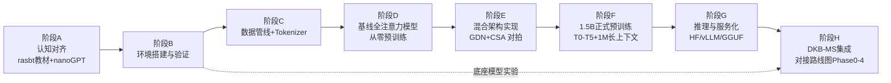

# 从零构建 TAIS Obsidian：总体实施计划

> **版本**：v0.1（2026-07-24）
> **定位**：本文档回答"如何从零构建、训练并推理我们自己的框架"这一总问题，是连接三部设计文档（What & Why）与落地代码（How）的**总实施计划**。阶段 G/H 与《DKB-MS_实施规划与路线图.md》v0.1 的 Phase 0–4 对接，不重复展开。
> **素材来源**：本文档的事实性内容（显存公式、超参、工具能力边界）来自 2026-07-24 的联网调研，来源在文中以 arXiv 编号或 URL 标注；"已有研究证据"与"本项目独创设想"严格区分，独创设想以【设想】标注。

---

## 0. 本计划回答的四个问题

1. **环境**：本机现在有什么、怎么查、要装什么（§1–§2）。
2. **构建**：TAIS Obsidian 1.5B 混合架构（GDN-MemBlock : CSA-AttnBlock = 3:1）如何从一张白纸写成可训练的代码（§4–§7）。
3. **训练**：从 124M 管线验证到 1.5B 正式预训练、再到原生 1M 长上下文，每一阶段做什么、凭什么进入下一阶段（§6–§8）。
4. **推理**：自训自定义架构模型如何加载、生成、服务化，并支持知识块所需的 LoRA 热加载 / KV prefix / hidden state 捕获（§9）。

**总原则**（继承路线图"分阶段推进、不达标不进入下一阶段"的纪律）：每个阶段都有**检查点**（可客观验证的退出标准）。任何检查点失败，回检设计文档对应章节并修订，而不是硬闯。

---

## 1. 本机环境现状（2026-07-24 实测）

### 1.1 实测结果

| 项目 | 实测值 | 判断 |
|---|---|---|
| GPU | NVIDIA GeForce RTX 4060 Laptop，**8GB** 显存（Ada Lovelace，sm_89） | ⚠️ 与设计目标卡 RTX PRO 4000 Blackwell SFF（24GB，sm_120）不同，见 §1.3 |
| 驱动 / 驱动支持的最高 CUDA | 566.07 / CUDA 12.7 | 可跑 cu126 系 PyTorch wheel；若用 cu128 wheel 需升级驱动至 ≥570 |
| 系统内存 | 31.6 GB | 充足 |
| 磁盘 | C: 盘剩余 ~1.6 TB | 充足（数据集与权重都放本地足够） |
| Python | 3.11.15（位于 `C:\Espressif\tools\python\`，ESP-IDF 嵌入式工具链自带） | ⚠️ 不要污染该环境；用 uv 管理独立 Python（见 §3） |
| uv | 0.11.28 | ✅ 推荐的环境管理器，已就绪 |
| git | 2.55.0 | ✅ 仓库已于今日初始化（`main` 分支） |
| CUDA toolkit（nvcc） | 未安装 | ✅ 正常：PyTorch wheel 自带 CUDA runtime，只有源码编译 kernel 时才需要 |
| PyTorch | 未安装 | 待装，见 §3 |
| WSL2 | Ubuntu 已安装（默认版本 2） | ✅ 日后跑 vLLM 的官方路径（vLLM 不支持 Windows 原生） |

### 1.2 如何检查机器环境（标准清单，日后换机/排障复用）

| 检查项 | 命令 | 期望输出 / 判断标准 |
|---|---|---|
| 驱动与驱动支持的 CUDA 上限 | `nvidia-smi` | 右上角 `CUDA Version` 是**驱动支持的最高 CUDA runtime**，不是已装的 toolkit；同时确认显存总量与 GPU 型号 |
| CUDA toolkit | `nvcc --version` | 仅在需要源码编译（flash-attn、自定义 kernel）时才必须装；装 wheel 跑 PyTorch 不需要 |
| PyTorch 版本与自带 CUDA | `python -c "import torch; print(torch.__version__, torch.version.cuda)"` | 形如 `2.9.1+cu126` |
| GPU 可用性 | `torch.cuda.is_available()` | `True` |
| 设备与计算能力 | `torch.cuda.get_device_name(0)` / `torch.cuda.get_device_capability(0)` | 本机应为 `(8, 9)`（Ada）；未来 Blackwell 卡应为 `(12, 0)` |
| **kernel 是否真的编进 wheel** | `torch.cuda.get_arch_list()` | 列表必须包含本机的 `sm_XX`；否则运行时报 `no kernel image is available for execution on the device`——这是换 Blackwell 卡后最重要的一个断言 |
| bf16 支持 | `torch.cuda.is_bf16_supported()` | `True` |
| bf16 实际计算 | 跑一次 4096×4096 bf16 matmul | 不报错即 tensor core 路径健康 |
| 训练期观察 | `nvidia-smi -l 1` | 训练时 GPU-Util 应持续 ~95–100%（否则是数据管线瓶颈）；显存占用稳定不爬升 |

要点：`torch.version.cuda` 显示的是 **wheel 编译时用的 CUDA**，与系统是否装 toolkit 无关；PyTorch 只要求**驱动**足够新（向后兼容）。

### 1.3 硬件差距的诚实评估（重要）

本机 4060 Laptop（8GB，~50W 持续功耗）与目标卡 RTX PRO 4000（24GB，70W）都不是正式预训练 1.5B 的吞吐卡。按标准显存公式（§6.2）：

- **8GB 本机能做什么**：教材级复现（124M 模型全量训练，模型状态 ~2GB）；0.5B 级模型用 8-bit AdamW（~5GB）+ gradient checkpointing 勉强可训；Phase 1 探针实验（9B 以下模型 bf16 推理不可行，需换 4B 级或量化）；所有**管线/代码正确性验证**。
- **8GB 本机不能做什么**：1.5B 全参数训练（8-bit AdamW 也要 ~15GB 模型状态）；9B 底座 bf16 推理（需 ~19GB）。
- **结论**：本机定位为"开发与管线验证机"。底座模型实验待目标 24GB 卡到位（或租云端按小时计费实例）；正式 1.5B 预训练按路线图规划走多卡/云端。各阶段任务已按此分级标注【本机可跑】/【需 24GB】/【需多卡】。

---

## 2. 总体路线图



阶段 A–B 是"学会造"（对应 rasbt 教材路径），C–F 是"造出来并训练"（自有框架），G 是"推理部署"，H 回到本项目的核心命题（知识块/记忆系统）。每个阶段的任务与检查点见后文。

---

## 3. 阶段 B：环境搭建与验证【本机可跑】

> 排在阶段 A 之前叙述是因为它是后续一切的前提；实际执行时 A（读书写码）与 B（装环境）可并行。

### 3.1 任务分解

1. **升级 NVIDIA 驱动**（可选但建议）：当前 566.07 最高支持 CUDA 12.7 runtime。若计划使用 cu128/cu130 系 wheel（未来 Blackwell 卡必需），升级到 ≥570 的最新 Game Ready / Studio 驱动。不升级则锁定 cu126 系 wheel，本机 Ada 卡完全够用。
2. **创建独立 Python 环境**（不碰 Espressif 的 Python）：
   ```bash
   uv python install 3.12
   uv venv .venv --python 3.12
   source .venv/Scripts/activate   # Git Bash；PowerShell 用 .venv\Scripts\Activate.ps1
   ```
3. **安装 PyTorch**（按驱动二选一）：
   ```bash
   # 驱动不升级（CUDA ≤12.7）：cu126
   uv pip install torch --index-url https://download.pytorch.org/whl/cu126
   # 驱动已升级（≥570）：cu128
   uv pip install torch --index-url https://download.pytorch.org/whl/cu128
   ```
4. **安装核心依赖**（随阶段推进分批装，首批）：
   ```bash
   uv pip install transformers datasets tokenizers accelerate tiktoken \
                  bitsandbytes tensorboard lm-eval numpy safetensors
   ```
   - `bitsandbytes`：8-bit AdamW 的关键，现已有官方 Windows wheel（构建目标含 sm_89/sm_120）。
   - **不装 flash-attn**：FA2 官方仅支持 Linux，且 sm_120 源码编译已知失败（Dao-AILab/flash-attention issue #2361）；用 PyTorch 内置 SDPA（`attn_implementation="sdpa"`），本规模下吞吐接近 FA2。
   - **不装 vLLM 到 Windows 原生**：官方明确不支持 Windows 原生（docs.vllm.ai 安装页），日后在 WSL2 Ubuntu 中安装。
5. **写环境自检脚本** `scripts/check_env.py`（入库，作为§1.2 清单的可执行版本）。
6. **git 初始提交**：`.gitignore` 已就位（排除数据/权重/日志/venv），提交 `AGENTS.md`、`docs/`、`.gitignore`。

### 3.2 检查点（退出标准）

- [ ] `check_env.py` 全绿：`torch.cuda.is_available()`、`get_arch_list()` 含本机 sm、`is_bf16_supported()`、bf16 matmul 实测通过。
- [ ] **过拟合冒烟测试**（Karpathy "overfit one batch" 法）：6 层/hidden 384 小 GPT 在固定一个 batch（几千 token）上训练数百步，**loss 稳定降到接近 0**——证明前向/反向/优化器/混合精度全链路健康。
- [ ] `bitsandbytes.optim.AdamW8bit` 能正常 step（验证 CUDA 二进制真的加载了）。
- [ ] 训练中 `nvidia-smi -l 1` 观察 GPU-Util ≥95%。

---

## 4. 阶段 A：认知对齐与教材级复现【本机可跑】

目标：团队成员（含 AI 代理）对"从零构建 LLM"的每个组件有一手经验，为自研框架打下不出错的基本功。主教材即用户指定的 [rasbt/LLMs-from-scratch](https://github.com/rasbt/LLMs-from-scratch)（《Build a Large Language Model (From Scratch)》，Manning，纯 PyTorch 不依赖任何 LLM 库）。

### 4.1 任务分解（按书的最小完整路径）

| 步骤 | 内容 | 产出 |
|---|---|---|
| 1 | Ch 2：BPE tokenizer（tiktoken）、滑动窗口采样、DataLoader、token+position embedding | 能把任意文本变成 batch 张量 |
| 2 | Ch 3：self-attention → causal → multi-head attention，**手写**，不调库 | 注意力机制逐行可解释 |
| 3 | Ch 4：完整 GPT（LayerNorm/GELU/shortcut/block 堆叠）、文本生成 | 一个能 `generate()` 的小 GPT |
| 4 | Ch 5：无标注预训练循环、交叉熵、温度/top-k 采样、加载 GPT-2 权重 | 第一个"自己训的"语言模型 |
| 5 | Appendix D：cosine 衰减、warmup、grad clip 加入训练循环 | 工程化训练循环 |
| 6 | Appendix E：LoRA 原理与实现 | 为知识块 LoRA 载体打底 |
| 7 | 进阶复现：[karpathy/nanoGPT](https://github.com/karpathy/nanoGPT)（~300 行 model.py + ~300 行 train.py），在 tiny 语料上训 GPT-2 124M | 接近真实工程的训练/采样分离结构 |

### 4.2 检查点

- [ ] 不看书能写出 causal MHA 的 forward（面试级标准）。
- [ ] 在 Gutenberg 小语料（书的官方 bonus 脚本）上过拟合一个小模型，loss → 近 0。
- [ ] nanoGPT 124M 在本机 8GB 上训练 ≥1000 步，采样出连贯文本，记录实测吞吐（token/s）作为本机性能基线。
- [ ] 能用 Appendix E 的 LoRA 给训好的模型挂 adapter 并验证输出变化——**这是知识块 LoRA 载体的第一次动手**。

---

## 5. 阶段 C：数据管线与 Tokenizer【本机可跑】

### 5.1 数据策略（依据设计文档 §4：基于 OLMo 3 / Dolma 3 系列）

已验证的公开配方（已有研究证据，非本项目设想）：

| 数据 | 规模 | 用途 | 来源 |
|---|---|---|---|
| Dolma 3 Mix | 5.9T token | 预训练主混（提高代码/数学比例） | Ai2，[OLMo 3 博客](https://allenai.org/blog/olmo3) |
| Dolma 3 Dolmino | ~100B | mid-training（数学/科学/代码/指令高质量池） | 同上 |
| Dolma 3 Longmino | ~50B | 长上下文 mid-training（教 65K） | 同上 |
| Dolci 套件 | — | 后训练 SFT/DPO/RLVR | 同上 |
| FineWeb-Edu | 1.3T | 教育内容过滤标杆（备用/补充） | arXiv:2406.17557 |
| DCLM | 240T 池 | 数据过滤方法论参照 | arXiv:2406.11794 |

### 5.2 任务分解

1. **下载与流式读取**：`datasets.load_dataset("allenai/dolma3_mix", streaming=True)`（或 FineWeb-Edu 起步，体积更友好）；本机阶段只取数 GB 样本做管线验证。
2. **处理管线**：用 HuggingFace [datatrove](https://github.com/huggingface/datatrove) 复现标准流程——语言过滤 → 质量启发式 → MinHash 模糊去重 → 去污。**去污用 13-gram overlap**（GPT-3 惯例，arXiv:2005.14165；Ai2 有开源 `decon` 工具）。
3. **Tokenize 落盘**：用选定 tokenizer 编码为 `uint16` memmap/bin shards（nanoGPT 格式即可），附带数据统计报告（文档数、token 数、长度分布、来源配比）。
4. **Tokenizer 决策**（检查点 C-2，需正式记录）：
   - **默认方案**（与设计文档一致）：复用 Qwen 系 129280 词表 + tied embedding。利：byte-level BPE 无 OOV、CJK 压缩率高、生态兼容；弊：**embedding 参数 = 129280 × 2048 ≈ 2.65 亿，占 1.5B 总参数 ~17%**（Qwen 151936 词表则 ~20%），挤占主干容量，且罕见 token embedding 在中等训练量下欠训（Tao et al. NeurIPS 2024，arXiv:2407.13623 证明大词表需配足训练量）。
   - **必做实验**：在同一份语料上对比 Qwen tokenizer 与自训 32k/49k BPE（`tokenizers` 库 `BpeTrainer`）的压缩率（bytes/token）；若走 overtraining 路线（数千 token/参数），欠训问题可缓解，维持默认方案；否则重开词表讨论并修订设计文档 §2。
5. **数据配比课程**（正式训练用，本阶段只写配置不跑全量）：参照 SmolLM3 三阶段（web 85/code 12/math 3 → 75/15/10 → 63/24/13，[SmolLM3 博客](https://huggingface.co/blog/smollm3)）与 OLMo 2 1B（4T 预训练 + 50B Dolmino 单轮 anneal，arXiv:2501.00656）设计本项目的 mix 配置文件。

### 5.3 检查点

- [ ] 管线端到端跑通：原始样本 → 清洗 → tokenized shards → DataLoader 读出的 batch 形状/词表范围正确。
- [ ] 去污验证：构造含评测集（如 HellaSwag 片段）的污染样本，确认被 13-gram 规则拦截。
- [ ] Tokenizer 决策记录（压缩率对比数据 + 最终选择 + 理由）归档进 `docs/`。
- [ ] mix 配置文件（YAML/JSON）评审通过，与《TAIS_Obsidian_细致框架设计文档》§4 一致。

---

## 6. 阶段 D：基线全注意力模型从零预训练【本机小规模 / 正式量需多卡】

目标：在引入任何自创架构之前，先用**标准架构**把"从零预训练"的全流程（训练循环、混合精度、调度、checkpoint、评测）跑通并建立基线。这既是管线验证，也是日后分离"混合架构效应"的对照组（路线图已规划 Qwen3-8B 作外部对照，这里是我们的内部对照）。

### 6.1 两级模型配置

| 级别 | 配置 | 用途 | 本机可行性 |
|---|---|---|---|
| D-1 | ~124M：12 层 / hidden 768 / 12 头，GPT-2 式 | 管线验证 + 速度基线 | ✅ 全量 AdamW（模型状态 ~2GB） |
| D-2 | ~0.5B：24 层 / hidden 1024–1536，现代件（RMSNorm、SwiGLU、RoPE θ=5e5、QK-Norm、tied embedding、无 bias） | 验证现代配方 + 作为阶段 E 混合架构的同规模对照 | ⚠️ 需 8-bit AdamW（~5GB）+ gradient checkpointing + 小 micro batch |

现代件组合均为已验证证据：RMSNorm/SwiGLU/RoPE/QK-Norm 经 OLMo 2（arXiv:2501.00656）与 SmolLM3 实证；FFN 内维 ≈ (8/3)·d_model 取整到 128 倍数；embedding 层不加 weight decay（SmolLM3 借自 OLMo 2，改善训练动态）。

### 6.2 显存与吞吐估算（套用到本项目的标准公式）

- **模型状态**（bf16 mixed 标准配方，arXiv:1910.02054）：每参数 16 B = bf16 权重 2 + bf16 梯度 2 + FP32 master 4 + Adam m/v 各 4。**禁止纯 bf16**：尾数仅 8 bit，小更新被舍入吞掉（stale weights problem），必须 FP32 master + FP32 优化器状态。
- **8-bit AdamW**（bitsandbytes）：m/v 量化到共 2 B，每参数 10 B。1.5B → ~15GB（24GB 卡可行但紧）；0.5B → ~5GB（本机 8GB 勉强可行）。
- **激活**：不 checkpoint 时每层 ≈ `s·b·h·(34+5a/h)` 字节（Megatron 选择性重计算论文）；1.5B/28 层/seq 4096 不 checkpoint ≈ 45GB → 必须开 activation checkpointing（全量重算后 ≈ `2sbhL`，代价约 +30–40% 时间）。
- **大词表陷阱**（本项目直接相关）：129280 词表 × seq 4096 × bs 8 的 logits 就 ~4.2GB（bf16），再加 FP32 softmax 中间量与主干激活同量级——必须减小 micro batch 或用 chunked/fused cross-entropy（如 Liger kernel）。
- **吞吐**：每 token 训练 ≈ 6N FLOPs。4090 级（165 TFLOPS bf16，MFU 30–45%）训 1.5B ≈ 5.5k–8k token/s；本机 4060 Laptop 受功耗墙限制显著更低，以阶段 A 实测为准。**Chinchilla 量程（20:1，1.5B→30B token）在单卡 24GB 需 1.5–2 个月，正式训练必须多卡/云端**；小模型过训范式（SmolLM2 1.7B 训 11T ≈ 6500 token/参数，arXiv:2502.02737）更确定了这一点。

### 6.3 超参默认值（1–3B 规模实测值，直接起步）

| 项 | 值 | 依据 |
|---|---|---|
| 优化器 | AdamW β(0.9, 0.95)，eps 1e-8，wd 0.1（embedding 不衰减），clip 1.0 | GPT-3 / SmolLM3 / OLMo 2 共同惯例 |
| peak lr | 2e-4–3e-4（1.5B）；小模型可到 6e-4 | GPT-3 1.3B 用 2e-4（arXiv:2005.14165） |
| 调度 | **WSD**：warmup ~2000 步，稳定段恒定，末 10–20% 线性衰减到 0 | MiniCPM 提出，实证与 cosine 持平或更优，且**无需预定总长、可续训**——契合分阶段推进 |
| global batch | 0.5M–2M token/step（micro batch × 梯度累积凑齐，累积零显存成本） | SmolLM3 用 2.36M |
| 精度 | bf16 计算 + FP32 master/优化器/梯度累积 | §6.2 |

### 6.4 任务分解

1. 基于 nanoGPT 骨架（或直接采用 [allenai/OLMo-core](https://github.com/allenai/OLMo-core) 配置）实现 D-1 训练脚本：WSD 调度、bf16 mixed、grad clip、checkpoint 保存/续训、tensorboard 日志。
2. D-1 在阶段 C 产出的 shards 上训练 ≥10k 步；跑通"中断→续训 loss 曲线连续"。
3. **训练期 sanity**：盯 train loss、gradient norm（clip 1.0 下应平稳；OLMo 2 复盘表明 loss spike 通常由 grad norm spike 先导）、吞吐/MFU。
4. 评测接入 [lm-evaluation-harness](https://github.com/EleutherAI/lm-evaluation-harness)：早期信号选低方差基准（HellaSwag/PIQA/ARC-E/CSQA，各截断 1000 样本；FineWeb 方法论）；**1.5B 短训时 MMLU ≈ 随机（25%），不作早期信号**。
5. D-2 同管线放大，作为阶段 E 的对照组固定下来（种子、数据、步数、评测全部记录）。

### 6.5 检查点

- [ ] D-1：loss 曲线健康无 spike，grad norm 平稳；续训无缝；lm-eval 早期信号基准**显著高于随机**。
- [ ] D-2：同配置混合架构对照组就绪；实测吞吐/显存与 §6.2 公式估算偏差 <30%（验证我们的容量规划能力）。
- [ ] 训练报告归档：配置、数据版本、超参、曲线、评测结果（这份报告就是阶段 E/F 的对照基准）。

---

## 7. 阶段 E：TAIS Obsidian 混合架构实现与小尺度对拍【本机小规模】

目标：把设计文档 §2 的 28 层 = 7 × {3 GDN-MemBlock + 1 CSA-AttnBlock}（hidden 2048）写成可训练代码，并在 0.5B 尺度证明"混合架构不劣于同配置纯注意力"。

### 7.1 关键外部依托（已有研究证据，大幅降低自研风险）

- **GDN 算子**：[fla-org/flash-linear-attention](https://github.com/fla-org/flash-linear-attention) 提供 Gated DeltaNet（arXiv:2412.06464）的 Triton chunk kernel（训练/推理一体），其 `fla.models.*Config` 可直接注册进 transformers AutoClass，hybrid（哪些层换全注意力）仅需改 config。
- **结构参照**：**Qwen3-Next**（48 层 = 12×{3 GDN+1 Gated Attention}，hidden 2048——层间比与 hidden 与我们几乎相同，仅多了 MoE）与 **OLMo Hybrid 7B**（32 层 3:1 GDN:MHA，数据课程同为 Dolma 3 系列，训练代码 OLMo-core 全开源）。两者 transformers 均已原生支持，`modeling_qwen3_next.py` / `modeling_olmo_hybrid.py` 可直接裁剪为 dense 1.5B。

### 7.2 任务分解

1. **HF 侧模型实现**：以 modular 方式（或复制裁剪）写出 `modeling_tais_obsidian.py` + `configuration_tais_obsidian.py`（继承 `PreTrainedModel`/`PreTrainedConfig`，获得 `save_pretrained`/`from_pretrained`；设 `model_type="tais_obsidian"` 并 `register_for_auto_class`）。**GDN 层无 KV cache、KV prefix 注入只适用 CSA 层、LoRA 各层通用**——"载体适用性"按层类型写进 config 与 Block Spec v0.2 字段（设计红线，路线图 §8 已列）。
2. **数值对拍**：固定随机权重，对照 fla 参考实现与本实现逐层输出（误差 <1e-5 量级）；构造 llm.c 式 debug state（小 batch 输入 + 目标激活/梯度），后续任何改动跑回归。
3. **0.5B 对拍实验**：同数据/同种子/同步数训混合版与 D-2 纯注意力版，对比 loss 曲线、下游早期信号、吞吐、显存。【设想】设计文档预期混合架构以 ~1/4 KV cache 代价达到接近全注意力质量——此实验是该设想的第一次证伪机会。
4. **KAL 探针挂点预留**：在 checkpoint 结构中预留探针输入层索引（设计文档 §6），本阶段只验证 `register_forward_hook` 能在混合模型各层类型上正确捕获残差流（GDN 层与 CSA 层分开验证）。

### 7.3 检查点

- [ ] 模型可 `save_pretrained` → `from_pretrained` 往返无损；`model.generate()` 正常。
- [ ] 数值对拍通过；debug state 回归脚本入库。
- [ ] 0.5B 对拍：混合架构早期信号基准不低于纯注意力基线的 95%（或差异可解释），吞吐/显存优势可测量。
- [ ] 层类型→载体适用性标注表（KV prefix / LoRA / steering vector × GDN / CSA）合入 Block Spec v0.2 草案。

---

## 8. 阶段 F：1.5B 正式预训练与原生 1M 上下文【需 24GB 起步 / 正式量多卡 / 长上下文阶段云端】

> 本阶段是《TAIS_Obsidian_细致框架设计文档》§3/§7（原生 1M 训练方案、T0–T5）的工程执行版，细节以该文档为准；此处只列阶段切分与检查点，避免双源不一致。

### 8.1 子阶段与检查点

| 子阶段 | 内容 | 硬件 | 检查点 |
|---|---|---|---|
| F-0 配方冻结 | 汇总 D/E 结论：最终 config、mix、超参、WSD 各段长度、token 预算（建议参照 OLMo 2 1B 的 4T 与 OLMo Hybrid 7B 的 5.5T 定 1–4T 区间，过训范式） | — | 训练方案评审通过，修订合入设计文档 |
| F-1 短上下文主干 | 2K–8K 上下文预训练主体（WSD 稳定段） | 多卡/云端 | 周期性早期信号基准单调爬升；无不可逆 loss spike；checkpoint 每 N 步评测归档 |
| F-2 mid-training | Dolmino 式高质量退火（数学/代码/指令上采样，WSD 衰减段） | 同上 | 衰减段 loss 快速下掉；下游基准跳升（WSD 已知行为） |
| F-3 长上下文扩展 | Longmino 式数据 + RoPE θ 提升（SmolLM3：1.5M→5M）/ YaRN，逐级 32K→128K→1M | 1M 阶段云短租多卡 | **RULER** 各长度达标（设计文档 §3 的指标）；长文 needle 测试通过 |
| F-4 KAL/HRL 内生部件 | 按设计文档 §6 训练元认知探针与分层强化学习模块（checkpoint 内生，非外挂） | 同上 | 探针 AUROC 指标（与路线图 Phase 1 的 ≥0.8 对齐）；模块可随 checkpoint 存取 |
| F-5 后训练（可选/远期） | Dolci 式 SFT → DPO（TRL `SFTTrainer`/`DPOTrainer`；SFT lr 1e-5–2e-5、DPO lr 5e-7–5e-6、β≈0.1） | 同上 | 指令跟随评测对比 base 显著提升 |

### 8.2 全程纪律

- 每个子阶段结束跑完整 lm-eval 套件 + RULER，结果对照 F-0 预期；不达标回检设计文档对应章节并修订（设计冻结纪律）。
- 所有 checkpoint 带配置/数据版本/超参元数据，任何人可从 checkpoint 复现该次评测。
- 训练事故（loss spike、硬件中断）按 OLMo 2 复盘流程记录进风险登记册。

---

## 9. 阶段 G：推理与服务化——给自己的框架做推理【底座实验需 24GB / 本机可验证小模型】

自训自定义架构模型的推理分三层，按成熟度排序推进。

### 9.1 第一层：HuggingFace 本地推理（无外部依赖，最先打通）

- 阶段 E 的 `save_pretrained` 产物 + `auto_map` + `trust_remote_code=True` 即可 `from_pretrained` 本地加载、`generate()` 生成；KAL 探针用 `register_forward_hook` 或 `output_hidden_states=True` 捕获各层 hidden state（hybrid 模型按层类型分别验证）。
- 注意 transformers v5 的权重加载重构：自定义 `PreTrainedModel` 若添加显式 `nn.Parameter` 需自行 override `_init_weights`（v5.0.0rc0 已知行为）。
- **检查点**：自训 checkpoint 加载 → 生成连贯文本 → hooks 落盘 hidden state（这正是路线图 Phase 0 的退出标准"提问→捕获→落盘"管线）。

### 9.2 第二层：vLLM 服务化（在 WSL2/Linux，性能与知识块能力的主战场）

**必须走原生实现路线**：vLLM 的 transformers 后端（trust_remote_code 捷径）官方只支持 full/sliding attention，GDN 层走不通。任务：

1. fork vLLM 的 `qwen3_next.py`（或写 out-of-tree 插件，`ModelRegistry.register_model`），实现：
   - 模型类 + `load_weights()`（attention 用 `vllm.model_executor.layers.attention.Attention`，GDN 层用 vLLM 已集成的 fla Triton GDN kernel——vLLM 对 Qwen3-Next 默认 full CUDA graph）；
   - 协议 `IsHybrid` + GDN 层继承 `MambaBase`（`get_state_dtype`/`get_state_shape`/`mamba_type`/`get_attn_backend`），metadata 类参考 `LinearAttentionMetadata`，backend 注册进 `MambaAttentionBackendEnum`，custom op 加入 `_attention_ops`（torch.compile/piecewise CUDA graph 前提）；
   - 协议 `SupportsLoRA`，**target module 命名在设计阶段对齐**（社区教训：Qwen3.5 上未列入支持表的模块名会被静默忽略，vllm issue #38085）——这直接决定 Block Spec 的 LoRA 载体字段怎么写；
   - 协议 `SupportsMambaPrefixCaching`（为 GDN 状态做周期性 checkpoint 与 KV 块对齐）——**这是 hybrid APC 的前提，属于写在模型实现里的能力，不是配置开关**。
2. **知识块运行时能力验收**（对应 DKB-MS 读通道）：
   - LoRA 热加载：`VLLM_ALLOW_RUNTIME_LORA_UPDATING=True` + `POST /v1/load_lora_adapter`，`load_inplace: true` 原位替换——官方描述的场景就是"持续更新 adapter 不中断推理"，与"离线编译知识块→运行时换入"同构（官方标注为开发模式能力，有安全风险，仅限隔离环境）；
   - Automatic Prefix Caching：`enable_prefix_caching=True`。**风险登记**：hybrid APC 刚进入实验阶段，Mamba-2 系已支持，但 **Qwen3-Next/Qwen3.5 这条 GDN 线的 APC 截至 2026-07 仍命中率 ~0%（open issue）**——KV prefix 知识块若依赖引擎级 APC，需自研上述协议或准备 fallback（GDN 层状态不参与缓存、仅 CSA 层命中）；
   - sleep/wake_up：`enable_sleep_mode=True`，`sleep(level=1)` 权重 offload 到 CPU 释放 90%+ 显存——与"睡眠时间"离线编译/训练天然对应（服务端为 dev mode 端点，不对外暴露）。
3. **检查点**：`vllm serve` 自训 checkpoint 出 OpenAI 兼容 API；吞吐/延迟基准报告；LoRA 热加载演示（请求级切换 adapter）；prefix caching 命中率实测并写入风险登记册。

### 9.3 第三层：llama.cpp / GGUF（长期备选，端侧）

llama.cpp 已有 `GGML_OP_GATED_DELTA_NET` 算子与 Qwen3-Next converter；我们若保持同构（GDN + 全注意力、dense），主要工作是 `convert_hf_to_gguf.py` 新增一个 dense Model 类。已知风险：hybrid 模型 prompt cache 在 llama.cpp 仍不稳定（context checkpoint 失效导致全量重算，issue #19794）。**不阻塞主线，阶段 H 之后再评估。**

---

## 10. 阶段 H：DKB-MS 集成（对接既有路线图）

模型能力就绪后，回到本项目核心命题。本阶段**完全按《DKB-MS_实施规划与路线图.md》Phase 0–4 执行**，此处只建立映射，不重复展开：

| 路线图 Phase | 依赖本文档阶段 | 退出标准（以路线图为准） |
|---|---|---|
| Phase 0 基础设施 | §3 环境 + §9.1 HF hooks | "提问→捕获 hidden state→落盘"端到端 |
| Phase 1 空白探针 | §9.1 + 底座模型（Qwen3.5-9B，需 24GB） | 中间层线性探针 AUROC ≥ 0.8，优于两个基线 |
| Phase 2 读通道 | §9.2 vLLM 原生实现（LoRA/KV prefix） | 注入后目标领域准确率显著提升，切换开销 < 思考段 20% |
| Phase 3 写通道与睡眠固化 | §9.2 sleep 模式 + LoRA 热加载 | "记录→固化→次日无提示答对"闭环 |
| Phase 4 闭环与进化 | §8 F-4 + 以上全部 | RL 路由、联想路由、人格块、长期运行 |

注意底座实验与自训模型是**两条并行线**：路线图 Phase 0–3 用 Qwen 底座先验证 DKB-MS 科学问题（探针、注入、固化），本文档阶段 D–F 造出自有框架后再把 DKB-MS 能力内生化（KAL/HRL checkpoint 内生）。

---

## 11. 风险登记册（本文档新增，并入路线图风险登记册维护）

| # | 风险 | 等级 | 缓解 |
|---|---|---|---|
| R-a | 本机 8GB 与目标 24GB 硬件差距，底座实验（9B 推理需 ~19GB）当前无法启动 | 高 | 底座实验整体待 24GB 卡/云端；本机先行阶段 A–E（管线与代码正确性） |
| R-b | vLLM hybrid APC 在 GDN 线未完工（Qwen3-Next 自身 APC 命中率 ~0%） | 高 | KV prefix 知识块设计预留"仅 CSA 层命中"fallback；为自研模型实现 `SupportsMambaPrefixCaching` 列入 §9.2 任务 |
| R-c | 129280 大词表占 1.5B 参数 ~17%，罕见 token 欠训 + logits 显存/算力开销 | 中 | 阶段 C 压缩率实验 + 过训范式对冲；chunked CE；必要时修订设计文档 §2 |
| R-d | 单卡吞吐不足以支撑正式预训练（Chinchilla 量程需 1.5–2 月/24GB 卡） | 高 | 正式训练按路线图走多卡/云端；F-0 冻结前先做成本测算 |
| R-e | Windows 生态死路：vLLM 无原生支持、flash-attn 无官方 Windows wheel | 中 | vLLM 一律 WSL2；attention 用 SDPA；8-bit AdamW 用 bitsandbytes 官方 Windows wheel |
| R-f | 驱动 566.07（CUDA ≤12.7）与未来 cu128+ 生态（Blackwell 必需）不匹配 | 低 | 换卡前升级驱动 ≥570；本机现阶段用 cu126 wheel |
| R-g | transformers v5 / vLLM V1 快速演进，自定义模型接口可能随版本漂移 | 中 | 每个阶段锁定依赖版本并记录；数值对拍 + debug state 回归兜底 |

---

## 12. 附录

### 12.1 关键数字速查

- 显存：标准配方 16 B/参数；8-bit AdamW 10 B/参数；激活不 checkpoint ≈ `sbh(34+5as/h)` 每层；logits ≈ `bs·seq·vocab·2B`（bf16）。
- 训练 FLOPs：≈ 6N/token（N=参数量，不含词表大头）。
- token 预算锚点：Chinchilla 20:1（arXiv:2203.15556）；OLMo 2 1B = 4T；OLMo Hybrid 7B = 5.5T；SmolLM2 1.7B = 11T（过训）。
- 超参：AdamW β(0.9,0.95) eps 1e-8 wd 0.1 clip 1.0；lr 2e-4–3e-4（1.5B）；WSD warmup ~2000 步末 10–20% 衰减；global batch 0.5M–2M token。
- 本机基线：8GB / Ada sm_89 / cu126 / 4060 Laptop 实测吞吐（阶段 A 填）。

### 12.2 核心参考资料

- 教材：rasbt/LLMs-from-scratch（Ch 2–5 + Appendix D/E）；续作 rasbt/reasoning-from-scratch。
- 训练框架：karpathy/nanoGPT；KellerJordan/modded-nanogpt（现代技巧目录：Muon、QK-Norm、ReLU² 等，1.5B 规模有实证）；huggingface/nanotron + datatrove + lighteval；allenai/OLMo-core（全开放配方参照系）；pytorch/torchtitan（正式多卡底座候选）。
- 数据：Dolma 3 系列（allenai.org/blog/olmo3）；FineWeb-Edu（arXiv:2406.17557）；DCLM（arXiv:2406.11794）。
- 混合架构：fla-org/flash-linear-attention（GDN kernel）；Qwen3-Next 模型卡；OLMo Hybrid 7B 模型卡（同 3:1、同 Dolma 3 课程的最近参照）。
- 推理：vLLM 文档（Adding a New Model / LoRA / APC / Sleep Mode）；PyTorch 博客 "Hybrid Models as First-Class Citizens in vLLM"（2025-11）。
- 评估：EleutherAI lm-evaluation-harness；RULER（长上下文）。

### 12.3 立即行动清单（本文档视角，与路线图 §8 互补）

1. 【本周】§3 环境搭建 + 检查点全过（含过拟合冒烟测试）。
2. 【本周起】阶段 A 教材路径推进（每天可交付一个章节的代码笔记）。
3. 【环境就绪后】阶段 C 数据管线（FineWeb-Edu 样本起步）+ tokenizer 压缩率实验。
4. 【待硬件】底座模型实验（路线图 Phase 0–1）与 §9.2 vLLM 原生实现，需 24GB 卡或云端预算到位后启动。
