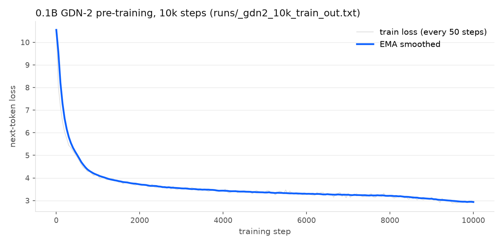
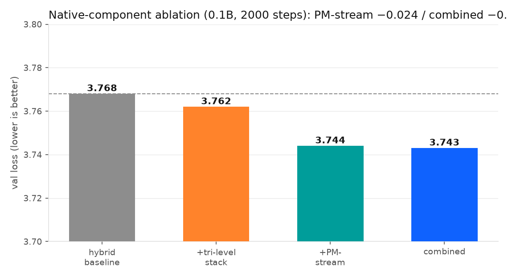
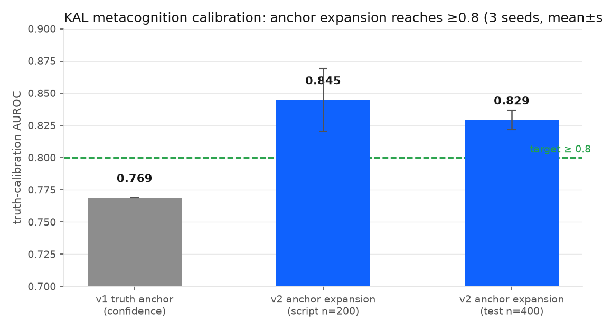
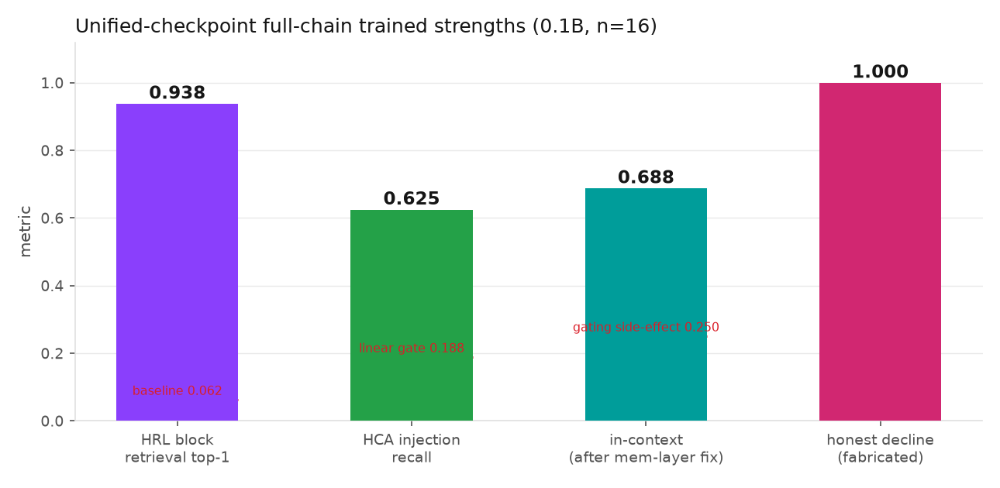
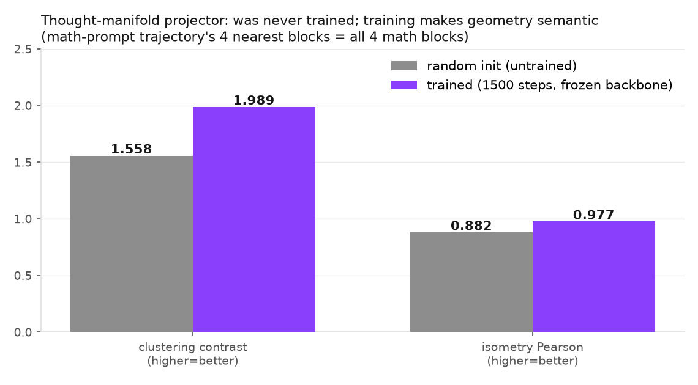
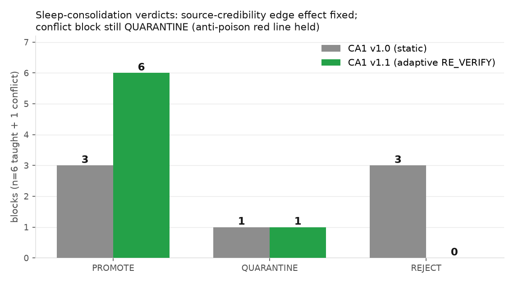
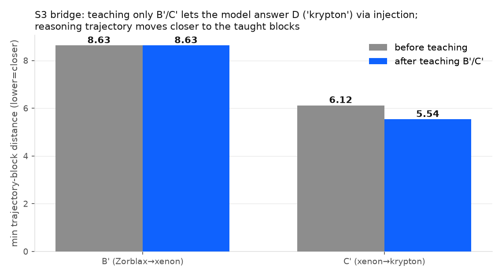
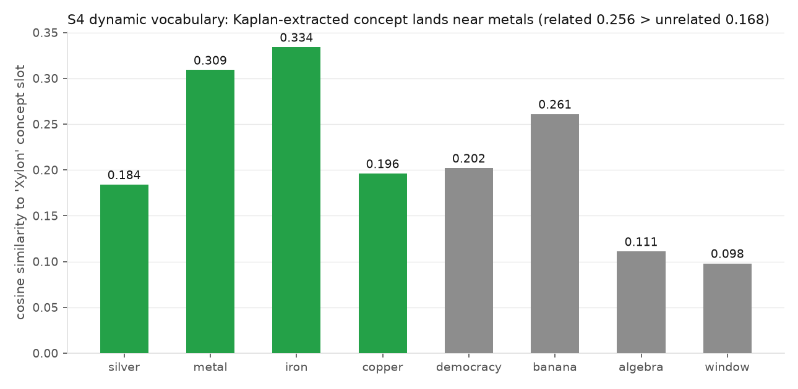
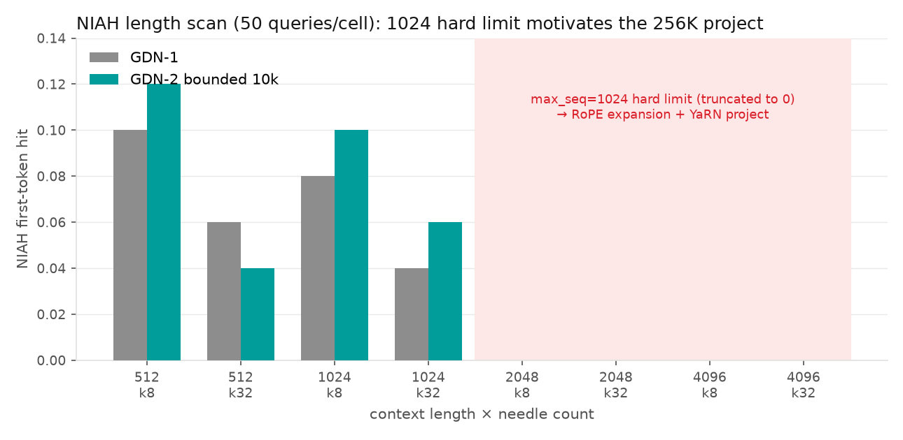

# Developing a Self-Learning Edge Language Model: A Weight Virtual-Memory Architecture and Its 0.1B Pilot Validation

Tianrui Bai
Electrical and Computer Engineering
July 31st, 2026

## Executive Objective

This report describes TAIS Obsidian, a language model architecture designed to keep learning after deployment through an operating-system-style "weight virtual memory," and summarizes the complete validation of a 0.1B-parameter pilot: every planned subsystem was implemented, measured, and honestly reported, including negative results. The report further outlines the ongoing transition to a 1B-parameter model and the engineering path toward edge deployment.

## The Problem: Deployed LLMs Cannot Learn

A pre-trained LLM stores everything it knows in frozen weights. After deployment, the model cannot absorb new facts, correct its mistakes, or adapt to a user's domain without an expensive re-training cycle. This single limitation cascades into three practical failures that are well documented in the literature.

First, the standard workaround, Retrieval-Augmented Generation (RAG) [1], and its active variants (FLARE [2], Self-RAG [3]), patch knowledge into the prompt as text. Text is not the model's native knowledge representation: the injection depends on prompt concatenation rather than a weight-level interface, consumes the finite context window, and produces no persistent memory — the same fact must be retrieved again in the next conversation.

Second, models have no explicit readout of their own knowledge boundary. Linear probes on hidden states can decode "the model knows it does not know" with high accuracy (SAPLMA [4]; up to 0.904–1.000 AUROC even under 4-bit quantization [5]), which means the signal exists inside the model — but mainstream architectures never use it to drive behavior. The result is hallucination: the model guesses fluently where it should say "I don't know."

Third, long-context operation — required for documents, codebases, and conversation history — is expensive. Attention computation scales quadratically with sequence length, and the KV cache grows linearly until a single long sequence consumes gigabytes of memory [6]. On edge devices, where the small language model market is growing at a 28.7% CAGR (USD 0.93B in 2025 to a projected 5.45B by 2032) precisely because of privacy, latency, and energy constraints [7], [8], both the model and its context budget must stay small. A small, edge-bound model is exactly the model that most needs to keep learning.

Finally, naive continued learning is destructive. Fine-tuning on new data causes catastrophic forgetting, and recent evidence shows that even optimizer choice changes how much is forgotten — full fine-tuning with the same optimizer used in pre-training forgets measurably less [9]. Biological brains solve an analogous problem with complementary fast and slow learning systems (hippocampus for fast episodic capture, neocortex for slow consolidation) [10]. Current LLM architectures have no equivalent.

## Limitations of Current Approaches

Several research directions attack parts of this problem, but each leaves a structural gap. RAG and agentic tool-use keep knowledge outside the model, so nothing accumulates as an auditable, weight-level asset; retrieval quality bounds the whole system. Test-time-training approaches (TTT, Titans) update weights during inference [11], [12], but deliberately avoid learned compression in the attention path and offer no mechanism for verifying what should be written — memory poisoning becomes an unguarded attack surface, as demonstrated by MemoryGraft-style injection attacks [26]. Continual fine-tuning methods fight forgetting with regularization or replay, but they modify the very weights that define the model's behavior, which is unacceptable for a deployed system that must remain auditable and reversible. Metacognition research (SAPLMA [4], MeCo [24], Meta-R1 [25]) proves that knowledge-gap signals are linearly readable, but treats them as monitoring signals only — none close the loop into "detect gap → acquire knowledge → verify → write → recall → consolidate."

## Proposed Solution: The TAIS Obsidian Architecture

TAIS Obsidian (Figure 1) is built around one idea: knowledge should be a runtime object at the same level as weights — the KnowledgeBlock — managed like virtual memory in an operating system.

**Weight virtual memory.** Knowledge blocks are registered in a page table (SQLite), stored in a tiered hierarchy (L0 VRAM ↔ L1 DRAM ↔ L2 NVMe ↔ L3 remote), and paged into the running model on demand through weight-level injection points. Page faults are fail-closed: the model explicitly declares "this part of memory is currently unavailable" rather than answering from empty knowledge. Every block carries tamper-evident signatures and a markdown source form as the final audit and rollback basis; compiled forms can be discarded and rebuilt at any time.

**Read/write asymmetry.** At runtime, only zero-gradient fast writes are allowed (append-only logs, steering vectors, KV-prefix or memory-layer delta writes); gradient-based consolidation into the backbone happens exclusively offline in a "sleep" phase, gated by validation — mirroring the fast/slow complementary learning systems of the brain [10]. The persona block is read-only at runtime.

**Hybrid efficient backbone.** The backbone alternates GDN-2 linear-attention layers (constant-size recurrent state; erase/write decoupled gating [13]) with a three-level retrieval attention stack: a 512-token sliding window for exact local attention, a compressed sparse selection branch (CSA, stride-4), and a heavily compressed gist branch (HCA, 128:1) [14]. Long-context cost stays near-linear, which is a prerequisite for edge deployment.

**Layered metacognition (KAL).** Small frozen linear heads read the backbone's hidden states (read-only, on different layers than the intervention points, to prevent self-excitation) and output a three-state "probability of knowing" P(IK), affect signals, and conflict signals. Low P(IK) drives behavior: retrieve, ask a clarifying question, call a tool, or honestly decline [2], [4].

**Active inquiry loop.** When a knowledge gap is detected, the system does not self-correct blindly — large language models are known to fail at unaided self-correction [15]. Retrieved or elicited candidate knowledge must pass a cross-verification gate (multi-source consistency, prior consistency, conflict detection) before being written as a knowledge block; the block is then immediately retrievable in the same conversation (HRL indexer + HCA injection) and is later consolidated during sleep with a CA1-style gate and ternary-reward reinforcement [16].

**Dynamic vocabulary.** Reserved concept slots (2,048 of them) let the model mint new single-token concepts from its own inner lexicon via Kaplan's detokenization mechanism [17], without re-training the tokenizer — the vocabulary grows on a three-level ladder (input side free, output side gated).

## Current Progress: What Has Been Validated at 0.1B

Every subsystem above has been implemented in a self-built pure-PyTorch framework and measured on a 0.1B pilot (12 layers, d_model 768, 120M training tokens), on a dual-GPU workstation. All numbers below come from project evaluation artifacts; the full suite of 471 unit tests passes.

**Backbone and efficiency ablations.** The hybrid baseline reaches validation loss 3.768. The three-level retrieval stack scores 3.762 (−0.006 nats, +0.093% parameters), and the PM-stream multi-stream residual scores 3.744 (−0.024); the combination is compatible at 3.743 (−0.025) [14], [18].

*Fig. 1: 0.1B GDN-2 pre-training convergence, 10k steps (real training log).*

*Fig. 2: Native-component ablation (2000-step val loss).*

**GDN-2 gate convergence and bounded decay.** Early NIAH retrieval lag of GDN-2 was shown to be under-converged gates, not an architecture defect: a three-stage evidence chain (under-trained → gate saturation → overtake at NIAH 0.240 vs GDN-1 0.200) established this. Replacing the unbounded decay parameterization with a bounded scaled-sigmoid (g_min = −5) accelerated gate convergence by 4× while preserving numerical range for 1M-context operation.

**Metacognition.** Post-hoc probes read "knowing vs not-knowing" linearly at AUROC 0.945 (0.979 on the semantic-gap subset), exceeding the FLARE output-distribution baseline. Truth-anchor calibration — anchoring on factual truth rather than language-modeling confidence — first reached AUROC 0.769, and an expanded anchor set then raised it to 0.845 and 0.829 on two evaluation protocols (three seeds each), meeting the ≥0.8 target. A prediction-feedback loop was implemented, evaluated, and honestly reported as no-gain and rolled back. After calibration, the certainty direction is semantically correct (known text P(known) ≈ 1.000, fabricated text ≈ 0.13), and backbone validation loss is bit-identical before and after calibration (the probe-frozen red line holds).

*Fig. 3: KAL truth-calibration AUROC (3 seeds, mean±std; the feedback-loop arm showed no gain and was rolled back).*

**Write-then-use knowledge blocks.** After training, the HRL indexer retrieves the correct block at top-1 = 1.000 (0.938 on the unified checkpoint). Injecting block KV into the HCA region answers injection-recall questions at 0.625, against an in-context upper bound of 0.70 and a pre-training baseline of 0.062 — with the backbone weights bit-identical (drift = 0.0).

*Fig. 4: Unified-checkpoint full-chain strengths (n=16; dashed red = respective baselines).*

**Honest degradation.** On fully fabricated facts, the calibrated model declines to answer 16/16 times instead of confabulating.

**Knowledge internalization and sleep consolidation.** Teaching-style SFT raises the internalization gap (answer with the knowledge chain minus without) from 0.015 to 0.758, with a perfect 1.000 dissociation score: consistent knowledge is fully internalized, contradictory knowledge is fully rejected. The sleep consolidator's gated adjudication produced PROMOTE 8 / QUARANTINE 1 / REJECT 8 on a mixed batch.

**Dynamic vocabulary.** The Kaplan inner-lexicon extraction is live (strongest at layer 3 at 0.1B scale) and wired into the self-learning loop; semantic checks show real meaning (electron–photon cosine 0.513 vs electron–democracy 0.217).

**Interactive full-chain validation (2026-07-31 supplement).** Beyond the offline suite, an interactive validation system (chat REPL + deterministic four-phase scenario) re-verified the complete "runtime correction + sleep consolidation" loop under a realistic dialog flow: fabricated facts → certainty 0.000 with Decline 6/6; teaching 6 facts → write rate 1.00, KV-injection recall 0.500 vs 0.000 baseline (n=6, same magnitude as the 0.625 at n=16); reasoning-trajectory certainty directionally correct; grid-code probe −0.052 (correctly negative — the unified checkpoint carries no path-integration training); sleep adjudication PROMOTE 3 / QUARANTINE 1 / REJECT 3. The validation also surfaced a structural finding: **the CA1 consolidation gate coupled to source credibility with an edge effect** — tool-sourced (CallTool/doc) blocks scored consensus 0.68, just below the 0.7 threshold, and were systematically rejected, while user-sourced blocks (0.76) were promoted; only 3 of 6 taught facts could consolidate.

**Extended validation: manifold training, adaptive CA1, and the five-scenario suite (2026-07-31, second supplement).** Three systemic pieces of work followed, plus a five-scenario extended test (113 logged dialog turns; 14 of 15 criteria passed, one honest negative).

*① Manifold reasoning needed training — and got it.* Evidence showed the unified checkpoint contains no manifold-projector weights (zero manifold keys among 266; weight statistics match random init exactly). Training the projector for 1500 steps with the backbone frozen (bit-identical before/after) raised semantic clustering contrast from 1.558 to **1.989** and isometry Pearson from 0.882 to **0.977** (Fig. 5). The clearest evidence: the four nearest knowledge blocks to a math prompt's reasoning trajectory are exactly the four math blocks. A manifold-reasoning preview (per-generation-step 3D trajectory with knowledge-block overlay and four-class bad-path detection) was also built.

*Fig. 5: Thought-manifold projector — untrained by accident, then trained (frozen backbone).*

*② Adaptive CA1 gate (v1.0 → v1.1), fixing the edge effect above.* Three mechanisms: a RE_VERIFY margin band (blocks with consensus in [0.62, 0.7) get one cross-verified retry with a bounded bonus instead of outright rejection); evidence-aware consensus (0.85·base + 0.10·usage + 0.05·verify-rate); and online source-credibility learning (EMA updated by historical verification outcomes). Empirically (Fig. 6): doc-sourced blocks moved 0.688 → RE_VERIFY → 0.743 → **PROMOTE (6/6 consolidated, vs 3/6 in v1.0)**, while the conflict block remained QUARANTINE. Anti-gaming was verified three ways: poor blocks (<0.62) never enter the band; failing re-verification cannot whitewash; repeated failures push a source below the band (0.70→0.36), removing retry eligibility.

*Fig. 6: Sleep-consolidation verdicts before/after CA1 v1.1.*

*③ Five-scenario suite.* S1: retrieval hits 0.67/1.00 on existing-knowledge chains (0.1B world knowledge is weak — recorded honestly). S2: multi-round teaching kept the recall curve non-decreasing, with re-taught entries coexisting as v1/v2/v3 (the accumulate-never-overwrite red line). **S3 (the key result):** the model cannot infer D by default (certainty 0.000), yet after teaching only the intermediate facts B' and C', injection recall answers D ('krypton'), and the reasoning trajectory's nearest distance to the taught blocks improves from 6.12 to 5.54 (Fig. 7). S5: all 19 doc-sourced blocks consolidated via RE_VERIFY (source credibility 0.70→0.95), and post-sleep recall is unchanged (consolidation does not harm runtime ability).

*Fig. 7: S3 bridging — teaching only B'/C' enables answering D; the trajectory moves closer to the taught blocks.*

**The carrier distribution boundary (the most important honest finding).** In S4 (dynamic vocabulary), the new word "Xylon" registered its concept slot correctly, with sensible semantic neighbors (metals mean cos 0.256 > unrelated 0.168, Fig. 8) and top-1 retrieval — **yet injection recall failed completely** (five phrasing variants all fell back to prior answers). Root cause: KV-injection recall works only inside the teaching-SFT distribution (engine-fact templates and the fuel-word answer domain); custom fact formats scored 0.25 at best. At 0.1B, "write-then-use" is an **in-distribution capability**, not a universal one.

*Fig. 8: S4 — the Kaplan-extracted concept lands near metals, but injection recall fails for OOV words.*

**Solution analysis (cross-validated against the literature).** This boundary mirrors the known weakness of knowledge editing — edited facts generalize and compose poorly [27]. Three mutually reinforcing paths: ① **diversify the recall-training distribution** — evidence that few-shot fine-tuning generalizes better out-of-distribution than pure in-context learning, and that combining retrieval with fine-tuning is best [27]; the teaching-SFT templates and answer domains are already being diversified in the 1B data recipe; ② **retrieval robustness** — hard-negative training for the HRL indexer (STAR/ADORE-style curricula [28]) to stop out-of-distribution queries from being hijacked by distractor blocks; ③ **OOV concept graduation** — concept-slot vectors can steer but not recall facts (the theoretical boundary of position-invariant carriers), so output-side registration is required (better embedding initialization [29] plus short CPT of W_E/W_U only, per the design's three-level vocabulary ladder). All three are first-class observations for the 1B run, alongside KAL probe strength.

## Design Journey: Problems Found and How They Were Solved

Engineering honesty is a design principle of this project; several findings changed the architecture's course.

**Gate under-convergence was misdiagnosed as an architecture defect.** GDN-2 initially lost to GDN-1 on retrieval. Instead of abandoning the design, a staged investigation isolated the cause as under-trained gates, and bounded decay — borrowed from Kimi Linear's parameterization [19] — fixed convergence speed. Lesson recorded: retrieval lags gate divergence as a slow variable.

**Injection recall created a gating side effect.** Enlarging the fusion gate (necessary to reach 0.625 recall) also opened the gate for long-text gist, degrading pure-text in-context recall from 0.688 to 0.250. Two decoupling attempts (dual-channel gating; a fully decoupled CSA channel) were implemented and measured; the second produced an honest negative result — at 0.1B, injection recall depends on the enlarged gate's open-weight state and cannot be replicated in an isolated channel. The resolution came from relocating factual entries to the memory layer (token-addressable, fact-recallable), which restored in-context performance to 0.688 with zero interference; training the memory-layer readout interface is the scheduled completion of this path.

**Logprob is not truth.** Early calibration anchored on language-modeling confidence plateaued at 0.769 AUROC. The fix was anchoring on factual truth with a diversified anchor set (near-miss factual errors, cross-domain mashups, programmatic fabrications). This negative result drove the truth-anchor design now used throughout KAL.

**A silent optimizer-scheduler bug.** The Muon optimizer groups read `muon_lr`/`adamw_lr` keys, but the training loop only wrote the generic `lr` key — so the warm-stable-decay schedule silently never applied to Muon. The defect was caught in code review before the long run, fixed with a proportional scaling rule, and locked by a dedicated regression test.

**Optimizer-model consistency.** Following evidence that consolidation forgets less when it uses the pre-training optimizer [9], Muon (Newton–Schulz orthogonalized momentum) was adopted for both pre-training and sleep consolidation, and measured to converge better than AdamW (6.523 vs 6.868) at only 4.6% throughput cost.

## Current Stage: The 1B Transition

The pilot phase is complete and the project has transitioned to a 1B-parameter model (1,017.7M parameters: d_model 1536, 32 layers = 8×{3 GDN-2 + 1 attention stack}), training on a 10B-token multi-domain corpus (web education 73%, mathematics 12%, synthetic textbooks 10%, Chinese web 5%) with a 1B-token quality-upweighted mid-training annealing phase, following the OLMo 3 Dolmino and SmolLM2 multi-stage recipes [20], [21]. The 10B-token budget is deliberately positioned as an architecture-validation run: it is half of the Chinchilla compute-optimal amount for 1B [22] and far below current 1B practice (4T+ tokens [21]), and all downstream evaluation will be reported with this caveat. The full toolchain — streaming data preparation with resume and vocabulary-bounds scanning, Muon training with the scheduler fix, checkpoint-resume hardening, tokenizer-bundled export, and HuggingFace upload — has passed a 471-test regression suite. Context extension to 256K tokens via YaRN-scaled RoPE and a progressive window curriculum is implemented at first version and scheduled after the 1B run [23].

*Fig. 9: NIAH length scan — the max_seq=1024 hard limit (RoPE cache) motivates the 256K extension project.*

## Impact and Future Development

A self-learning edge LLM changes what a small model can be. Instead of shipping a frozen snapshot, a device could arrive with a compact backbone and accumulate its owner's knowledge as auditable, revocable knowledge blocks — privacy-preserving because nothing needs to leave the device, and safer because writes are verified, signed, and gated. The immediate next steps are: completing the 1B training and its component re-validation (KAL probe strength at scale is the first observation), training the memory-layer readout interface to reach side-effect-free recall at the 0.625 level, the 256K progressive context curriculum, and standard-format export for community benchmarking. The longer-term target remains the design's full specification: a 1.5B model with a native 1M-token context and the complete self-learning loop trained end-to-end.

## Reference

[1] P. Lewis *et al.*, "Retrieval-augmented generation for knowledge-intensive NLP tasks," in *Proc. NeurIPS*, 2020, arXiv:2005.11401.

[2] Z. Jiang *et al.*, "Active retrieval augmented generation (FLARE)," in *Proc. EMNLP*, 2023, arXiv:2305.06983.

[3] A. Asai, Z. Wu, Y. Wang, A. Sil, and H. Hajishirzi, "Self-RAG: Learning to retrieve, generate, and critique through self-reflection," in *Proc. ICLR*, 2024, arXiv:2310.11511.

[4] A. Azaria and T. Mitchell, "The internal state of an LLM knows when it's lying (SAPLMA)," in *Findings of EMNLP*, 2023, arXiv:2304.13734.

[5] "Hallucination is linearly decodable from mid-layer hidden states in quantized LLMs," arXiv:2606.02628, 2026.

[6] "KV cache optimization strategies for scalable and efficient LLM inference," arXiv:2603.20397, 2026.

[7] MarketsandMarkets, "Small language model market report 2025–2032," 2025. [Online]. Available: https://www.marketsandmarkets.com/Market-Reports/small-language-model-market-4008452.html

[8] E. Kristiani, V. K. Verma, and C.-T. Yang, "Deploying LLM transformer on edge computing devices: A survey of strategies, challenges, and future directions," *AI*, vol. 7, no. 1, p. 15, Jan. 2026.

[9] Y. Liu, "Optimizer-model consistency: Full finetuning with the same optimizer as pretraining forgets less," arXiv:2605.06654, 2026.

[10] J. L. McClelland, B. L. McNaughton, and R. C. O'Reilly, "Why there are complementary learning systems in the hippocampus and neocortex," *Psychological Review*, vol. 102, no. 3, pp. 419–457, 1995.

[11] Y. Sun *et al.*, "Learning to (learn at test time): RNNs with expressive hidden states (TTT)," arXiv:2407.04620, 2024.

[12] A. Behrouz *et al.*, "Titans: Learning to memorize at test time," arXiv:2501.00663, 2025.

[13] A. Hatamizadeh, Y. Choi, and J. Kautz, "Gated DeltaNet-2: Decoupling erase and write in linear attention," NVIDIA, arXiv:2605.22791, 2026.

[14] J. Yuan *et al.*, "Native sparse attention: Hardware-aligned and natively trainable sparse attention," DeepSeek-AI, arXiv:2502.11089, 2025.

[15] J. Huang *et al.*, "Large language models cannot self-correct reasoning yet," in *Proc. ICLR*, 2024, arXiv:2310.01798.

[16] "TruthRL: Incentivizing truthful LLMs via reinforcement learning (ternary reward)," arXiv:2509.25760, 2025.

[17] G. Kaplan, M. Oren, Y. Reif, and R. Schwartz, "From tokens to words: On the inner lexicon of LLMs," in *Proc. ICLR*, 2025, arXiv:2410.05864.

[18] Z. Xie *et al.*, "mHC: Manifold-constrained hyper-connections," DeepSeek-AI, arXiv:2512.24880, 2025.

[19] Kimi Team, "Kimi Linear: An expressive, efficient attention architecture," Moonshot AI, arXiv:2510.26692, 2025.

[20] OLMo Team, "OLMo 3: Fully open language models," Allen Institute for AI, arXiv:2512.13961, 2025.

[21] L. Ben Allal *et al.*, "SmolLM2: When smol goes big — Data-centric training of a small language model," arXiv:2502.02737, 2025.

[22] J. Hoffmann *et al.*, "Training compute-optimal large language models (Chinchilla)," in *Proc. NeurIPS*, 2022, arXiv:2203.15556.

[23] Qwen Team, "Qwen2.5-1M technical report," arXiv:2501.15383, 2025.

[24] "MeCo: Learnable meta-cognition for tool use and retrieval in LLMs," in *Proc. ACL*, 2025, arXiv:2502.12961.

[25] "Meta-R1: Metacognitive reinforcement learning for large language models," arXiv:2508.17291, 2025.

[26] "MemoryGraft: Temporally-decoupled indirect memory injection attacks on LLM agents," arXiv:2512.16962, 2025.

[27] "WISE: Rethinking the knowledge memory for lifelong model editing of large language models," arXiv:2405.14768, 2024.

[28] J. Zhan, J. Mao, Y. Liu, J. Guo, M. Zhang, and S. Ma, "Optimizing dense retrieval model training with hard negatives," in *Proc. SIGIR*, 2021, arXiv:2104.08051.

[29] J. Hewitt, "Initializing new word embeddings for pretrained language models," Columbia University, 2021. [Online]. Available: https://www.cs.columbia.edu/~johnhew//vocab-expansion.html
