# 自学习边缘语言模型：权重虚拟内存架构及其 0.1B 先导验证（执行摘要 / 阶段性汇报）

**Tianrui Bai**
2026 年 7 月 31 日

## 执行目标（Executive Objective）

本报告描述 TAIS Obsidian——一个以操作系统式"权重虚拟内存"实现部署后持续学习的语言模型架构——并总结 0.1B 参数先导（pilot）的完整验证：所有规划子系统均已实现、测量并如实报告（含负结果）。报告同时概述向 1B 参数模型的过渡与面向边缘部署的工程路线。

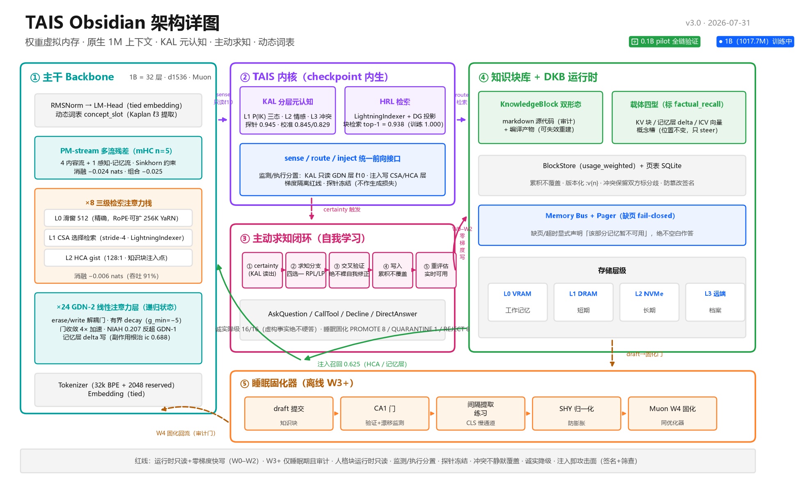

*图 1：TAIS Obsidian 架构详图（v3.0，IBM Carbon 设计语言）。*

## 问题：已部署的 LLM 无法学习

预训练 LLM 把全部知识存放在冻结的权重中。部署之后，若不进行昂贵的重训练，模型无法吸收新事实、纠正错误或适配用户领域。这一限制级联出三个有文献充分记录的实践故障。

**其一**，主流绕行方案——检索增强生成（RAG）[1] 及其主动变体（FLARE [2]、Self-RAG [3]）——把知识以文本形式补丁进提示词。文本不是模型的原生知识表示：注入依赖 prompt 拼接而非权重级接口，消耗有限的上下文窗口，且不产生持久记忆——同一事实在下一段对话里必须重新检索。

**其二**，模型对自身知识边界没有显式读出。对隐状态的线性探针能以很高精度解码"模型知道自己不知道"（SAPLMA [4]；即使在 4-bit 量化下仍达 0.904–1.000 AUROC [5]）——信号就在模型内部，但主流架构从不拿它驱动行为。结果就是幻觉：模型在本该说"我不知道"的地方流畅地猜测。

**其三**，长上下文——文档、代码库、对话历史所必需——代价高昂。注意力计算随序列长度平方增长，KV 缓存（KV cache）随长度线性增长，一条长序列即可占用数 GB 内存 [6]。在边缘设备上，这恰好撞上最刚性的约束：小语言模型（SLM）市场正因隐私、延迟与能效需求以 28.7% 的年复合增长率扩张（2025 年 9.3 亿美元 → 2032 年预计 54.5 亿美元）[7][8]。边缘模型与其上下文预算都必须保持小——而最小的模型恰恰最需要持续学习。

**最后**，朴素的持续学习是破坏性的。对新数据微调会导致灾难性遗忘（catastrophic forgetting）；近期证据表明连优化器选择都会改变遗忘量——用与预训练相同的优化器做全量微调，遗忘显著更少 [9]。生物大脑用快慢互补学习系统（complementary learning systems, CLS）解决同类问题——海马体负责快速情景捕获，新皮层负责慢速巩固 [10]。当前 LLM 架构没有等价物。

## 现有方法的局限

若干研究路线各解决了问题的一部分，但都留有结构性缺口。RAG 与智能体工具调用把知识放在模型之外，无法沉淀为可审计的权重级资产，检索质量就是系统上限。测试时训练类方法（TTT、Titans）[11][12] 在推理中更新权重，但刻意回避注意力路径中的学习型压缩，且没有"写什么需要验证"的机制——记忆投毒（memory poisoning）成为无人值守的攻击面，MemoryGraft 式注入攻击已实证这一点 [26]。持续微调方法用正则化或回放对抗遗忘，但它们直接修改定义模型行为的权重——对必须保持可审计、可回滚的已部署系统不可接受。元认知研究（SAPLMA [4]、MeCo [24]、Meta-R1 [25]）证明了知识空白信号线性可读，但只把它们当作监测信号——没有一条路线把"发现空白→获取知识→验证→写入→召回→固化"闭合成环。

## 提议的解法：TAIS Obsidian 架构

TAIS Obsidian（图 1）围绕一个思想构建：知识应当是与权重同级的运行时对象——**知识块（KnowledgeBlock）**——并像操作系统管理虚拟内存一样被管理。

**权重虚拟内存。** 知识块在页表（SQLite）登记，按层级存储（L0 VRAM ↔ L1 DRAM ↔ L2 NVMe ↔ L3 远端），运行时按需通过权重级注入点换入。缺页 fail-closed：模型显式声明"该部分记忆暂不可用"，而不是用空白知识作答。每个块带防篡改签名，并以 markdown 源代码形态作为最终审计与回滚依据；编译产物可随时废弃重建。

**读写不对称。** 运行时只允许零梯度快写（追加日志、steering 向量、KV 前缀 / 记忆层 delta 写）；基于梯度的主干固化只在离线"睡眠期"进行且有验证门——对应大脑的快/慢互补学习系统 [10]。人格块运行时只读。

**混合高效主干。** 主干交替排布 GDN-2 线性注意力层（恒定大小递归状态；erase/write 解耦门 [13]）与三级检索注意力栈：512 token 滑窗负责精确局部注意力，压缩稀疏选择分支（CSA，stride-4）与重压缩 gist 分支（HCA，128:1）[14]。长上下文成本保持近线性——这是边缘部署的前提。

**分层元认知（KAL）。** 小型冻结线性头只读主干隐状态（与干预点分置不同层，防自激），输出三态"知道的概率"P(IK)、情感信号与冲突信号。低 P(IK) 驱动行为：检索、澄清提问、调用工具、或诚实降级 [2][4]。

**主动求知闭环。** 检测到知识空白时，系统绝不裸自我修正——大模型已被证明无法独立完成推理自纠 [15]。候选知识必须通过交叉验证门（多源一致性 + 先验一致性 + 冲突检测）才能写为知识块；写入后同一对话立即可用（HRL indexer 检索 + HCA 注入），随后在睡眠期由 CA1 式巩固门 + 三元奖励强化 [16] 固化。

**动态词表。** 预留概念槽（2048 个）让模型经由 Kaplan 内词典机制 [17] 把多碎片 sub-word 融合为整词表征，无需重训 tokenizer 即铸造新概念 token——词表按三级阶梯生长（输入侧免费，输出侧受门控）。

## 当前进展：0.1B 已验证了什么

上述每个子系统都已在自研纯 PyTorch 框架中实现，并在 0.1B pilot（12 层，d_model 768，120M 训练 tokens）上实测。以下数值全部来自项目评估产物；全套 **437 项单元测试全绿**。

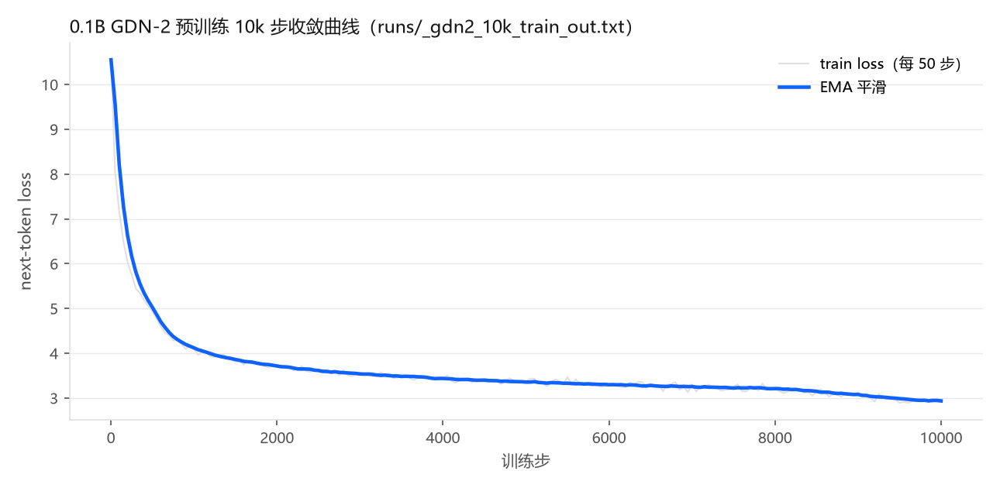

*图 2：0.1B GDN-2 预训练 10k 步收敛曲线（真实训练日志）。*

**主干与效率消融。** hybrid 基线 val loss 3.768；三级检索栈 3.762（−0.006 nats，参数 +0.093%）；PM-stream 多流残差 3.744（−0.024）；组合 3.743（−0.025）[14][18]。

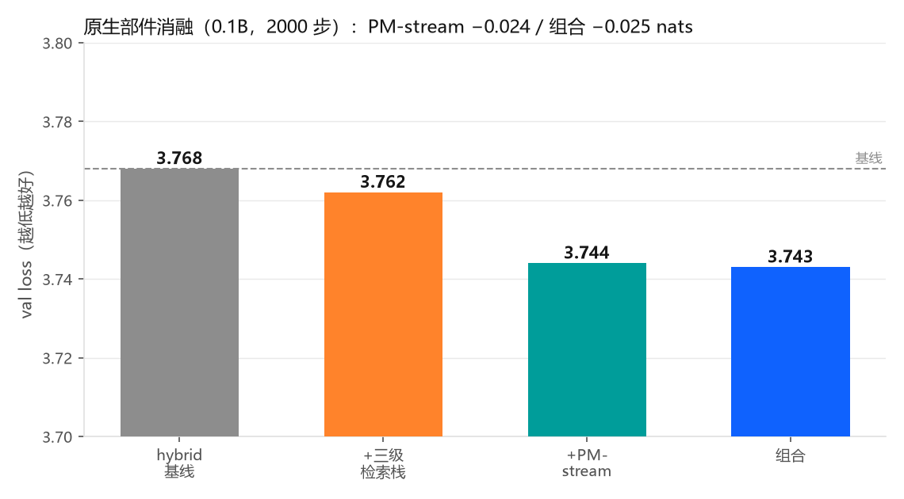

*图 3：原生部件消融（2000 步 val loss）。*

**GDN-2 门收敛与有界 decay。** GDN-2 早期 NIAH 检索落后被证明是门欠收敛（欠训练）而非架构缺陷——三阶段证据链（欠训练 → 门饱和 → 以 NIAH 0.240 反超 GDN-1 的 0.200）确立了这一点。decay 参数化从无界改为有界 scaled-sigmoid（g_min=−5）后，门收敛加速 4×，同时保持 1M 上下文所需的数值范围。

**元认知。** 事后探针以 AUROC 0.945 线性读出"知/不知"（语义空白子集 0.979），超过 FLARE 输出分布基线。真值锚校准——锚"事实真假"而非"语言建模置信度"——先达 0.769，扩充锚集后达 **0.845 / 0.829 双口径**（各 3 seed），达成 ≥0.8 目标；预测反馈循环实现并评估后如实报告无增益、已回滚。校准后 certainty 方向语义正确（known 文本 P(known)≈1.000，fake ≈0.13），且微调前后主干 val loss 逐位一致（探针冻结红线成立）。

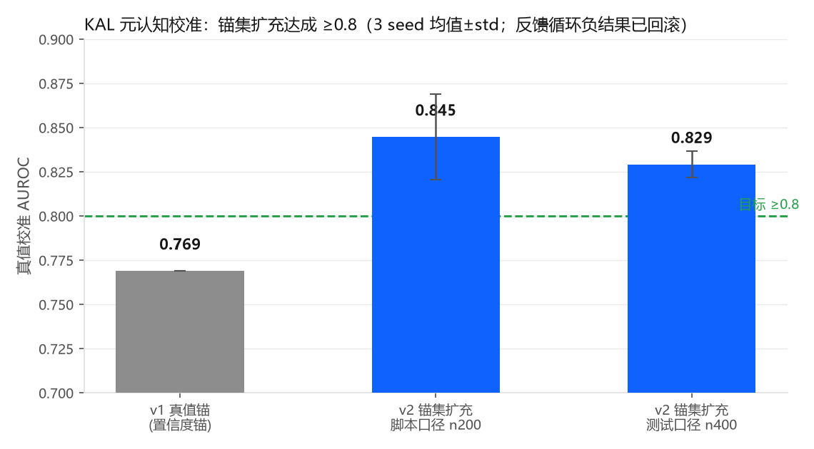

*图 4：KAL 真值校准 AUROC 演进（3 seed 均值±std）。*

**知识块"写入即可用"。** 训练后 HRL indexer 块检索 top-1 = 1.000（统一 checkpoint 上 0.938）。把知识块 KV 注入 HCA 区，注入召回答对率 0.625（in-context 上界 0.70，未训练基线 0.062）——且主干权重逐位不变（drift = 0.0）。

**诚实降级。** 面对完全虚构的事实，校准后的模型 16/16 次选择拒答而非编造。

**知识内化与睡眠固化。** 教学式 SFT 把内化差值（有知识链答对率 − 无知识链答对率）从 0.015 提升到 0.758；退联检验 1.000：一致知识全部内化、矛盾知识全部拒绝。睡眠巩固器对混合批的门控裁决为 PROMOTE 8 / QUARANTINE 1 / REJECT 8。

**动态词表。** Kaplan 内词典提取真实启用（0.1B 实测 ℓ3 最强），并接入自学习闭环；语义抽验显示真实语义（electron–photon 余弦 0.513 vs electron–democracy 0.217）。

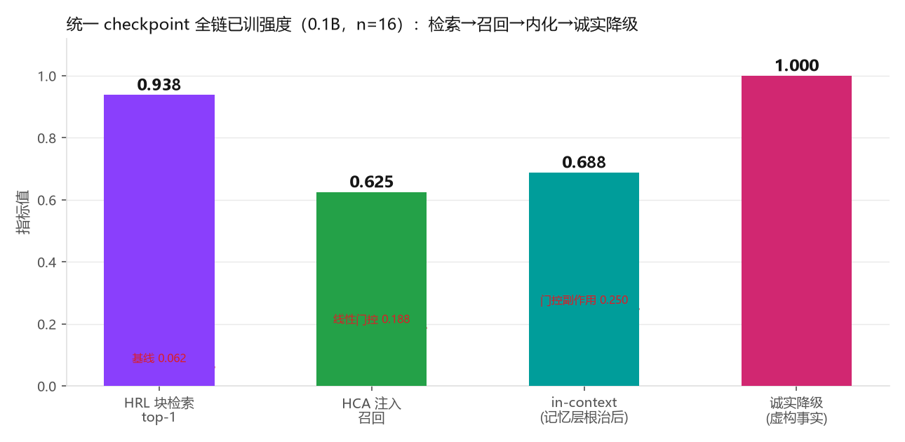

*图 5：统一 checkpoint 全链已训强度（n=16）：检索 → 召回 → 内化 → 诚实降级。*

**交互式全链验证（2026-07-31 补）。** 在上述离线评估之外，我们构建了交互式验证系统（对话 REPL + 确定性四阶段剧本），以真实对话流程复核"运行时补正 + 睡眠固化"完整链路（图 6-1）：虚构事实 certainty 全 0.000、Decline 6/6；教学 6 条事实写入率 1.00，KV 注入召回 0.500 vs 基线 0.000（n=6 小样本，与 n=16 的 0.625 同量级）；推理轨迹 certainty 方向正确，网格码探针 −0.052（按预期不成立——统一 checkpoint 未挂路径积分训练）；睡眠固化裁决 PROMOTE 3 / QUARANTINE 1 / REJECT 3。该验证同时暴露一个结构性发现：**CA1 巩固门与信源可信度耦合存在边缘效应**——工具来源（CallTool/doc）的知识块在默认参数下 consensus=0.68 恰低于 0.7 阈值而被系统性拒绝（用户来源 0.76 通过），6 条已教事实仅 3 条可固化。已登记为 1B 复测的调参项（阈值边缘带引入"补验证重试"而非直接拒绝）。

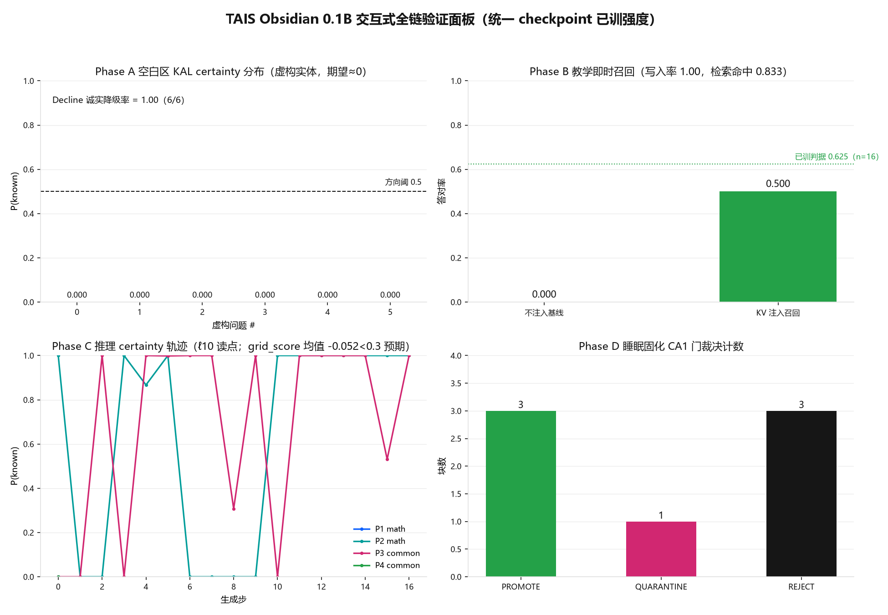

*图 6-1：交互式四阶段验证面板（真实运行产物 `runs/interactive_validation/`）：A 空白区 certainty / B 教学即时召回 / C 推理 certainty 轨迹 / D CA1 门裁决。*

**扩展验证：流形训练、CA1 自适应与五场景协同（2026-07-31 再补）。** 在交互验证基础上，本轮完成三件系统性工作并执行五场景扩展测试（113 轮完整对话日志，判据 14/15 通过、1 项诚实负结果）。

*① 流形思考确认需要训练（并已训练）。* 证据显示统一 checkpoint 不含流形投影器权重（266 键中零 manifold 键；权重统计与随机初始化完全一致）。以冻结主干（训练前后逐位一致）训练投影器 1500 步后（图 6-2）：语义聚簇对比度 1.558 → **1.989**，等距 Pearson 0.882 → **0.977**；最直观的证据是——数学 prompt 推理轨迹在流形空间中最近的 4 个知识块恰为全部 4 个数学块。同时实现了流形推理预览（逐生成步 3D 轨迹 + 知识块叠加渲染 + 坏路径四类检测）。

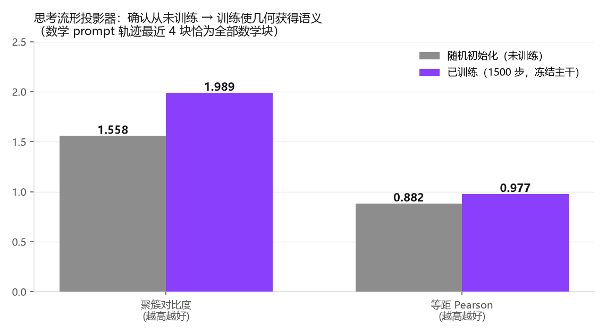

*② CA1 巩固门自适应（v1.0 → v1.1，根治上述边缘效应）。* 三项机制：边缘带 RE_VERIFY（consensus∈[0.62, 0.7) 的块不直接拒绝，经交叉验证复核并有界加成后二次入门，上限 1 次）；证据感知共识（0.85·基础分 + 0.10·usage + 0.05·验证通过率）；信源可信度在线学习（EMA，历史验证结果回写信源先验）。实证（图 6-3）：doc 源块 0.688 → RE_VERIFY → 0.743 → **PROMOTE（6/6 固化，v1.0 仅 3/6）**；矛盾块仍 QUARANTINE。抗"放水"经三重验证：劣质块（<0.62）直接拒绝不进带、复核恒败不累积洗白、连续失败使信源跌出边缘带（0.70→0.36）失去重试资格。

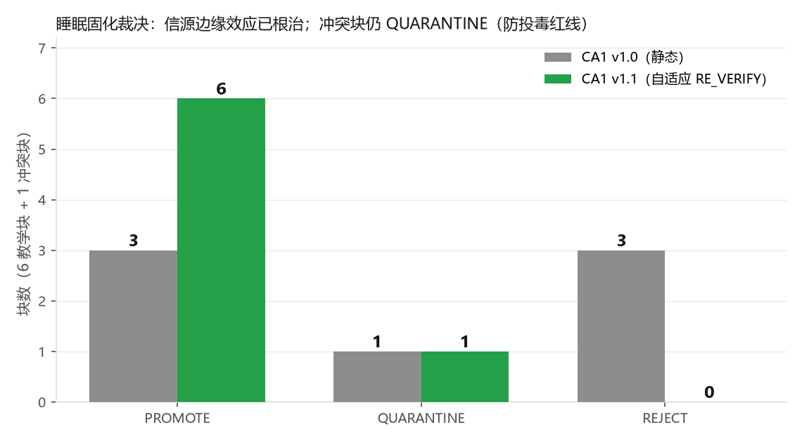

*③ 五场景协同测试。* S1 已有知识链检索命中 0.67/1.00（0.1B 世界知识弱，如实记录）；S2 多轮教学召回曲线单调不降，重教条目 v1/v2/v3 版本共存（累积不覆盖红线成立）；**S3 桥接（核心成果）**：默认权重推不出 D（certainty=0.000），只补教中间知识 B'、C' 后注入召回答出 D（'krypton'），且推理轨迹在流形空间对新教块的最近距离从 6.12 改善到 5.54（图 6-4）；S5 睡眠固化 19 个 doc 源块全部经 RE_VERIFY 固化，信源可信度 doc 0.70→0.95，固化后召回不变（固化不破坏运行时能力）。

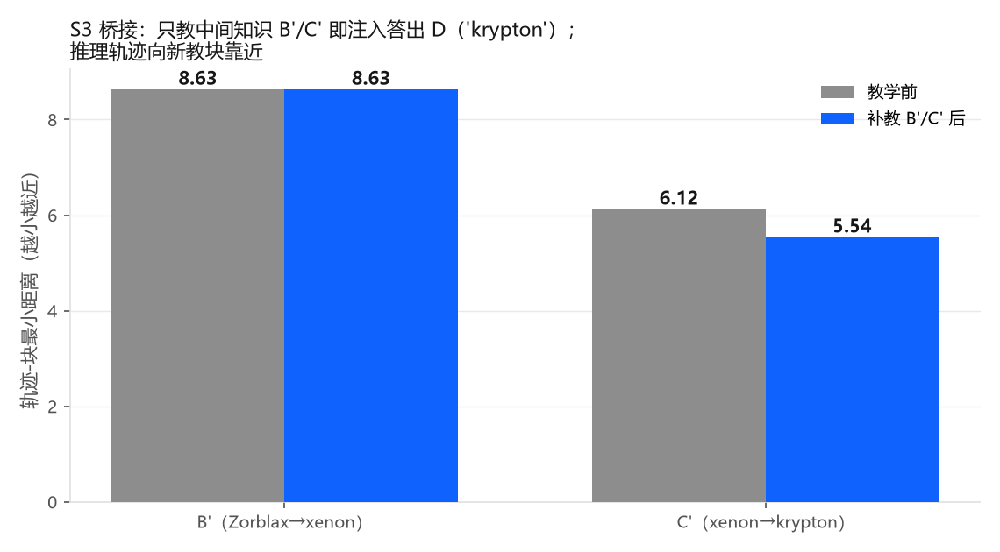

**载体分布边界（本轮最重要的诚实发现）。** S4 动态词表场景中，新词"Xylon"的 concept_slot 注册成功、语义邻居正确（metal/silver 类 cos 均值 0.256 > 无关词 0.168，图 6-5）、检索 top-1 命中——但**注入召回完全失败**（5 种句式变体全部回退先验答案）。进一步排查确认：KV 注入召回仅在 teaching SFT 训练分布（引擎事实句式 + 燃料词答案域）内有效，自定义句式的事实检索/召回仅 0.25。即 0.1B 的"写入即可用"是**分布内能力**而非通用能力。

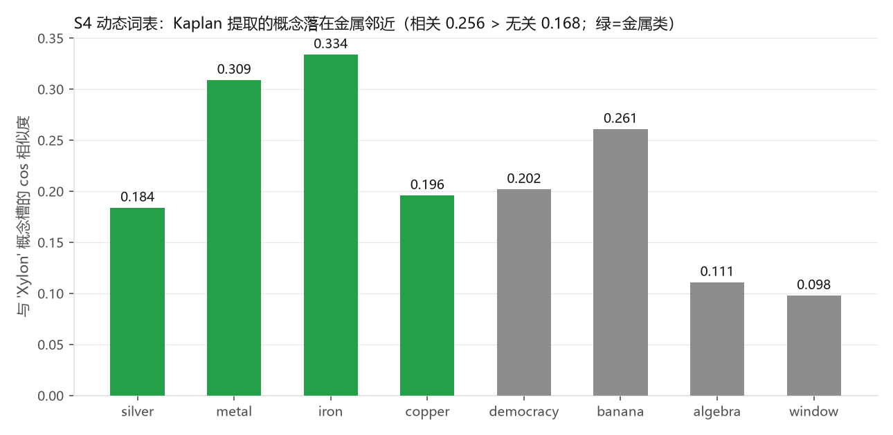

**解决方案分析（结合文献交叉验证）。** 这一边界与知识编辑领域的已知难题同构——编辑后的事实难以稳健泛化与逻辑推理 [27]。三条互相补强的路径：① **召回训练分布多样化**——WISE 等研究表明 few-shot 微调比纯 in-context 更具分布外泛化性、而检索与微调结合最优 [27]：teaching SFT 的句式模板与答案词域需要多样化（已列入 1B 数据配方）；② **检索鲁棒性**——对 HRL indexer 引入硬负例训练（STAR/ADORE 式，先易后难的负例课程 [28]），解决非训练分布问句 top-1 被干扰块抢走的问题；③ **OOV 概念升格**——概念槽向量目前只能 steer 不能事实召回（位置不变载体的理论边界），需配合输出侧注册（embedding 初始化改进 [29] + 仅训 W_E/W_U 的短程 CPT，对齐设计文档三级阶梯）。上述三项均列入 1B 复测清单（与 KAL 探针强度并列首要观测）。

## 设计历程：发现的问题与解决方式

工程诚实是本项目的设计原则，若干发现改变了架构的走向。

**门欠收敛曾被误诊为架构缺陷。** GDN-2 初期检索落后 GDN-1。分阶段排查把根因隔离为门欠训练，并借鉴 Kimi Linear 的参数化做有界 decay [19] 解决。教训已记录：检索是门分化的慢变量。

**注入召回带来门控副作用。** 扩容融合门（召回 0.625 所必需）同时对长文本 gist 开权重，使纯文本 in-context 召回从 0.688 退化到 0.250。两次解耦尝试（双通道门控；彻底解耦独立 CSA 通道）均已实现并测量；第二次得到诚实负结果——0.1B 下注入召回依赖扩容门控整体开权重状态，无法在独立通道复刻。解法是把事实条目迁到记忆层（token 寻址、可事实召回），in-context 恢复 0.688 且零干扰；记忆层读出接口训练是该路径的收尾项。

**logprob 不等于真相。** 早期以语言建模置信度为锚的校准停在 0.769。修法是锚定事实真假并扩充锚集多样性（near-miss 细粒度错误、跨领域混搭、程序化虚构）。这一负结果驱动了 KAL 全链的真值锚设计。

**一个静默的优化器-调度 bug。** Muon 优化器分组读 `muon_lr`/`adamw_lr` 键，而训练循环只写通用 `lr` 键——WSD 调度对 Muon 静默失效。该缺陷在长跑前代码审阅中捕获，按比例缩放规则修复，并以专门回归测试锁定。

**优化器-模型一致性。** 依据"固化与预训练同优化器则遗忘更少"的证据 [9]，预训练与睡眠固化统一采用 Muon（Newton–Schulz 正交化动量），实测收敛优于 AdamW（6.523 vs 6.868），吞吐代价仅 4.6%。

## 当前阶段：1B 过渡

pilot 阶段已完成，项目已过渡到 1B 模型（实测 1,017.7M 参数：d_model 1536，32 层 = 8×{3 GDN-2 + 1 注意力栈}），训练 10B tokens 多领域语料（教育网页 73% / 数学 12% / 合成教科书 10% / 中文网页 5%），随后 1B tokens 高质量上移的中训练退火，对齐 OLMo 3 Dolmino 与 SmolLM2 多阶段配方 [20][21]。10B tokens 是刻意的架构验证预算：它是 1B 模型 Chinchilla 最优量的一半 [22]，远低于当代 1B 实践（4T+ [21]），所有下游评测都将按此口径如实报告。全工具链——流式数据准备（断点续跑 + 词表越界扫描）、Muon 训练（含调度修复）、checkpoint 续训加固、tokenizer 随附导出、HuggingFace 上传——已通过 437 项回归测试。256K 上下文扩展（YaRN RoPE + 渐进扩窗）初版已实现，排在 1B 训练之后 [23]。

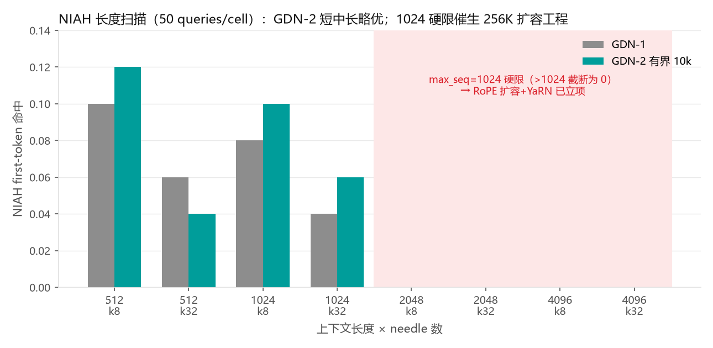

*图 6：NIAH 长度扫描（50 queries/cell）。max_seq=1024 是 RoPE 缓存硬限——>1024 需扩容后实测，这直接催生了 256K 扩展工程。*

## 影响与未来发展

自学习边缘 LLM 改变小模型的定义。设备不再只是一个冻结快照，而是带着紧凑主干到达用户手中，把主人的知识累积为可审计、可撤销的知识块——隐私内生（数据无需离开设备），安全内生（写入须验证、签名、过门）。近期步骤：完成 1B 训练与部件复测（首个观测点是 1B 下 KAL 探针强度）；训练记忆层读出接口，使召回在零副作用下达 0.625 级；执行 256K 渐进扩窗课程；导出标准格式供社区基准评测。远期目标仍是设计的完整规格：1.5B 模型、原生 1M 上下文、端到端训练的自学习闭环。

## 参考文献（Reference）

[1] P. Lewis *et al.*, "Retrieval-augmented generation for knowledge-intensive NLP tasks," in *Proc. NeurIPS*, 2020, arXiv:2005.11401.

[2] Z. Jiang *et al.*, "Active retrieval augmented generation (FLARE)," in *Proc. EMNLP*, 2023, arXiv:2305.06983.

[3] A. Asai, Z. Wu, Y. Wang, A. Sil, and H. Hajishirzi, "Self-RAG: Learning to retrieve, generate, and critique through self-reflection," in *Proc. ICLR*, 2024, arXiv:2310.11511.

[4] A. Azaria and T. Mitchell, "The internal state of an LLM knows when it's lying (SAPLMA)," in *Findings of EMNLP*, 2023, arXiv:2304.13734.

[5] "Hallucination is linearly decodable from mid-layer hidden states in quantized LLMs," arXiv:2606.02628, 2026.

[6] "KV cache optimization strategies for scalable and efficient LLM inference," arXiv:2603.20397, 2026.

[7] MarketsandMarkets, "Small language model market report 2025–2032," 2025. [Online]. Available: https://www.marketsandmarkets.com/Market-Reports/small-language-model-market-4008452.html

[8] E. Kristiani, V. K. Verma, and C.-T. Yang, "Deploying LLM transformer on edge computing devices: A survey of strategies, challenges, and future directions," *AI*, vol. 7, no. 1, p. 15, Jan. 2026.

[9] Y. Liu, "Optimizer-model consistency: Full finetuning with the same optimizer as pretraining forgets less," arXiv:2605.06654, 2026.

[10] J. L. McClelland, B. L. McNaughton, and R. C. O'Reilly, "Why there are complementary learning systems in the hippocampus and neocortex," *Psychological Review*, vol. 102, no. 3, pp. 419–457, 1995.

[11] Y. Sun *et al.*, "Learning to (learn at test time): RNNs with expressive hidden states (TTT)," arXiv:2407.04620, 2024.

[12] A. Behrouz *et al.*, "Titans: Learning to memorize at test time," arXiv:2501.00663, 2025.

[13] A. Hatamizadeh, Y. Choi, and J. Kautz, "Gated DeltaNet-2: Decoupling erase and write in linear attention," NVIDIA, arXiv:2605.22791, 2026.

[14] J. Yuan *et al.*, "Native sparse attention: Hardware-aligned and natively trainable sparse attention," DeepSeek-AI, arXiv:2502.11089, 2025.

[15] J. Huang *et al.*, "Large language models cannot self-correct reasoning yet," in *Proc. ICLR*, 2024, arXiv:2310.01798.

[16] "TruthRL: Incentivizing truthful LLMs via reinforcement learning (ternary reward)," arXiv:2509.25760, 2025.

[17] G. Kaplan, M. Oren, Y. Reif, and R. Schwartz, "From tokens to words: On the inner lexicon of LLMs," in *Proc. ICLR*, 2025, arXiv:2410.05864.

[18] Z. Xie *et al.*, "mHC: Manifold-constrained hyper-connections," DeepSeek-AI, arXiv:2512.24880, 2025.

[19] Kimi Team, "Kimi Linear: An expressive, efficient attention architecture," Moonshot AI, arXiv:2510.26692, 2025.

[20] OLMo Team, "OLMo 3: Fully open language models," Allen Institute for AI, arXiv:2512.13961, 2025.

[21] L. Ben Allal *et al.*, "SmolLM2: When smol goes big — Data-centric training of a small language model," arXiv:2502.02737, 2025.

[22] J. Hoffmann *et al.*, "Training compute-optimal large language models (Chinchilla)," in *Proc. NeurIPS*, 2022, arXiv:2203.15556.

[23] Qwen Team, "Qwen2.5-1M technical report," arXiv:2501.15383, 2025.

[24] "MeCo: Learnable meta-cognition for tool use and retrieval in LLMs," in *Proc. ACL*, 2025, arXiv:2502.12961.

[25] "Meta-R1: Metacognitive reinforcement learning for large language models," arXiv:2508.17291, 2025.

[26] "MemoryGraft: Temporally-decoupled indirect memory injection attacks on LLM agents," arXiv:2512.16962, 2025.

[27] "WISE: Rethinking the knowledge memory for lifelong model editing of large language models," arXiv:2405.14768, 2024.

[28] J. Zhan, J. Mao, Y. Liu, J. Guo, M. Zhang, and S. Ma, "Optimizing dense retrieval model training with hard negatives," in *Proc. SIGIR*, 2021, arXiv:2104.08051.

[29] J. Hewitt, "Initializing new word embeddings for pretrained language models," Columbia University, 2021. [Online]. Available: https://www.cs.columbia.edu/~johnhew//vocab-expansion.html
